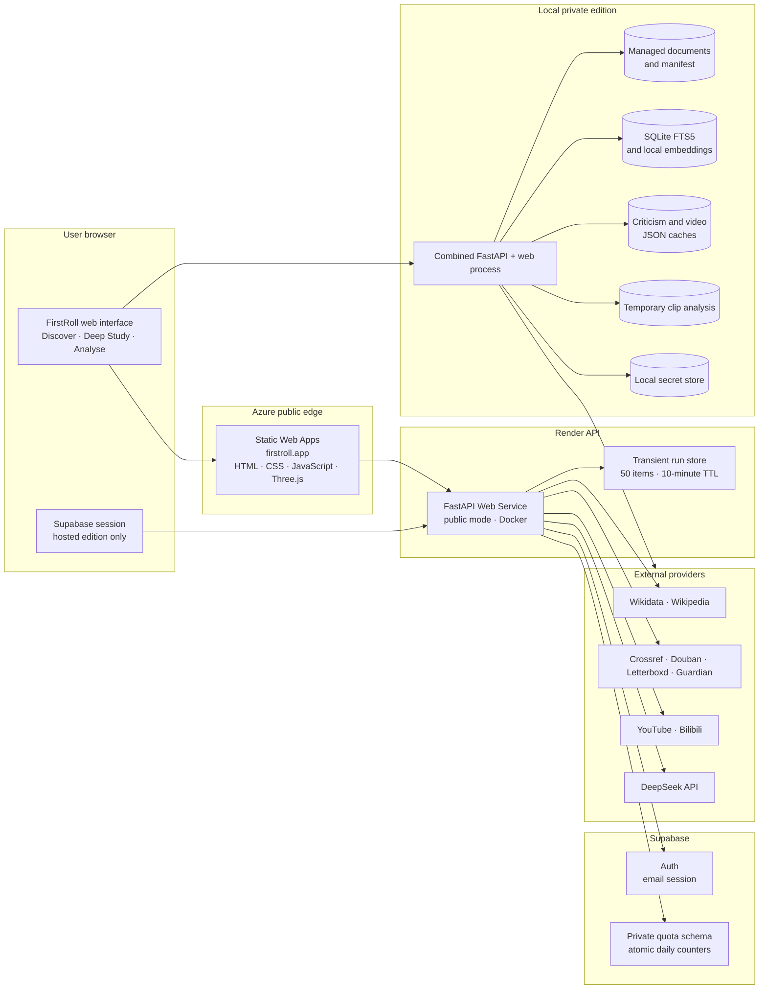
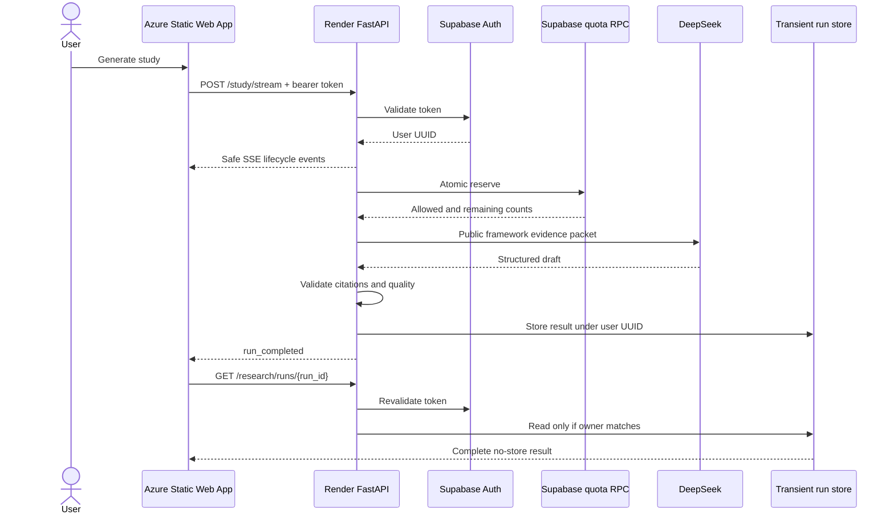

# FirstRoll Architecture

**Status:** Current implementation  
**Last reconciled:** 19 August 2026

FirstRoll is a local-first film-study system with a hybrid Azure and Render public beta. “Local-first”
describes where private books, credentials, derived vectors and uploaded film clips are kept; it does
not mean the product is available only on one computer.

## Product Topology



Azure Static Web Apps deploys the browser bundle from `master` and serves it at `firstroll.app`.
Render deploys the Docker FastAPI service independently from the same branch. The static frontend
remains available while the free-tier API instance wakes. The browser learns the API origin at build
time through `FIRSTROLL_API_BASE`; the API accepts only configured frontend origins through
`FIRSTROLL_CORS_ALLOWED_ORIGINS`. Terraform under `infra/terraform` defines the foundation for the
planned migration of that API to Azure Container Apps; it does not yet own the existing Static Web
App.

## Runtime Modes

| Capability | Local private edition | Hosted public beta |
|---|---|---|
| Web delivery | FastAPI serves the interface and API on `127.0.0.1:8000` | Azure Static Web Apps serves the interface; Render Web Service currently serves the API |
| Film discovery | Public Wikidata/Wikipedia adapters | Same adapters |
| Criticism and videos | Public adapters plus optional local credentials and persistent private caches | Public/hosted adapters; personal DeepSeek and YouTube keys may be request-scoped in one signed-in tab |
| Private document library | Enabled | Not published; local routes return 404 |
| Hybrid PDF retrieval | Local SQLite FTS5 and Sentence Transformers | Replaced by bounded first-party study frameworks |
| Deep Study | Local DeepSeek key; no hosted account quota | Supabase bearer authentication plus atomic per-account and global quota reservation |
| Research progress | Synchronous result route remains available | Authenticated POST-based SSE followed by a separate owner-scoped result request |
| Clip analysis | Enabled when local dependencies are available | Disabled by default and returns 503 |
| Durable account state | Not required | Supabase Auth and quota counters |
| Durable study results | Not implemented | Not implemented; current result store is process-local and expires after ten minutes |

## Component Responsibilities

| Component | Responsibility | Does not own |
|---|---|---|
| `app/web` | Search, disambiguation, 3D shelf, evidence views, authentication UI, progress rendering and clip upload UI | Provider secrets, evidence validation or quota decisions |
| `main.py` | HTTP boundary, mode gates, authentication calls, quota ordering, request validation and error mapping | Provider parsing rules or model-quality policy |
| `discovery.py` | Canonical film identity, credits, posters, overview reconciliation and related films | Critical interpretation or creator intention |
| `criticism.py` | Provider-specific acquisition, identity checks, attributed review models and private cache | Direct film observation |
| `video_sources.py` | Public video discovery, classification, deduplication, captions/descriptions and private cache | Copyright adjudication or verified speaker identity by default |
| `library.py` | Private document catalogue and managed-file metadata | Text extraction or ranking |
| `library_index.py` | PDF extraction, chunking, FTS5, local embeddings, rank fusion and page citations | Film-specific factual claims |
| `evidence.py` | Typed evidence packet and permitted-claim boundaries | Model generation or provider access |
| `study_service.py` | DeepSeek request, Pydantic validation, citation validation, quality gate and one repair | Authentication, quota reservation or research-tool authorisation |
| `research_stream.py` | Fixed public progress vocabulary and transient owner-scoped result store | Hidden reasoning, prompts, credentials or private evidence bodies |
| `research_graph` | Bounded LangGraph state, reducers, routes and deterministic safety boundaries | Production provider credentials or public cut-over decision |
| Supabase functions | Atomic quota status and reservation for the authenticated user | Prompts, evidence or generated studies |

## Core Data Flows

### Discovery

```text
title/year/director query
→ Wikidata candidates
→ title, year and director identity evidence
→ explicit user choice when more than one candidate remains
→ Wikidata/Wikipedia dossier
→ optional ratings, criticism, video and related-film enrichment
```

Film identity is selected before Deep Study. The model never decides silently between same-title
films.

### Local Deep Study

```text
selected film
→ cached criticism and video text
→ private hybrid library retrieval
→ typed EvidencePacket
→ DeepSeek structured draft
→ schema and citation validation
→ deterministic quality gate
→ at most one repair
→ escaped article rendering
```

Only selected excerpts and attributed source text in the evidence packet are sent to DeepSeek. Full
books, vectors, local paths and uploaded clips do not leave the device.

### Hosted Deep Study



Quota is reserved immediately before the paid model call. A provider failure after reservation still
consumes the allowance; this prevents retries from becoming an unbounded cost path.

### Clip Analysis

```text
private browser upload
→ temporary server file
→ metadata, shot, scene, colour, object and shot-scale analysis
→ JSON/CSV response
→ temporary file removal
```

The measurement result does not yet enter the Deep Study evidence packet. Until that bridge exists,
film-form statements generated without a clip remain viewing hypotheses.

## Trust and Privacy Boundaries

| Boundary | Allowed to cross | Must not cross |
|---|---|---|
| Static browser → hosted API | Search terms, selected film ID, bearer token, study question, optional request-scoped provider key | Local books, local vectors, stored connector secrets or uploaded clips |
| Hosted API → Supabase | Bearer token for verification; authenticated UUID/day for quota functions | Prompts, evidence or study text |
| Study service → DeepSeek | Typed selected evidence, question and schema instructions | Complete library, file paths, clip binaries or hidden application state |
| Progress stream → browser | Run ID, allow-listed event kind, sequence, fixed public message, elapsed time and safe counts | Prompt, API key, review body, private passage, model output or chain-of-thought |
| Local API → local disk | Managed documents, SQLite index, connector settings and provider caches | Nothing is committed to Git; `.firstroll` is ignored |

Retrieved reviews, captions and webpages are untrusted evidence. They may support attributed claims,
but they cannot authorise tools, change system policy or become model instructions.

## Availability and Scaling

- Render free-tier cold starts can delay discovery even though the Azure-hosted static shell loads
  immediately.
- Discovery, reception and related-film caches are process memory and reset on restart.
- The hosted research result store is capped at 50 runs with a ten-minute TTL. It is suitable for a
  single-process beta, not horizontal scaling or resumable work.
- Supabase quota reservation uses an advisory transaction lock per UTC day, so concurrent requests
  cannot exceed the configured account or global boundary.
- Local SQLite indexes and JSON caches are single-device artefacts and are never assumed to exist on
  Render's ephemeral filesystem.
- Optional providers fail independently. Their absence reduces evidence coverage rather than making
  film identity or the whole application unavailable.

## Configuration Boundaries

| Setting class | Examples | Placement |
|---|---|---|
| Public static build values | `FIRSTROLL_API_BASE`, `FIRSTROLL_SUPABASE_URL`, `FIRSTROLL_SUPABASE_PUBLISHABLE_KEY` | Azure Static Web Apps GitHub Actions build environment |
| Hosted backend public configuration | `FIRSTROLL_PUBLIC_MODE`, `FIRSTROLL_CORS_ALLOWED_ORIGINS`, `SUPABASE_URL`, `SUPABASE_PUBLISHABLE_KEY` | Render Web Service environment |
| Hosted backend secrets | `DEEPSEEK_API_KEY`, optional `YOUTUBE_API_KEY` | Render Web Service only |
| Local private paths | `FIRSTROLL_LIBRARY_PATH`, `FIRSTROLL_LIBRARY_MANIFEST`, `FIRSTROLL_LIBRARY_INDEX`, `FIRSTROLL_SETTINGS_PATH` | Local backend environment |
| Local optional credentials | DeepSeek, Douban cookie, Letterboxd OAuth and YouTube key | Local Settings or local environment |

See [Local Setup](LOCAL_SETUP.md), [Public Beta Hosting](HOSTING.md), [Data Model](DATA_MODEL.md),
[API Reference](API_REFERENCE.md) and [Architecture Decisions](DECISIONS.md) for operational detail.
