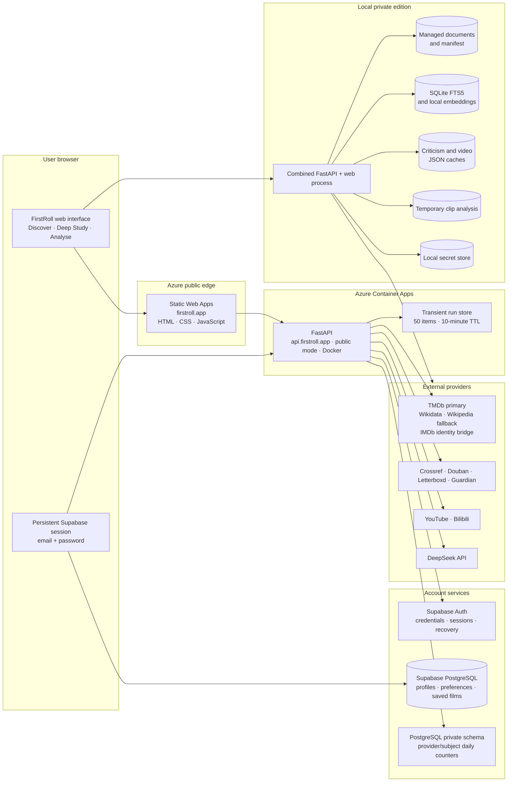

# FirstRoll Architecture

**Status:** Current implementation  
**Last reconciled:** 24 August 2026

FirstRoll is a local-first film-study system with an Azure-hosted public beta. “Local-first”
describes where private books, credentials, derived vectors and uploaded film clips are kept; it does
not mean the product is available only on one computer.

## Product Topology



Azure Static Web Apps deploys the browser bundle from `master` and serves it at `firstroll.app`.
Azure Container Apps runs the versioned FastAPI image at `api.firstroll.app`. The browser learns the
API origin at build time through `FIRSTROLL_API_BASE`; the API accepts only configured frontend
origins through `FIRSTROLL_CORS_ALLOWED_ORIGINS`. Terraform under `infra/terraform` owns the imported
Static Web App, both Azure custom-domain associations and the Container Apps infrastructure. The
Spaceship DNS records and deployed website content remain outside Terraform.

## Runtime Modes

| Capability | Local private edition | Hosted public beta |
|---|---|---|
| Web delivery | FastAPI serves the interface and API on `127.0.0.1:8000` | Azure Static Web Apps serves the interface; Azure Container Apps serves the API |
| Film discovery | TMDb primary when configured; Wikidata/Wikipedia key-free fallback | Same server-side provider policy; credentials never enter the browser bundle |
| Criticism and videos | Public adapters plus optional local credentials and persistent private caches | Public/hosted adapters; personal DeepSeek and YouTube keys may be request-scoped in one signed-in tab |
| Private document library | Enabled | Not published; local routes return 404 |
| Hybrid PDF retrieval | Local SQLite FTS5 and Sentence Transformers | Replaced by bounded first-party study frameworks |
| Deep Study | Local DeepSeek key; no hosted account quota | Configured bearer authentication plus atomic provider/subject and global PostgreSQL quota reservation; legacy Supabase RPC retained for rollback |
| Research progress | Synchronous result route remains available | Authenticated POST-based SSE followed by a separate owner-scoped result request |
| Clip analysis | Enabled when local dependencies are available | Disabled by default and returns 503 |
| Durable account state | Loopback-only test identity with browser-local profile, preferences and saved films | Supabase Auth plus RLS-owned profile, preferences and saved-film rows; generic PostgreSQL quota counters remain staged |
| Durable study results | Not implemented | Not implemented; current result store is process-local and expires after ten minutes |

## Account Identity and Persistence

Supabase is the production identity provider. The browser uses password-based `signUp()` and
`signInWithPassword()`, persists and refreshes the Supabase session, and sends the access token to
FastAPI only for protected API operations. Password recovery also remains inside Supabase. The
browser contains the publishable key, never a service-role key.

The private edition also exposes one development identity, `luo_zhiyang@outlook.com`, so signed-in
interfaces can be exercised without coupling local work to Supabase availability. This is a
separate adapter, not a Supabase bypass: FastAPI accepts its fixed development token only when both
the URL host and connected client are loopback addresses. The condition is independent of port and
launcher, which keeps `uv run firstroll` and the hosted-mode preview consistent. The adapter stores
test profile, preference and saved-film state in the current browser and returns an unlimited local
FirstRoll quota marker. Its presence selects the same account-navigation shell used in production,
without changing the API's private/public execution boundary or disabling local video analysis.
Non-loopback deployments never publish the local identity and cannot accept
its token; they retain Supabase verification, RLS persistence and atomic production quota checks.

FirstRoll application records are separate from credentials:

```text
Supabase Auth auth.users(id)
    -> public.firstroll_profiles(user_id)
    -> public.firstroll_preferences(user_id)
    -> public.firstroll_saved_films(user_id, canonical film_id)
```

All three tables reference the stable `auth.users` primary key with `ON DELETE CASCADE`. They are
in Supabase's exposed `public` schema, so RLS is mandatory: authenticated users can operate only on
rows where `(select auth.uid()) = user_id`, and the `anon` role receives no table privileges. The
saved-film interface queries these tables directly through the Supabase client because PostgreSQL,
not browser conditionals, enforces ownership.

Quota persistence is now decoupled in code. The PostgreSQL adapter uses a backend-only connection and
keys quota rows by provider plus immutable subject; it never forwards the browser bearer token. The
legacy Supabase RPC remains the production rollback path until the generic migration is installed
and a dedicated database login is configured. Entra code remains staged as an optional learning and
future-enterprise path, but ADR-017 removes it from the production critical path.

## Component Responsibilities

| Component | Responsibility | Does not own |
|---|---|---|
| `app/web` | Search, disambiguation, per-tab Discover continuity, resilient native director shelf, password-account UI, RLS-backed saved films, retained safe progress history, packet/gap/timing diagnostics, exact citation targets and clip upload UI | Provider secrets, cross-account authorisation, durable study storage, evidence validation or quota decisions |
| `main.py` | HTTP boundary, mode gates, authentication calls, quota ordering, request validation and error mapping | Provider parsing rules or model-quality policy |
| `tmdb_discovery.py` | Official TMDb candidate hydration, provider-qualified routing, IMDb/Wikidata identity bridges and open-catalogue failover | Critical interpretation, browser-held catalogue secrets or silent first-result selection |
| `discovery.py` | Key-free Wikidata/Wikipedia identity fallback, overview reconciliation and related films | Critical interpretation or creator intention |
| `criticism.py` | Provider-specific acquisition, identity checks, attributed review models and private cache | Direct film observation |
| `video_sources.py` | Public video discovery, classification, deduplication, captions/descriptions and private cache | Copyright adjudication or verified speaker identity by default |
| `library.py` | Private document catalogue and managed-file metadata | Text extraction or ranking |
| `library_index.py` | PDF extraction, chunking, FTS5, single-flight background query-encoder warm-up, local embeddings, rank fusion and page citations | Film-specific factual claims |
| `evidence.py` | Typed packet; focus-aware theory/claim/attributed ranking; exact/near deduplication; source and character budgets; permitted-claim and omission boundaries | Model generation or provider access |
| `packet_quality.py` | Pre-synthesis identity, citation, provenance, duplication, lexical relevance, diversity and retrieved-instruction diagnostics | Source-text persistence, factual correctness, human usefulness or model grading |
| `agent_evidence.py` | Typed autonomous evidence gaps, independent-origin recovery rule and deterministic no-model planner baseline | Source acquisition, model calls or human usefulness judgements |
| `autonomous_study.py` | Exact claim-audit coverage, path-local citation authority and traceable filmmaker-exercise validation | Model transport, source acquisition or hidden reasoning |
| `autonomous_agent.py` | Default-off research-to-audit/edit/reaudit/coach controller with separate four-call budget and safe strategy metrics | HTTP routing, checkpoint persistence or production authorisation |
| `autonomous_runs.py` | Owner-scoped mode-`0600` phase checkpoints, atomic writes, cancellation and interrupted-call replay prevention | Hosted coordination, cross-device projects or provider idempotency |
| `local_research_agent.py` | Default-off local graph adapter, aggregate-only gap planning and ephemeral multi-provider acquisition | HTTP routing, cache mutation, credentials in graph state or production cut-over |
| `study_observability.py` | Allow-listed monotonic stage timings, terminal status and bounded aggregate counts | Prompts, evidence text, credentials, model output or exception details |
| `study_service.py` | Concise bounded DeepSeek request, Pydantic/citation validation, generated-study gate, fixed-workflow repair and local Agent field-patch repair with complete revalidation | Authentication, quota reservation, automatic timeout retry or research-tool authorisation |
| `research_stream.py` | Fixed public progress vocabulary and transient owner-scoped result store | Hidden reasoning, prompts, credentials or private evidence bodies |
| `research_graph` | Bounded LangGraph state, reducers, routes and deterministic safety boundaries | Production provider credentials or public cut-over decision |
| `quota.py` + PostgreSQL function | Provider-neutral quota status and atomic reservation after authentication | Bearer tokens, prompts, evidence or generated studies |
| Supabase account tables + RLS | Durable profile, preferences and saved-film ownership scoped by `auth.uid()` | Passwords, provider keys, prompts, evidence or studies |

## Core Data Flows

### Discovery

```text
title/year/director query
→ HybridDiscoveryService checks TMDb configuration
→ TMDb /search/movie candidate IDs when configured
→ at most eight /movie/{id} hydrations, four concurrent, with credits + external IDs appended
→ local title, release-year and director validation
→ Wikidata/Wikipedia fallback when TMDb is absent or its search fails
→ explicit user choice when more than one candidate remains
→ provider-qualified tmdb:{id} or wikidata:{QID} identity
→ IMDb/Wikidata external-ID bridge for secondary-provider reconciliation
→ fast director filmography from TMDb person credits or the canonical Wikidata relationship
→ attributed TMDb dossier, or Wikidata/Wikipedia fallback dossier
→ optional ratings, criticism, video and related-film enrichment
```

Film identity is selected before Deep Study. The model never decides silently between same-title
films. TMDb detail calls run concurrently rather than serially, but the candidate cap and ten-second
per-request deadline bound provider cost. Search and detail results share a process-memory cache.
TMDb's director credits already contain poster paths for the shelf, avoiding per-film detail calls.
The open fallback retains separate fast and enriched shelf caches; a provider-local page found from
a title is accepted only when its structured title, year and director agree with the canonical
record.

#### Browser session continuity

After each stable discovery transition, the browser writes a versioned, size-bounded snapshot to
per-tab `sessionStorage`. The snapshot contains the public query, candidate summaries, selected shelf
summaries, shelf readiness and an optional open-dossier film ID. It excludes dossier bodies,
criticism, studies, credentials and account data. A completed shelf restores synchronously after a
refresh without repeating search or related-film requests; an interrupted loading snapshot safely
reissues only its latest query. Invalid, oversized, incompatible or older-than-twenty-four-hour
snapshots are discarded.

Product navigation changes only the active section. It neither rebuilds nor empties Discover, and
per-view scroll offsets are restored when moving among Discover, Analyse and Settings. This state is
session continuity, not durable account persistence: closing the tab session clears it, and no state
is synchronised across devices.

### Catalogue provider decision matrix

| Option | Metadata quality | Runtime/setup | Cost/access | Decision |
|---|---|---|---|---|
| TMDb official API | Strong search, posters, runtime, credits and external IDs | Simple bearer token; application-oriented REST; parallelisable | Free non-commercial use with attribution; commercial use requires review | Primary when configured |
| Wikidata + Wikipedia | Uneven crew completeness but open, attributable records | Key-free; existing adapter; occasional query latency | CC0/CC BY-SA | Automatic fallback |
| IMDb official API | High-authority title and credit graph | AWS Data Exchange subscription, SigV4 and multiple AWS identifiers | Licensed/commercial boundary | Future enterprise adapter |
| OMDb | Convenient title/IMDb lookup; shallower credits and poster access | Simple key | Published use restrictions and patron-only poster API | Rejected as primary |
| IMDb HTML scraping | Markup-dependent and difficult to attribute reliably | High maintenance and blocking risk | Not an official application interface | Rejected |

### Local Deep Study

```text
local API startup → background query-encoder warm-up while Discover remains available
selected film
→ cached criticism and video text
→ private hybrid library retrieval
→ focus-ranked, deduplicated and layer-budgeted EvidencePacket with explicit omission reasons and untrusted-instruction boundary
→ deterministic packet-quality diagnostics in evaluation paths
→ compact selected prompt records (complete selected packet remains inspectable in the result)
→ concise DeepSeek structured draft (3,200-token ceiling)
→ schema and citation validation
→ deterministic quality gate
→ at most one total invalid-schema/citation or quality repair; transport retry remains explicit
→ redacted packet-quality and stage observability attached to the private result
→ retained progress history, packet selection/gaps and exact citation-target rendering
→ escaped article rendering
```

Only selected excerpts and attributed source text in the evidence packet are sent to DeepSeek. Full
books, vectors, local paths and uploaded clips do not leave the device. Encoder warm-up uses one
fixed first-party phrase, accepts no private passage and reports only bounded state/duration. A model
initialisation lock prevents startup and an early request from loading duplicate encoder instances;
`FIRSTROLL_PREWARM_EMBEDDINGS=0` restores lazy loading, and a failed warm-up leaves FTS retrieval
available. A shared `StudyTrace` spans
the HTTP route, cache reads, public or private retrieval, packet assembly and synthesis. It emits only
schema-controlled stage names, durations, statuses, attempt/failure totals and bounded counts.
Selection keeps at most eight theory passages, twelve critic claims and twelve attributed excerpts,
with 12,000/18,000-character claim/attributed budgets and per-source/domain quotas. The complete
selected evidence and aggregate omission reasons appear in the owner-visible result; prompt JSON
omits redundant fields and whitespace rather than hiding evidence from inspection. The observability
record also appears as a redacted server log record;
public SSE retains its smaller allow-list and receives no token counts or internal timings.

### Default-Off Autonomous Agent Foundation

```text
explicit selected film + frozen focus
→ build the unchanged fixed evidence packet
→ deterministic packet-quality and typed evidence-gap assessment
→ if initially passed: zero planner or acquisition calls
→ if limited: safe aggregate gaps + public identity/focus → one objective/tool proposal
→ deterministic allow-list and budget authorisation
→ ephemeral Guardian, Crossref, Douban, Letterboxd or video-text acquisition
→ rebuild through unchanged EvidencePacket selection
→ reassess and adapt; recovered packets need two origins and two required epistemic classes
→ deterministic Agent synthesis, bounded field-patch recovery and complete quality/citation validation
→ exact claim-support audit
→ patch at most four weak claim fields and re-audit once
→ produce three to six evidence-linked filmmaker exercises or stop safely
```

`FIRSTROLL_LOCAL_AGENT_ENABLED=0` is the default. Enabling it makes a Python service factory
available to local evaluators but registers no HTTP route. The model planner returns one supplied gap
and one supplied tool. It sees no evidence text, credentials, URLs or private locators. A separate
deterministic gap router can run the same graph without a planner model call and is the required
ablation baseline. Provider objects and credentials remain in runtime context; graph state receives
bounded evidence only for the non-checkpointed local run.

The revised text graph owns synthesis retries. `generate_once()` makes one deterministic-temperature
call with no hidden repair. A quality-valid structure may route through `repair_once()`; a parseable
schema/citation failure retains only a process-local candidate and routes through
`repair_invalid_once()`. That method requests at most four exact field paths in an 800-token patch,
merges it without changing accepted fields and revalidates the whole study. Malformed or unpatchable
output may use one graph-budgeted full regeneration. Safe metrics expose strategy/category counts but
never the candidate or patch. The graph still enforces one initial generation, two repairs and the
total model-call budget, while the production fixed route keeps temperature `0.2` and its existing
single internal repair. Evaluator-only context modes stop cleanly at
`evidence_ready` or force synthesis over a frozen packet. Evidence-only completion reserves a virtual
non-call slot after the last planner turn so a synthesis-oriented total-call check cannot block
`evidence_ready`; planner, provider, step, deadline, item and character limits remain unchanged. They allow acquisition to run once and both
packet lanes to use the same retry controller during three alternating repetitions, so packet content
is the only synthesis difference. Reports contain safe aggregate quality/tool/timing/token fields.

The successor local factory can connect a completed research graph to `AutonomousStudyFinisher`.
The finisher audits every required central/section claim path exactly once, permits only path-local
citation IDs and forbids interpretive claims from being labelled directly supported. At most four
unsupported or stronger-than-evidence fields receive one targeted edit, followed by one mandatory
re-audit. Only accepted paths may become three to six exercises using the explicit actions `log`,
`compare`, `count`, `track`, `mark` or `inspect`. Audit, editor, re-audit and coaching share a separate
four-model-call ceiling. Full private objects return to the local caller; safe metrics retain only
strategy, status, duration, tokens and failure category. This pipeline has synthetic coverage but no
provider validation or HTTP route.

For local durability, `DurableAutonomousRunEngine` stores each completed phase beneath
`.firstroll/autonomous-runs/` using a mode-`0700` directory and owner-checked mode-`0600` atomic JSON
checkpoints. Research, audit, edit, re-audit and coaching can resume at phase boundaries. Cancellation
is checked before each phase. The store writes an in-flight marker before a potentially paid action;
if the process disappears before committing its outcome, the next invocation stops failed-safe
instead of replaying a call whose spend is unknown. This is a single-device private pilot, not a
multi-instance checkpointer: it has no distributed lease, hosted key management, cross-device sync or
provider idempotency guarantee.
Private packets may be written under ignored mode-`0600` `.firstroll` storage only after every machine
gate passes. The completed repeated run failed P50/P95 ratios `1.100404/1.993109`, so it wrote no
packet and its consumed authorisation now prevents rerun. The structural-repair revision has only
synthetic evidence. Its paid validation used no repair and passed machine targets, but a worktree
symlink escaped the private-output boundary, so the safe write was rejected and no human artifact
exists. The evaluator now preflights resolved private paths; the budget is consumed. Hosted execution
remains prohibited.

### Hosted Deep Study

```mermaid
sequenceDiagram
    actor User
    participant Web as Azure Static Web App
    participant API as Azure Container Apps FastAPI
    participant Auth as Supabase Auth
    participant Quota as PostgreSQL quota function
    participant Model as DeepSeek
    participant Runs as Transient run store

    User->>Web: Generate study
    Web->>API: POST /study/stream + bearer token
    API->>Auth: Validate token
    Auth-->>API: User UUID
    API-->>Web: Safe SSE lifecycle events
    API->>Quota: Provider + immutable subject; atomic reserve
    Quota-->>API: Allowed and remaining counts
    API->>Model: Public framework evidence packet
    Model-->>API: Structured draft
    API->>API: Validate citations and quality
    API->>Runs: Store result under user UUID
    API-->>Web: run_completed
    Web->>API: GET /research/runs/{run_id}
    API->>Auth: Revalidate token
    API->>Runs: Read only if owner matches
    Runs-->>Web: Complete no-store result
```

Quota is reserved immediately before the paid model call. A provider failure after reservation still
consumes the allowance; this prevents retries from becoming an unbounded cost path.

### Clip Analysis

```text
private browser upload
→ temporary server file
→ metadata, shot, scene, colour, object and shot-scale analysis
→ JSON/CSV response
→ temporary file removal
```

The measurement result does not yet enter the Deep Study evidence packet. Until that bridge exists,
film-form statements generated without a clip remain viewing hypotheses.

## Trust and Privacy Boundaries

| Boundary | Allowed to cross | Must not cross |
|---|---|---|
| Static browser → hosted API | Search terms, selected film ID, bearer token, study question, optional request-scoped provider key | Local books, local vectors, stored connector secrets or uploaded clips |
| Hosted API → identity provider | Bearer token for verification | Prompts, evidence, study text or database credentials |
| Hosted API → quota PostgreSQL | Verified provider and immutable subject through a backend-only connection | Browser bearer token, email, prompt, evidence or study text |
| Study service → DeepSeek | Typed selected evidence, question and schema instructions | Complete library, file paths, clip binaries or hidden application state |
| Progress stream → browser | Run ID, allow-listed event kind, sequence, fixed public message, elapsed time and safe counts | Prompt, API key, review body, private passage, model output or chain-of-thought |
| Local API → local disk | Managed documents, SQLite index, connector settings and provider caches | Nothing is committed to Git; `.firstroll` is ignored |

Retrieved reviews, captions and webpages are untrusted evidence. They may support attributed claims,
but they cannot authorise tools, change system policy or become model instructions.

## Development-agent boundary

The repository's `.pi` directory is coding-harness configuration, not a FirstRoll product Agent.
Trusted Pi sessions may delegate isolated scout, planner, reviewer or bounded-worker tasks to child Pi
processes. The extension is absent from the web build, backend runtime and OpenAPI contract; it cannot
change local or hosted research routing. Children share the developer working tree and provider
allowance, so parallel dispatch is reserved for read-only work and the parent retains diff review,
Git integration and delivery. Private `.firstroll` material remains outside every delegated role.
See [FirstRoll Pi subagents](../.pi/README.md) for the operational boundary.

## Availability and Scaling

- The Container App currently keeps one warm replica. Setting the minimum to zero would reduce cost
  but reintroduce cold-start delay while the Azure-hosted static shell remained available.
- Discovery, reception and related-film caches are process memory and reset on restart.
- The hosted research result store is capped at 50 runs with a ten-minute TTL. It is suitable for a
  single-process beta, not horizontal scaling or resumable work.
- PostgreSQL quota reservation uses an advisory transaction lock per UTC day, so concurrent requests
  cannot exceed the configured account or global boundary.
- Local SQLite indexes and JSON caches are single-device artefacts and are never assumed to exist on
  the Container App's ephemeral filesystem.
- Optional providers fail independently. Their absence reduces evidence coverage rather than making
  film identity or the whole application unavailable.

## Configuration Boundaries

| Setting class | Examples | Placement |
|---|---|---|
| Public static build values | `FIRSTROLL_API_BASE`, `FIRSTROLL_SUPABASE_URL`, `FIRSTROLL_SUPABASE_PUBLISHABLE_KEY` | Azure Static Web Apps GitHub Actions build environment |
| Hosted backend public configuration | `FIRSTROLL_PUBLIC_MODE`, `FIRSTROLL_CORS_ALLOWED_ORIGINS`, `SUPABASE_URL`, `FIRSTROLL_AUTH_PROVIDER`, `FIRSTROLL_QUOTA_PROVIDER` | Azure Container App environment |
| Hosted backend secrets | `SUPABASE_PUBLISHABLE_KEY`, `FIRSTROLL_DATABASE_URL`, `DEEPSEEK_API_KEY`, optional `YOUTUBE_API_KEY` | Azure Container Apps secret boundary only |
| Local private paths | `FIRSTROLL_LIBRARY_PATH`, `FIRSTROLL_LIBRARY_MANIFEST`, `FIRSTROLL_LIBRARY_INDEX`, `FIRSTROLL_SETTINGS_PATH` | Local backend environment |
| Local optional credentials | DeepSeek, Douban cookie, Letterboxd OAuth and YouTube key | Local Settings or local environment |

See [Local Setup](LOCAL_SETUP.md), [Public Beta Hosting](HOSTING.md), [Data Model](DATA_MODEL.md),
[API Reference](API_REFERENCE.md) and [Architecture Decisions](DECISIONS.md) for operational detail.
