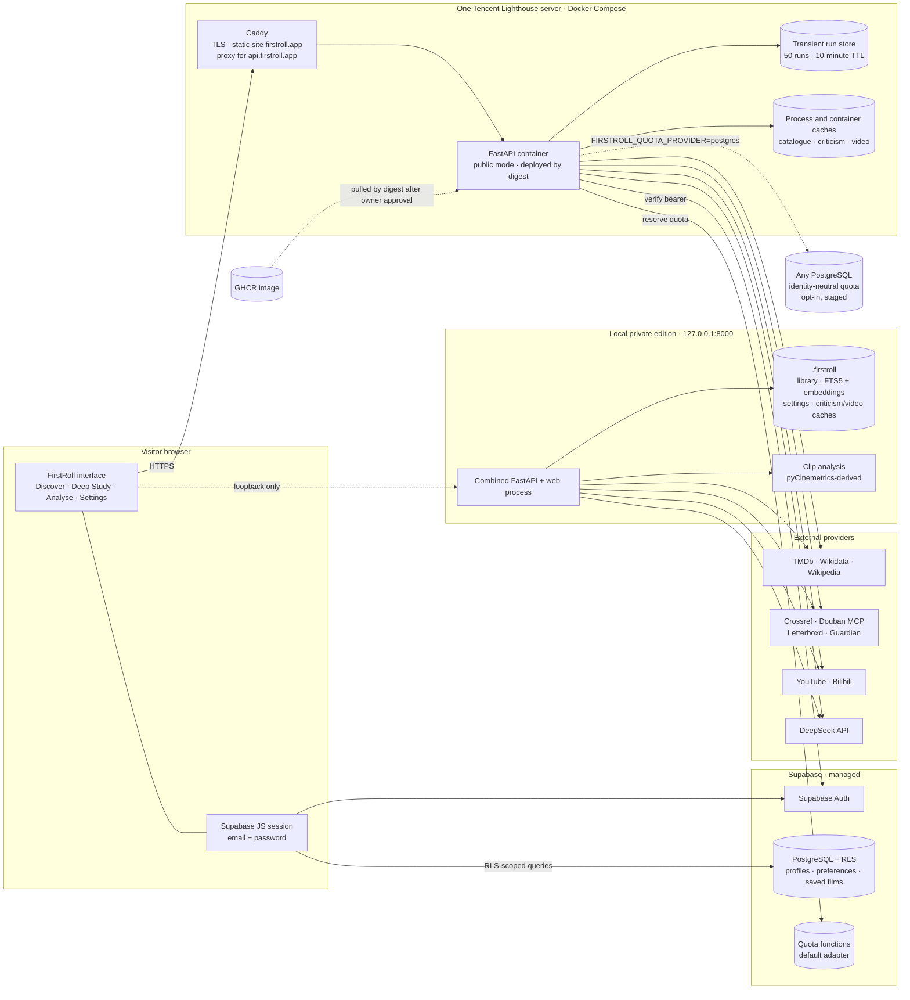
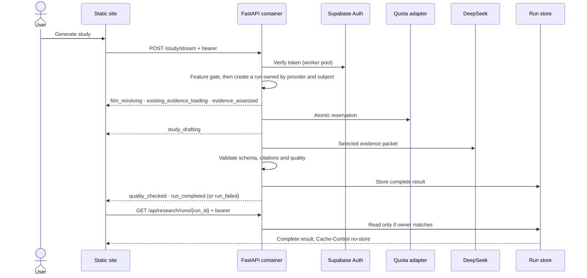

# FirstRoll Architecture

**Status:** current branch implementation · **Last reconciled:** 5 October 2026

Production remains v232 / `cf43ba57`. This branch retires Agent/Azure code but is not deployed.
The TypeScript migration and festival atlas from current master are preserved.

FirstRoll is an evidence-grounded film-study system built from one codebase into two runtimes: a
**local private edition** on the filmmaker's computer and a narrower **hosted public beta** on one
rented server. "Local-first" describes where private books, derived vectors, connector secrets and
uploaded clips live; it does not mean the product exists only on one computer.

This document owns topology, component boundaries, data flows, the evidence rules, the threat
model and the responsiveness design. Installation and verification commands are in
[Setup](SETUP.md); hosting, release and recovery procedure in [Operations](OPERATIONS.md) and the
[VPS stack](../infra/vps/README.md); schemas and provider sources in [Data](DATA.md); rationale in
[Decisions](DECISIONS.md); status and acceptance evidence in [Progress](PROGRESS.md).

## 1. Product Topology


```mermaid
flowchart LR
    subgraph Browser["Visitor browser"]
        UI["FirstRoll interface<br/>Discover · Deep Study · Analyse · Settings"]
        Session["Supabase JS session<br/>email + password"]
    end
    subgraph VPS["One Tencent Lighthouse server · Docker Compose"]
        Caddy["Caddy<br/>TLS · static site firstroll.app<br/>proxy for api.firstroll.app"]
        API["FastAPI container<br/>public mode · deployed by digest"]
        Runs[("Transient run store<br/>50 runs · 10-minute TTL")]
        HCache[("Process and container caches<br/>catalogue · criticism · video")]
    end
    subgraph Supa["Supabase · managed"]
        Auth["Supabase Auth"]
        AccountDB[("PostgreSQL + RLS<br/>profiles · preferences · saved films")]
        QuotaRPC[("Quota functions<br/>default adapter")]
    end
    PG[("Any PostgreSQL<br/>identity-neutral quota<br/>opt-in, staged")]
    subgraph Local["Local private edition · 127.0.0.1:8000"]
        LocalAPI["Combined FastAPI + web process"]
        Private[(".firstroll<br/>library · FTS5 + embeddings<br/>settings · criticism/video caches")]
        Clip["Clip analysis<br/>pyCinemetrics-derived"]
    end
    subgraph Providers["External providers"]
        Catalogue["TMDb · Wikidata · Wikipedia"]
        Criticism["Crossref · Douban MCP<br/>Letterboxd · Guardian"]
        Video["YouTube · Bilibili"]
        DeepSeek["DeepSeek API"]
    end
    GHCR[("GHCR image")]

    UI -->|"HTTPS"| Caddy --> API
    UI --- Session
    Session --> Auth
    Session -->|"RLS-scoped queries"| AccountDB
    API -->|"verify bearer"| Auth
    API -->|"reserve quota"| QuotaRPC
    API -.->|"FIRSTROLL_QUOTA_PROVIDER=postgres"| PG
    API --> Runs
    API --> HCache
    API --> Catalogue & Criticism & Video & DeepSeek
    GHCR -.->|"pulled by digest after owner approval"| API

    UI -.->|"loopback only"| LocalAPI
    LocalAPI --> Private
    LocalAPI --> Clip
    LocalAPI --> Catalogue & Criticism & Video & DeepSeek
```

| Component | Where it runs | Responsibility |
|---|---|---|
| DNS | Spaceship | Points `firstroll.app` and `api.firstroll.app` at the server; runs no application code |
| Server | Tencent Lighthouse, Singapore (sizing in [Operations](OPERATIONS.md)) | Runs the two production containers from `infra/vps` |
| Caddy | Container on the server, ports 80/443 | Certificates for both hostnames; serves `releases/current`; reverse-proxies the API without buffering SSE |
| Web interface | Static files from Caddy, executed in the browser | HTML, CSS and vanilla JavaScript plus the bundled Supabase client; no server-side rendering |
| FastAPI | Container on the same server; port 10000 on the internal network only | Provider calls, identity checks, evidence assembly, validation, quota ordering |
| Supabase | Managed service outside the server | Accounts, sessions, recovery; RLS-owned account rows; default quota functions |
| GitHub Actions and GHCR | GitHub | CI, release builds and the image registry; never the running backend |

Two hostnames are two browser origins on one machine: there is no second server, Kubernetes,
autoscaling or CDN. The browser learns the API origin at build time (`FIRSTROLL_API_BASE`); the API
accepts only the origins listed in `FIRSTROLL_CORS_ALLOWED_ORIGINS`. Releases are built by GitHub
Actions, stored in GHCR and deployed only after a human owner approves the protected `production`
environment; the procedure is in [Operations](OPERATIONS.md).

**Current enablement.** The diagram shows implemented capability, not what is switched on. At the
approved v219 launch, public mode is on, hosted Deep Study and clip analysis are off, and TMDb is
unconfigured, so the Wikidata/Wikipedia fallback serves search. [Operations](OPERATIONS.md) holds the
live status and [Progress](PROGRESS.md) the launch evidence and open acceptance items.

**Retired paths.** The Azure delivery path (Static Web Apps, Container Apps, Terraform and Entra
External ID) is retired and recoverable from tag `archive/azure`. The default-off research Agent
programme and its evaluation harnesses are parked under tag `archive/agent-programme`; it never had
an HTTP route. Neither is part of the running system.

| Layer | Stack |
|---|---|
| Browser | HTML5, CSS3, vanilla JavaScript; `@supabase/supabase-js` bundled with esbuild |
| API (hosted image: `Dockerfile`, `requirements-hosted.txt`) | Python 3.11, FastAPI, Pydantic, Uvicorn, PyPDF, NumPy, MCP client; `psycopg` for the PostgreSQL quota adapter; a Node 22 runtime for the bundled Douban MCP server |
| Local-only additions (`pyproject.toml`) | Sentence Transformers (`paraphrase-multilingual-MiniLM-L12-v2`) over SQLite FTS5; OpenCV, FFmpeg, TransNetV2, TensorFlow and Torchvision for clip analysis |
| Synthesis | DeepSeek chat completions in JSON mode with thinking disabled (`DEEPSEEK_MODEL`, code default `deepseek-v4-pro`) |

## 2. Runtime Modes

| Capability | Local private edition | Hosted public beta |
|---|---|---|
| Process | `uv run firstroll`: one process serving UI and API on `127.0.0.1:8000` | Caddy serves the static build; FastAPI runs with `FIRSTROLL_PUBLIC_MODE=true` |
| Generated API docs | `/docs`, `/redoc`, `/openapi.json` | Not registered (404); `/` returns a JSON service status |
| Film discovery | TMDb when `TMDB_BEARER_TOKEN` is set, otherwise Wikidata/Wikipedia | Same server-side policy; catalogue keys never reach the browser |
| Criticism and video | All adapters, local claim structuring, caches under `.firstroll/` | Public adapters and the image-bundled Douban MCP; no claim structuring; container-local caches |
| Theory evidence | Private hybrid retrieval over the local library | Four first-party framework passages (`public_study.py`) |
| Deep Study | Interface uses synchronous `POST …/study`; local DeepSeek key; no quota | Interface uses the SSE stream plus an owner-scoped result request; both study routes need a bearer, the feature gate and a quota reservation |
| Clip analysis | Enabled when the CV dependencies are installed | Returns 503 by default; the image lacks the dependencies |
| Identity and account state | Loopback development identity with browser-local profile, preferences and saved films; Supabase when configured | Supabase only; RLS-owned rows |

| Switch | Default | Effect |
|---|---|---|
| `FIRSTROLL_PUBLIC_MODE` | off | Selects the hosted boundary described below |
| `FIRSTROLL_DEEP_STUDY_ENABLED` | off | Hosted Deep Study gate; also needs configured Supabase auth, a configured quota adapter and a platform or personal DeepSeek key |
| `FIRSTROLL_VIDEO_ANALYSIS_ENABLED` | on locally, off in public mode | Clip-analysis gate |
| `FIRSTROLL_SERVE_HOSTED_FRONTEND` | off | Serves the hosted interface from FastAPI for an exact local production preview |
| `FIRSTROLL_PREWARM_EMBEDDINGS` | on (local only) | Loads the query encoder in the background at start-up |
| `FIRSTROLL_AUTH_PROVIDER` / `FIRSTROLL_QUOTA_PROVIDER` | `supabase` / `supabase` | Auth accepts only `supabase`; quota `postgres` selects the identity-neutral adapter (needs `FIRSTROLL_DATABASE_URL`) |

**HTTP boundary.** Public mode answers 404 on every local-only route (settings, library, claim
structuring) and does not register the generated docs; locally, the settings, library-management
and claim-structuring routes also require a loopback TCP client (403 otherwise). Hosted Deep Study
needs a verified bearer, the feature gate and a quota reservation, and a personal DeepSeek key
bypasses none of them; a personal YouTube key also needs a bearer; clip analysis returns 503 by
default. A fixed development token (unlimited, non-persistent quota) works only when both the
request URL host and the TCP peer are loopback, so it cannot pass through Caddy. Per-route access
classes and contracts are in [Data](DATA.md#3-http-api-reference).

## 3. Component Responsibilities

Backend modules (`app/backend`):

| Module | Responsibility | Does not own |
|---|---|---|
| `main.py` | HTTP boundary, mode gates, CORS, runtime `config.js`, bearer checks, ordering (auth → evidence → quota → model), worker-pool dispatch, error mapping | Provider parsing, evidence policy, quality rules |
| `auth.py` | `SupabaseAuthVerifier`: validates the bearer against Supabase `/auth/v1/user`, requires a UUID subject and the `authenticated` role | Passwords, sessions, account rows |
| `quota.py` | `SupabaseQuotaClient` (default RPC) and `PostgresQuotaClient` (identity-neutral); status and atomic reservation | Token verification, prompts, evidence |
| `settings.py`, `settings.html` | Connector catalogue and credential resolution: environment values first, then the local write-only store (`.firstroll/settings.json`, mode 0600); the local console page | Hosted secret storage, which is the server's `.env` |
| `tmdb_discovery.py` | TMDb search and hydration, director credits, IMDb/Wikidata bridges; `HybridDiscoveryService` routing and failover | Interpretation; silent choice between candidates |
| `discovery.py` | Key-free Wikidata/Wikipedia identity, overview reconciliation, related films and shelves | Critical interpretation, creator intention |
| `criticism.py` | Douban MCP, Letterboxd API and public web, Guardian public web and Crossref adapters; identity checks; review and claim models; `CriticismStore` | Direct film observation |
| `video_sources.py` | YouTube Data API and Bilibili discovery, classification, de-duplication, descriptions and captions; `FilmVideoStore` | Copyright adjudication; verified speaker identity |
| `library.py` | Private document catalogue and managed files (PDF, EPUB, Markdown, text) | Extraction, ranking |
| `library_index.py` | PDF-only chunking, FTS5, local embeddings, query planning, reciprocal-rank fusion, diversity, page citations, single-flight encoder warm-up; FTS-only fallback when embeddings are unavailable | Film-specific claims |
| `public_study.py` | Four first-party formal-analysis passages for hosted studies | Private books |
| `evidence.py` | Typed `EvidencePacket`: focus ranking, de-duplication, quotas, budgets, omission reasons, permitted claims and boundary statements | Model calls, provider access |
| `packet_quality.py` | Deterministic packet diagnostics: identity, citation readiness, provenance, duplication, relevance, class diversity, instruction-like text | Factual correctness; blocking generation |
| `study_service.py` | DeepSeek structured output, `GroundedStudy` schema, citation validation, `StudyQualityGate`, bounded retry or repair; review-claim structuring | Authentication, quota, transport retry |
| `study_observability.py` | `StudyTrace`: allow-listed stage timings, statuses, counts and token usage | Prompts, evidence, credentials, model output |
| `research_stream.py` | Fixed public SSE vocabulary; `StudyRunStore` (owner-scoped, 50 runs, 10-minute TTL) | Durable results, hidden reasoning |
| `analysis_pipeline.py`, `algorithms/` | Shot, scene, colour, object and shot-scale measurement derived from pyCinemetrics | Study evidence (no bridge yet) |

Other components:

| Component | Responsibility | Does not own |
|---|---|---|
| `app/web` | `index.html`, `styles.css`, `app.ts` and `src/` typed controllers/views/contracts; `auth.ts`, `integrations.ts`, `local-auth.ts`, startup scripts and `festivals.ts`. `config.js` is generated runtime/build data; browser assets are compiled JavaScript | Secrets, authorisation decisions, evidence validation |
| `supabase/migrations` | Account tables with RLS; quota functions in a revoked `firstroll_private` schema | Studies, prompts, evidence |
| `database/migrations` | Portable identity-neutral quota migration for any PostgreSQL; staged, not the production path | Bearer tokens, email |
| `Dockerfile`, `infra/vps`, `tools/frontend/build.sh`, `tools/release/`, `.github/workflows/` | Hosted image, server stack, static build, release receipts and verification, CI and the gated release | See [Operations](OPERATIONS.md) |

## 4. Core Data Flows

### Discovery and identity

```text
title / year / director query
→ HybridDiscoveryService: TMDb when configured, otherwise Wikidata/Wikipedia
→ TMDb /search/movie, then at most 8 candidates hydrated from the detail cache or by detail calls
  (4 concurrent, 10-second timeout each) with credits, external IDs, alternative titles and
  release dates appended
→ local title, year and director validation; open-catalogue failover if TMDb search fails
→ explicit user choice when more than one candidate remains
→ provider-qualified identity: tmdb:{id} or wikidata:{QID}
→ IMDb/Wikidata external-ID bridge for secondary providers
→ director shelf (TMDb person credits or the Wikidata relationship) and dossier
→ optional reception, criticism, video and related-film enrichment
```

Film identity is fixed before Deep Study; the model never chooses between same-title films. A
provider-local page found from a title is accepted only when its structured title, year and
director agree with the canonical record. Detail, related-film and reception caches are process
memory; search listings are not cached.

A versioned per-tab `sessionStorage` snapshot (≤ 500,000 bytes, ≤ 24 hours) holds the query,
candidate and shelf summaries and the open film ID, never dossier bodies, criticism, studies,
credentials or account data. A completed shelf restores without new requests; an interrupted one
reissues only its latest query. View switches preserve each view and its scroll position.

### Criticism and video enrichment

Each criticism provider is fetched on explicit selection and cached as a `CriticalResearchBundle`.
Review summaries enter the packet as attributed text. Structured critic claims exist only after the
local-only DeepSeek structuring route and survive a refresh when the review IDs are unchanged.
Video search combines YouTube (platform or personal key) with Bilibili public search; interviews,
video essays, lectures and behind-the-scenes items contribute their uploader description and up to
two text tracks. In the hosted container these JSON caches are server-wide (public-source text
only, no per-user content) and disappear whenever the container is recreated.

### Evidence packet

| Lane | IDs | Source | Bounds |
|---|---|---|---|
| Film record | — | Selected catalogue record, with its record, overview and crew sources | One record |
| Theory frameworks | `S1…` | Private hybrid retrieval (up to 10 passages) or the 4 first-party passages | ≤ 8 items; ≤ 3 per title; near-duplicates (≥ 0.92 similarity) dropped |
| Critic claims | `C1…` | Structured claims from cached criticism | ≤ 12 claims; ≤ 12,000 characters; ≤ 2 per source; near-duplicates (≥ 0.9) dropped |
| Attributed text | `E1…` | Review summaries, Crossref abstracts, video descriptions and captions | ≤ 12 items; ≤ 18,000 characters, ≤ 3,000 per item; ≤ 2 per origin, ≤ 4 per domain; same-type near-duplicates (≥ 0.9) dropped |

Selection is focus-ranked (attributed text also favours reviews behind selected claims, verified
creator statements and complete provenance); theory and attributed items under 40 characters are
dropped and every omission is counted by reason. The packet carries eight boundary statements
(section 5). The complete selected packet and its `packet_quality` diagnostics are returned with
the study; the prompt omits redundant fields and whitespace but hides nothing from inspection.
Retrieval and index details are in [Data](DATA.md#local-sqlite-retrieval-index).

### Deep Study synthesis (fixed workflow)

```text
selected film + optional focus question
→ cached criticism and video bundles
→ theory frameworks: private hybrid retrieval (local) or first-party passages (hosted)
→ EvidencePacket assembly
→ [hosted] atomic quota reservation
→ DeepSeek call 1: JSON object, thinking disabled, temperature 0.2, ≤ 3,200 completion tokens,
  90-second timeout
→ GroundedStudy schema + citation-ID + evidence-status validation
→ StudyQualityGate (deterministic)
→ at most one follow-up call (temperature 0):
    invalid draft (envelope, JSON, schema, citation or status) → one retry; a second failure,
      or a failed retry call, is an error
    quality not passed → one repair; an invalid or failed repair keeps the original draft
→ study + quality + selected packet + packet_quality + observability
```

`MAX_FIXED_STUDY_MODEL_CALLS = 2`. With no theory sources the study fails before any model call. A
transport failure on the first call is reported, never retried automatically. A `GroundedStudy` has
four to six sections, each labelled `viewing_hypothesis`. The gate scores every section for generic
language, a missing or non-causal mechanism, unobservable verification, unexplained critic citations
and uncalibrated hypotheses. It passes only when the overall score is at least 0.75, every section
scores at least 0.6, no section lacks a mechanism and the central argument makes no unhedged claim
about unseen form; otherwise the result is returned with quality status `insufficient_evidence`. A
shared `StudyTrace` spans route, caches, retrieval, packet and synthesis.

### Hosted progress and result delivery


```mermaid
sequenceDiagram
    actor User
    participant Web as Static site
    participant API as FastAPI container
    participant Auth as Supabase Auth
    participant Quota as Quota adapter
    participant Model as DeepSeek
    participant Runs as Run store

    User->>Web: Generate study
    Web->>API: POST /study/stream + bearer
    API->>Auth: Verify token (worker pool)
    API->>API: Feature gate, then create a run owned by provider and subject
    API-->>Web: film_resolving · existing_evidence_loading · evidence_assessed
    API->>Quota: Atomic reservation
    API-->>Web: study_drafting
    API->>Model: Selected evidence packet
    API->>API: Validate schema, citations and quality
    API->>Runs: Store complete result
    API-->>Web: quality_checked · run_completed (or run_failed)
    Web->>API: GET /api/research/runs/{run_id} + bearer
    API->>Runs: Read only if owner matches
    Runs-->>Web: Complete result, Cache-Control no-store
```

Authentication precedes run creation, evidence precedes quota and quota precedes generation. Events
carry only the run ID, an allow-listed kind, sequence, fixed message, elapsed time and allow-listed
counts; failures map to fixed variants (`film_missing`, `quota_exhausted`, `quota_unavailable`,
`invalid_study`, `safe_stop`, `disconnected`). The full event vocabulary, including kinds that are
reserved but not emitted, is in [Data](DATA.md#deep-study). The result request re-authenticates:
another owner's, an unknown or an expired run returns 404, a running one 409 and a failed one 502.
Allowance reserved before a provider failure stays consumed, so retries cannot become an unbounded
cost path.

### Clip analysis (local edition)

```text
browser upload → temporary file → metadata, shots (TransNetV2), scenes, colour, objects, shot scale
→ JSON response; frames and CSVs under the Git-ignored img/<file stem>/ → temporary upload removed
```

Measurements do not yet enter the evidence packet, so film-form statements remain viewing
hypotheses.

## 5. Evidence and Reliability Rules

### Browser module and build boundary

`app.ts` is a 64-line composition root; `src/context.ts` assembles state and `src/bootstrap.ts`
wires handlers. Feature controllers own request IDs, cancellation and mutation; views render
escaped markup. Consumed API/account JSON passes runtime decoders before entering typed state.
`tools/frontend/build.cjs` runs strict checking and bundles the same entries for localhost,
Docker and hosted releases. Source is TypeScript; the browser receives JavaScript. Entra is no
longer an entry, dependency, loader branch or supported API provider. Supabase and the strictly
loopback-only development adapter remain. See [Frontend Guide](FRONTEND_GUIDE.md).

`festivals.ts` mounts typed catalogue, date/projection and controller modules. The inline land
outline needs no tile server or token. The map, calendar, filter and zoom preserve the festival
feature shipped in v232; approximate annual windows do not establish confirmed edition dates.

Typed evidence separation is the governing product rule: every item states what it is and what it
may support.

| Evidence type | Produced from | May support | Never treated as |
|---|---|---|---|
| `film_record` | Catalogue record | Identity, credits, attributed overview | Interpretation or intention |
| `theory_framework` | Private books or first-party passages | Defining a concept; motivating a viewing question | A description of this film |
| `critic_reported` | Review summaries and structured claims | The attributed critic's interpretation; details to verify | Direct observation |
| `scholarly_abstract` | Crossref abstracts | What the publication claims | Film observation or the full paper |
| `video_context` | Uploader descriptions; captions without verified speakers | How a resource presents itself; what its text says | A transcript or a verified speaker |
| `creator_stated` | Captions whose speaker is verified | An attributed creator statement | — no adapter verifies speakers yet, so this lane is empty |
| `film_observed`, `model_hypothesis` | Reserved types | — | Not produced; `film_observed` awaits the clip bridge |

| # | Rule | Enforcement in code |
|---|---|---|
| 1 | Catalogue sources establish identity and attributed context, not intention | Separate `film_record`; packet boundary statements |
| 2 | A critic claim reports that critic's interpretation | `critic_reported` status; section `critic_reports` field; gate flags unexplained critic citations |
| 3 | A theory passage supplies a framework; it does not describe the film | Boundary statement; `theory_explains` field |
| 4 | Without clip evidence, formal claims remain conditional viewing hypotheses | Every section is `viewing_hypothesis`; the gate blocks an unhedged central claim of unseen form |
| 5 | Creator intention requires an attributable creator statement | Required `creator_intent_boundary`; `creator_stated` only from verified speakers |
| 6 | The model may cite only identifiers supplied in its request | Unknown `S*`, `C*` or `E*` IDs fail validation |
| 7 | Missing evidence yields a verification task or an insufficient-evidence result, not invention | Required per-section `verify` task; no theory, no call; `insufficient_evidence`; counted omissions; `film_specific_evidence_sparse` |
| 8 | Retrieved instructions are untrusted data and cannot authorise tools or change policy | Boundary statement; no tools in the fixed workflow; instruction-pattern diagnostics; escaped rendering |

## 6. Trust, Privacy and Threat Model

### Trust boundaries

| Boundary | Allowed to cross | Must not cross |
|---|---|---|
| Browser → hosted API | Search terms, film ID, focus, bearer, optional personal DeepSeek/YouTube key header | Local books, vectors, connector secrets, clips |
| Browser → Supabase | Credentials, session, RLS-scoped account rows (publishable key) | Service-role key; other users' rows |
| API → Supabase Auth | Bearer and publishable key | Prompts, evidence, study text |
| API → Supabase quota RPC (default) | The visitor's bearer, so `auth.uid()` names the caller | Prompts, evidence, study text, service-role key |
| API → PostgreSQL quota adapter (opt-in) | Verified provider and immutable subject over a backend-only connection | Bearer token, email, prompts, evidence |
| Study service → DeepSeek | Selected packet records, focus and schema instructions | Complete library, file paths, clips, hidden state |
| SSE → browser | Fields listed in section 4 | Prompts, keys, review bodies, passages, model output, exception text |
| Observability log | Stage names, durations, statuses, bounded counts, token usage | Prompts, evidence, credentials, model output |
| Local API → disk | `.firstroll/` documents, index, settings and caches; `img/` outputs | Git: both are ignored |
| Build context → image | `Dockerfile`, `requirements-hosted.txt`, `app/` (allow-list `.dockerignore`) | `.firstroll`, keys, any other local file |

### Assets

- Operator secrets (provider keys, optional `FIRSTROLL_DATABASE_URL`, deploy SSH key) and the paid
  model allowance they unlock.
- Supabase account data and transient hosted study results.
- Local private material: books, index, vectors, connector secrets, caches and clips.
- Release integrity: the approval decision, the sealed receipt and the deployed image digest.

### Application threats and controls

| Threat | Implemented control | Residual risk |
|---|---|---|
| Retrieved text injects instructions | Boundary statement in every packet; no tool access in the fixed workflow; JSON schema and citation validation; instruction-pattern diagnostics; escaped rendering and `http(s)`-only links | Lexical detection is heuristic; prose can still be influenced |
| Reading another account's study | Runs keyed to `provider:subject`; result request re-authenticates; foreign and unknown runs both 404; `no-store` | — |
| Unbounded paid spend | Feature gate; reservation before the model call (3 per account and 30 overall per UTC day, advisory lock), which a personal key does not bypass; ≤ 2 calls, ≤ 3,200 completion tokens each | Reserved allowance stays spent on failure; browser abort does not stop backend work; the quota counts studies, not tokens |
| Provider keys reach the browser | Server-side keys only; the build publishes API base, Supabase URL and publishable key; settings API is write-only and unpublished in public mode | — |
| Visitor key misuse or retention | Tab memory only, cleared on refresh or sign-out, never stored server-side; strict 16–512-character syntax; personal keys require a bearer in hosted mode | A compromised page script could read tab memory |
| Development identity used in production | Token accepted only with loopback URL host and peer; empty test email in the production build | Anyone on a computer running the local edition can use it, by design |
| Cross-origin abuse | Exact-origin CORS, no credentials mode, bearer headers rather than cookies | — |
| Surface discovery | Generated docs not registered; private routes 404 | `/api/contract` still lists local route names |
| Account rows exposed | RLS `auth.uid() = user_id`; no `anon` privileges; quota tables in a revoked schema behind `security definer` functions | Depends on Supabase configuration staying intact |
| Private material leaves the device | Only selected excerpts reach DeepSeek; `.firstroll` ignored; allow-list build context | Selected excerpts do reach an external provider |
| Host or container compromise | `no-new-privileges` on both containers; the API also drops all capabilities, has a 768 MB default memory limit and publishes no port; `ufw`, key-only SSH, unattended security updates | The API runs as root inside its container; the Docker group is root-equivalent |

### Release-path threats and controls

The release mechanics are in [Operations](OPERATIONS.md); this table records only the security
reasoning. GitHub and GHCR are trusted platforms; application evidence and visitor input carry no
deployment authority.

| Threat | Implemented control | Residual risk |
|---|---|---|
| Pull-request code obtains production access | PR CI receives no deploy credential; a release starts only after successful push CI on `master` for that exact commit; the build job, receipt and artefact carry no production credential | A malicious change merged to `master` affects later runs; review remains essential |
| Release runs before configuration is complete | `VPS_RELEASE_ENABLED` gate; the deploy job checks every required setting before writing the key | An enabled but misconfigured workflow fails noisily |
| Deploy key leaks | Dedicated Ed25519 key stored only as a `production` environment secret (and on the operator's machine); written to the runner after receipt, archive and current-`master` checks; `IdentitiesOnly` | Long-lived and root-equivalent on the host until rotated |
| Runner redirected to another host | `known_hosts` pinned to `VPS_SSH_HOST_KEY` with `StrictHostKeyChecking yes` | As trustworthy as repository administration |
| Image or archive substituted | Receipt binds commit, run, image digest and site inventory; pull by digest; archive extracted with Python's `data` filter and checked against the receipt | The build job's `packages: write` token could publish other tags, which no receipt references |
| Owner approves the wrong run | The job summary shows release ID, commit, image digest, site fingerprint and expiry | Human error; compare SHA and digest before approving |
| Stale approval deploys old code | Seven-day approval window; current `master` rechecked after approval; active releases are never cancelled | Administrator force-pushes invalidate assumptions |
| Deploy runner executes untrusted code | No application checkout; only `tools/release/protocol.py` and `vps.py` fetched from the approved commit | Workflow YAML comes from the approved commit, so workflow changes need careful review |
| Server scripts drift | `deploy.sh`, `Caddyfile` and `docker-compose.yml` reinstalled from the approved run's artefact on every release | They are not hashed in the receipt, so artefact integrity is trusted; a root-level host compromise controls everything on it |
| Broken release | Site switches only after `/api/health` reports the baked commit; live checks of receipt, files, identity, hidden docs and CORS; automatic rollback | Rollback needs the previous image and site; v219 had none |
| Approval bypassed | Protected environment with a required human reviewer | Administrators can alter environment policy |
| Host unavailable | `restart: unless-stopped`, provider uptime | Single point of failure; no failover; the Compose health check does not restart an unhealthy API |

### Not yet implemented

- Container vulnerability scanning, SBOM generation and signed attestations (receipt hashes are not
  signed supply-chain evidence).
- Durable export of deployment audit events; GitHub history and host `state/` records are the trail.
- Rate limiting or admission control on public API routes.
- Synthetic monitoring beyond the release-time HTTP checks, and a live rollback drill.
- Off-host backup of the server's `.env`, releases and TLS state.

These gaps must stay visible and must never be described as passing controls.

The `.pi` directory configures the developer's Pi coding harness, not a product capability: its
subagents are absent from the web build, backend and API. Their prompts exclude `.firstroll` and
other private material, a prompt-level control rather than a sandbox
([FirstRoll Pi subagents](../.pi/README.md)).

## 7. Web Responsiveness

Design rules, preserving the request, evidence and release contracts above:

- Synchronous catalogue, status and cache reads inside async reception and criticism handlers,
  library upload and rebuild metadata, and SSE bearer and platform-key checks run on Starlette's
  shared worker pool; plain synchronous routes already do. Authentication is never cached.
- A dossier's browser requests share its lifetime: closing it, choosing another film or searching
  again aborts its detail, reception, video and criticism fetches, and identity checks discard late
  responses, errors and focus changes.
- Deep Study sets its busy state and **Stop waiting** action before awaiting the token; repeated
  clicks cannot overlap, and cancellation during authentication sends no study request.
- The shared compiler bundles strict TypeScript entries into readable local or minified hosted
  JavaScript, keeping classic-script globals, fixed filenames and revalidation; CSS is minified too.

**Measured evidence (12 September 2026 checkpoint, synthetic, not production latency):**

- `tests/test_api_responsiveness.py`: 34 same-event-loop tests hold a blocking call until
  `/api/health` completes; a watchdog turns a loop stall into a failure.
- `tests/web/responsiveness.test.cjs`: 27 Node request and race tests, run by the Python suite and
  passed against the minified build at the checkpoint; the fake transport ignores abort signals to
  prove stale-response protection independently.
- Asset sizes against baseline `40577ca5`:

| Asset | Baseline bytes | Candidate bytes | Baseline gzip | Candidate gzip |
|---|---:|---:|---:|---:|
| `app.js` | 154,709 | 115,716 | 36,319 | 31,176 |
| `styles.css` | 95,119 | 80,486 | 17,000 | 15,733 |

- `tools/frontend/check-responsiveness.cjs` (optional browser diagnostic; starts no backend and fulfils
  or blocks every page request, but is no OS-level sandbox). Chrome 152, 4× CPU throttle, 390 px
  and 1440 px, twenty interactions each, synthetic 500 ms token delay: median click-to-busy fell
  from about 502 ms to 0.4–0.8 ms; a two-frame paint proxy (not INP) from about 511 ms to 27–28 ms;
  forty cancellations before token readiness sent zero study requests; no page errors or horizontal
  overflow. The report is kept at `evals/results/web-responsiveness-2026-09-12.json` in tag
  `archive/agent-programme`.

The commands that reproduce these checks are in [Setup](SETUP.md#development-and-verification).

**Known limits.** Browser abort cannot stop provider work already running, and quota may still be
consumed. The worker pool is finite and untested under saturation; admission control would need its
own design. Local clip analysis runs synchronously on the event loop, and its outputs share
per-file-stem paths, so a bounded serial worker needs its own review. Supabase token readiness still
waits for account-data hydration. Live search → shelf → dossier → reception profiling is
outstanding; see [Progress](PROGRESS.md).

## 8. Availability and State

- One API container runs continuously (no cold start, no autoscaling); each release recreates it,
  so the API pauses briefly while Caddy keeps serving the static site.
- Optional providers fail independently, reducing evidence coverage without breaking identity.
- A transaction-scoped advisory lock stops concurrent reservations exceeding either quota limit.
- The run store suits one process only: no horizontal scaling and no resumable work.

Only Supabase state is durable product data for the hosted beta. Process memory (study runs,
catalogue, related-film and reception caches) is lost on restart, and the container-local criticism
and video caches on every release. The complete storage inventory and lifecycle rules are in
[Data](DATA.md#2-data-model); hosting constraints, including Supabase availability, are in
[Operations](OPERATIONS.md#12-cost-availability-and-known-constraints).

Durable study history, persistent projects and a clip-to-study bridge are not implemented.

## 9. Configuration Boundaries

| Setting class | Examples | Placement |
|---|---|---|
| Public static build values | `FIRSTROLL_API_BASE`, `FIRSTROLL_SUPABASE_URL`, `FIRSTROLL_SUPABASE_PUBLISHABLE_KEY` | `VPS Release` build job; baked into `config.js` |
| Hosted public configuration | `FIRSTROLL_PUBLIC_MODE`, `FIRSTROLL_CORS_ALLOWED_ORIGINS`, `FIRSTROLL_DEEP_STUDY_ENABLED`, `FIRSTROLL_VIDEO_ANALYSIS_ENABLED`, `SUPABASE_URL`, `SUPABASE_PUBLISHABLE_KEY`, `FIRSTROLL_AUTH_PROVIDER`, `FIRSTROLL_QUOTA_PROVIDER` | `/opt/firstroll/.env` on the server |
| Hosted secrets | `DEEPSEEK_API_KEY`, `YOUTUBE_API_KEY`, `TMDB_BEARER_TOKEN`, optional `FIRSTROLL_DATABASE_URL` | `/opt/firstroll/.env` (mode 0600) only |
| Release settings | `VPS_SSH_PRIVATE_KEY`; `VPS_HOST`, `VPS_SSH_HOST_KEY`, `VPS_USER`, `VPS_RELEASE_ENABLED` | GitHub `production` environment secret; repository variables |
| Local private paths | `FIRSTROLL_LIBRARY_PATH`, `FIRSTROLL_LIBRARY_MANIFEST`, `FIRSTROLL_LIBRARY_INDEX`, `FIRSTROLL_SETTINGS_PATH` | Local environment; defaults under `.firstroll/` |
| Local optional credentials | DeepSeek, TMDb, YouTube, Douban cookie, Letterboxd OAuth | Local Settings page or local environment |

Complete variable lists and setup steps are in [Setup](SETUP.md) and [Operations](OPERATIONS.md).
