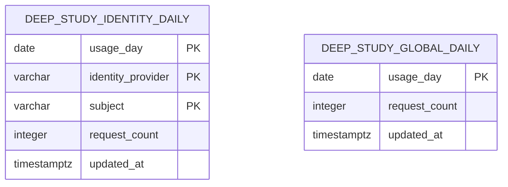

# FirstRoll Data Model

**Status:** Current implementation and staged identity-neutral migration
**Last reconciled:** 21 August 2026

FirstRoll deliberately uses different stores for different privacy and durability requirements. The
hosted edition persists account identity, profile, preferences, saved films and quota counters in Supabase. The replacement
quota model is ordinary PostgreSQL and keys usage by identity provider plus immutable subject, so
it can work with either Supabase Auth or Entra External ID. The local edition persists private
books, derived search data, connector settings and acquired research under `.firstroll/`.
Film discovery caches and current hosted study results are process memory. The browser keeps one
bounded Discover workspace in per-tab session storage solely to survive view changes and refresh.

## Storage Inventory

| Store | Runtime | Durable | Contains | Excluded from Git |
|---|---|---:|---|---:|
| Supabase Auth | Hosted | Yes | User identity and session state managed by Supabase | Not applicable |
| Supabase Postgres public account tables | Hosted | Yes | RLS-owned profile, preferences and saved film records | Not applicable |
| Supabase Postgres private schema | Hosted | Yes | Daily per-user and global Deep Study counters | Not applicable |
| Generic PostgreSQL private schema | Hosted, staged | Yes | Daily provider/subject and global Deep Study counters | Not applicable |
| `.firstroll/library.sqlite3` | Local | Yes | Extracted chunks, FTS5 index, float32 embeddings and index metadata | Yes |
| `.firstroll/library/` | Local | Yes | Managed private document files | Yes |
| `.firstroll/library.json` | Local | Yes | Registered paths and managed-file exclusions | Yes |
| `.firstroll/settings.json` | Local | Yes | Optional connector secrets not supplied by environment | Yes |
| `.firstroll/criticism/*.json` | Local | Yes | Attributed provider reviews and structured critic claims | Yes |
| `.firstroll/videos/*.json` | Local | Yes | Accepted video catalogue, descriptions and available captions | Yes |
| Discovery/reception dictionaries | Local and hosted | No | TMDb or Wikidata/Wikipedia details, related-film and reception cache | In memory only |
| Browser `sessionStorage` | Local and hosted browser | Per tab, ≤24 hours | Public Discover query/candidates/shelf, active product view, scroll offsets and optional dossier film ID | Not applicable; browser-managed |
| `StudyRunStore` | Hosted | No | Owner UUID, status and final study for a maximum of ten minutes | In memory only |

## Per-tab Discover continuity

`firstroll.discovery-session` is a versioned browser snapshot capped at 500 KB. It stores only the
current public query, at most twenty candidate summaries, twelve director-film summaries, ten nearby
summaries, shelf state and an optional canonical film ID for reopening a dossier. The companion
`firstroll.product-session` record stores the active product view and three scroll offsets. Both use
`sessionStorage`, not account tables or `localStorage`.

The browser rejects snapshots with the wrong schema, malformed film identity, excessive age or an
oversized serialised body. Completed shelves restore without provider requests; a refresh during an
in-flight search reissues the latest query. Dossier content, reviews, criticism, study output,
credentials, authentication tokens and account records are excluded. The records disappear with the
tab session and are not cross-device persistence.

## Supabase Postgres

Migrations:

- `supabase/migrations/202608150001_deep_study_quotas.sql`
- `supabase/migrations/202608200002_persistent_accounts.sql`

Supabase Auth owns credentials and identity in `auth.users`. FirstRoll does not duplicate passwords
or email addresses. Public application tables and the legacy private quota table reference the
stable Auth UUID.

```mermaid
erDiagram
    AUTH_USERS ||--|| FIRSTROLL_PROFILES : "user_id"
    AUTH_USERS ||--|| FIRSTROLL_PREFERENCES : "user_id"
    AUTH_USERS ||--o{ FIRSTROLL_SAVED_FILMS : "user_id"
    AUTH_USERS ||--o{ DEEP_STUDY_USER_DAILY : "user_id"

    AUTH_USERS {
        uuid id PK
    }

    FIRSTROLL_PROFILES {
        uuid user_id PK_FK
        text display_name
        timestamptz created_at
        timestamptz updated_at
    }

    FIRSTROLL_PREFERENCES {
        uuid user_id PK_FK
        text theme
        boolean shelf_motion
        timestamptz created_at
        timestamptz updated_at
    }

    FIRSTROLL_SAVED_FILMS {
        uuid id PK
        uuid user_id FK
        text film_id UK
        text title
        smallint release_year
        text director
        text poster_url
        timestamptz created_at
        timestamptz updated_at
    }

    DEEP_STUDY_USER_DAILY {
        date usage_day PK
        uuid user_id PK_FK
        integer request_count
        timestamptz updated_at
    }

    DEEP_STUDY_GLOBAL_DAILY {
        date usage_day PK
        integer request_count
        timestamptz updated_at
    }
```

### Public account tables

`firstroll_profiles` and `firstroll_preferences` have one row per Auth user.
`firstroll_saved_films` has a unique `(user_id, film_id)` constraint, where `film_id` is the
canonical discovery identity rather than a mutable title. The saved record contains only enough
display metadata to render an account library without repeating discovery immediately.

All three tables enable row-level security. `anon` has no privileges. The authenticated role has
only the operations needed by the UI, and every policy constrains old and new rows with
`(select auth.uid()) = user_id`. An indexed `user_id, created_at desc` path supports each account's
saved-film list. A small security-definer trigger creates profile and preference rows after Auth
sign-up; the migration also backfills existing users.

Deleting an Auth account cascades all three application records. Passwords remain in Supabase Auth.
Personal DeepSeek/YouTube keys, prompts, evidence and generated studies are explicitly excluded
from these tables.

### `firstroll_private.deep_study_user_daily`

One row represents one authenticated account's reserved Deep Study calls for one UTC day.

| Column | Type | Null | Default | Key/constraint | Meaning |
|---|---|---:|---|---|---|
| `usage_day` | `date` | No | — | Composite primary key | UTC quota day |
| `user_id` | `uuid` | No | — | Composite primary key; FK → `auth.users(id)` with `ON DELETE CASCADE` | Authenticated account |
| `request_count` | `integer` | No | `0` | `CHECK (request_count >= 0)` | Reservations consumed that day |
| `updated_at` | `timestamptz` | No | `now()` | — | Last reservation update |

The composite primary key provides the lookup index used by status and reservation functions. No
email address, prompt, film ID, evidence or study text is stored.

### `firstroll_private.deep_study_global_daily`

One row represents all reserved public-demo Deep Study calls for one UTC day.

| Column | Type | Null | Default | Key/constraint | Meaning |
|---|---|---:|---|---|---|
| `usage_day` | `date` | No | — | Primary key | UTC quota day |
| `request_count` | `integer` | No | `0` | `CHECK (request_count >= 0)` | Reservations consumed across every account |
| `updated_at` | `timestamptz` | No | `now()` | — | Last reservation update |

### RPC dictionary

| Function | Volatility | Caller | Side effect | Return |
|---|---|---|---|---|
| `public.deep_study_quota_status()` | `STABLE` | `authenticated` only | None | JSONB allowance, reason, account/global counts and next UTC reset |
| `public.reserve_deep_study_quota()` | `VOLATILE` | `authenticated` only | Atomically increments both rows when allowed | Same JSONB contract after the decision |

`reserve_deep_study_quota()` obtains a transaction-scoped advisory lock derived from the UTC day
before checking and incrementing. This serialises concurrent reservations across both tables and
prevents either limit being exceeded by a race. Current constants are three requests per account per
UTC day and thirty across the public demo.

Both tables have row-level security enabled and all direct table privileges are revoked from
`public`, `anon` and `authenticated`. The functions are `SECURITY DEFINER`, set an empty
`search_path`, derive the user with `auth.uid()` and expose execute permission only to
`authenticated`. FirstRoll does not require a Supabase service-role key.

## Identity-neutral PostgreSQL quota store

Migration: `database/migrations/202608200001_identity_neutral_deep_study_quotas.sql`

This is the target quota boundary. It can run on the existing Supabase PostgreSQL database first and
later on Azure Database for PostgreSQL without changing the application contract. FastAPI validates
the browser's access token, extracts the provider and immutable subject, and passes only those two
values to PostgreSQL through a backend-only connection. The bearer token never reaches the quota
database.



`firstroll_private.deep_study_quota_decision(provider, subject, reserve)` returns the same JSONB
contract as the legacy RPC. When `reserve` is true, a transaction-scoped advisory lock serialises
the account and global increments. The schema stores no email, bearer token, prompt, film, evidence
or generated study.

The database login should be a dedicated `firstroll_backend` role with only schema usage and execute
permission on the `SECURITY DEFINER` function. It does not require direct table permissions. Its
connection URL is an Azure Container Apps secret selected with
`FIRSTROLL_QUOTA_PROVIDER=postgres`; it must never enter the static frontend.

The old Supabase RPC and tables remain temporarily for rollback. Their current-day counts are not
automatically copied because the quota window resets every UTC day. Once the generic store has run
successfully through a complete quota day, the visitor-token adapter can be removed.

## Local SQLite Retrieval Index

Default path: `.firstroll/library.sqlite3`  
Override: `FIRSTROLL_LIBRARY_INDEX`

The index is rebuilt into `.building.sqlite3`, closed, changed to mode `0600` and atomically renamed
over the live file. This prevents readers from observing a partially built schema.

```mermaid
erDiagram
    CHUNK_RECORDS ||--o| EMBEDDINGS : "chunk_id"
    CHUNK_RECORDS ||--|| CHUNKS_FTS5 : "chunk_id"

    CHUNK_RECORDS {
        text chunk_id PK
        text document_id
        text title
        integer page
        text section
        text topics
        text language
        integer token_count
        text text
    }

    EMBEDDINGS {
        text chunk_id PK_FK
        integer dimension
        blob vector
    }

    INDEX_META {
        text key PK
        text value
    }
```

### `chunk_records`

| Column | SQLite type | Key | Meaning |
|---|---|---|---|
| `chunk_id` | `TEXT` | Primary key | Stable hash of document ID, page and normalised chunk text |
| `document_id` | `TEXT` | — | Stable local document identifier |
| `title` | `TEXT` | — | Cleaned document title used in citations |
| `page` | `INTEGER` | — | One-based PDF page number |
| `section` | `TEXT` | — | Locally inferred section heading, when available |
| `topics` | `TEXT` | — | Pipe-separated catalogue topics |
| `language` | `TEXT` | — | Detected language code |
| `token_count` | `INTEGER` | — | Chunk token estimate used by the chunking policy |
| `text` | `TEXT` | — | Extracted private chunk body |

### `chunks` FTS5 virtual table

| Field | Indexed | Meaning |
|---|---:|---|
| `chunk_id` | No | Join key to `chunk_records` |
| `document_id` | No | Document identity |
| `title` | No | Citation title |
| `page` | No | Page locator |
| `section` | No | Section context |
| `topics` | No | Catalogue topics |
| `text` | Yes | Lexical search body |

Tokenizer: `porter unicode61`. Retrieval uses BM25 candidates per planned query and reciprocal-rank
fusion rather than treating the raw BM25 value as an absolute relevance score.

### `embeddings`

| Column | SQLite type | Key/constraint | Meaning |
|---|---|---|---|
| `chunk_id` | `TEXT` | Primary key; FK → `chunk_records(chunk_id)` | One vector per chunk |
| `dimension` | `INTEGER` | — | Vector length used for validation |
| `vector` | `BLOB` | — | NumPy `float32` bytes generated locally |

The default model is `sentence-transformers/paraphrase-multilingual-MiniLM-L12-v2`. Embeddings are
optional and can be disabled with `FIRSTROLL_EMBEDDINGS=0`; lexical FTS retrieval remains available.

### `index_meta`

| Key | Meaning |
|---|---|
| `built_at` | UTC ISO-8601 build time |
| `schema_version` | Compatibility gate read by `LocalLibraryIndex.status()` |
| `chunking_version` | Chunk algorithm version |
| `embedding_model` | Local encoder name, or an empty value when embeddings were disabled |

## Local JSON and File Stores

### Library manifest

Default path: `.firstroll/library.json`

| Field | Type | Meaning |
|---|---|---|
| `documents` | array of absolute path strings | User-registered documents outside the managed library |
| `excluded_documents` | array of absolute path strings | Managed documents hidden from the catalogue without deleting the source file |

Managed uploads are copied into `.firstroll/library/`, limited to 500 MB each, written through a
temporary file and set to mode `0600`. API catalogue responses expose stable IDs, cleaned titles,
formats, sizes, topics and source kind, never file paths or document contents.

### Local connector settings

Default path: `.firstroll/settings.json`

This object may contain local secret values such as `deepseek_api_key`, `douban_cookie`,
`letterboxd_client_id`, `letterboxd_client_secret` and `youtube_api_key`. Environment variables take
precedence. The directory is mode `0700`, the file is mode `0600`, writes use atomic replacement and
API responses return only configured state, source and a masked hint.

### Criticism bundle

Default directory: `.firstroll/criticism/`  
File key: sanitised film ID plus provider

| Field | Type | Meaning |
|---|---|---|
| `film_id` | string | Provider-qualified FirstRoll identity, currently `tmdb:{id}` or `wikidata:{QID}` |
| `provider` | string | Normalised provider name |
| `provider_film_id` | string | Matched provider identity |
| `provider_film_title` | string | Provider title used for human verification |
| `fetched_at` | ISO-8601 string | Acquisition time |
| `reviews` | `ReviewSource[]` | Attributed title, author, URL, language, rating label and bounded summary |
| `claims` | `CriticalClaim[]` | Optional DeepSeek-structured secondary claims with provenance |
| `claim_status` | `pending | structured` | Whether the cached raw reviews have been structured |
| `notice` | string | Provider/evidence boundary shown to the user |

Pydantic models reject extra fields. Files are written atomically with mode `0600`.

### Video bundle

Default directory: `.firstroll/videos/`  
File key: sanitised film ID

| Field | Type | Meaning |
|---|---|---|
| `film_id` | string | Canonical film identity |
| `query` | string | Search query used for the catalogue |
| `fetched_at` | ISO-8601 string | Last merged search time |
| `videos` | `FilmVideo[]`, maximum 48 | Deduplicated YouTube/Bilibili resources |
| `providers` | string array | Providers contributing accepted results |
| `notice` | string | Limitations and merge summary |

Each video records platform ID, title, creator, description, canonical and embed URLs, optional
thumbnail/published time/duration, category, relevance and up to three text tracks. Text tracks are
bounded to 12,000 characters and retain language, source URL and `speaker_verified`; unverified
captions cannot establish creator intention.

## Process-Memory Records

### `StudyRunStore`

| Field | Type | Meaning |
|---|---|---|
| Run key | UUID string | Opaque ID returned in `X-FirstRoll-Run-ID` |
| `owner_id` | `provider:subject` string | Required again when reading the result; prevents cross-provider identifier collisions |
| `created_at` | monotonic process time | TTL calculation only |
| `status` | `running | complete | failed` | Current terminal state |
| `result` | object or null | Complete study; never placed in SSE |
| `public_error` | allow-listed string or null | Redacted error safe for the owner |

The store has a ten-minute TTL and a maximum of 50 entries. On overflow it evicts the oldest entry.
It is intentionally not a database and cannot support multiple API instances, process restarts or
resumable Agent threads.

### Discovery and reception caches

TMDb and Wikidata/Wikipedia details, related-film results and reception summaries are cached in
dictionaries for process lifetime. They are accelerators, not records of truth, and are repopulated
after restart. TMDb records retain external IMDb and Wikidata IDs for cross-provider reconciliation;
the provider-qualified FirstRoll ID remains the cache and downstream-bundle key.

## Data-Lifecycle Rules

1. Never commit `.firstroll`, private books, extracted text, embeddings, provider caches, cookies,
   API keys or uploaded clips.
2. Quota PostgreSQL stores provider, subject, UTC day and counters only; it does not store emails,
   bearer tokens, prompts or generated studies.
3. Azure Container Apps' filesystem is ephemeral and must not be treated as durable application storage.
4. Private local files use restrictive modes and atomic replacement where practical.
5. Schema changes require a new PostgreSQL migration or a bumped local index `schema_version`.
6. A new persisted field must document its owner, retention, privacy class and deletion behaviour in
   this file before release.
