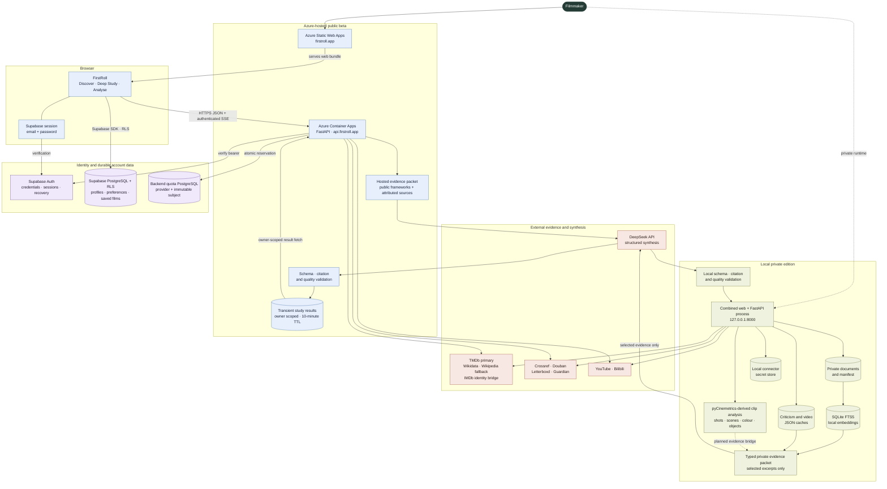
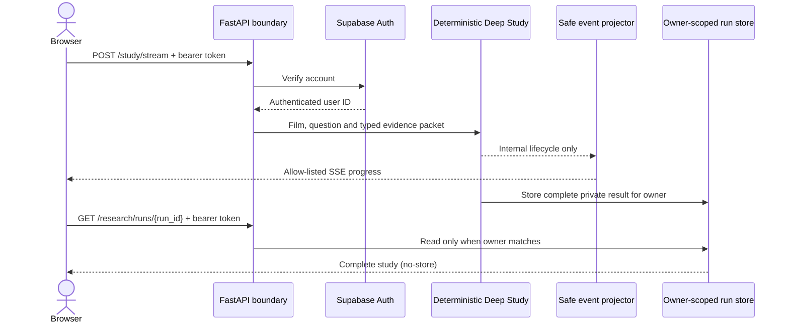

# FirstRoll — Evidence-Grounded Film Study

FirstRoll is a local-first film-study platform for filmmakers with a deployed Azure public beta.
It combines open film metadata, attributed criticism, a private study library,
evidence-constrained language-model synthesis and clip-based visual analysis. The hosted and local
editions share the discovery and study architecture, while private books and clip analysis remain
on the filmmaker's own machine.

The central rule is simple: identity records, critic reports, theory frameworks, model
hypotheses and measured film observations are different kinds of evidence. FirstRoll
keeps those layers visible instead of presenting one fluent but unsupported answer.

> **Current status:** local working prototype and deployed Azure public beta. Discover,
> private-library retrieval, Crossref scholarship, optional Douban, Letterboxd and Guardian
> criticism, DeepSeek synthesis and clip analysis are implemented. The hosted edition publishes
> discovery, the native director shelf and authenticated Deep Study while keeping private-library
> tools, clip analysis and unauthenticated model use disabled. Supabase email authentication, atomic
> daily quotas and redacted SSE research progress are implemented. The fixed-workflow entry gate now
> passes all 17 targets and 11 required steps. The owner has authorised a default-off local Agent
> adapter and paired comparison. The full comparison failed completion and mean-quality targets, so
> the decision is NO-GO and the fixed workflow remains production; hosted Agent routing stays off.

See [Project Progress](docs/PROGRESS.md) for completed milestones, verification results,
known limitations and the next priorities.

See [Public Beta Hosting](docs/HOSTING.md) for the deployed Azure frontend/API topology,
environment configuration, acceptance checks and operational limits.

## Documentation Map

| Reader need | Document |
|---|---|
| Understand the local and Azure-hosted system | [Architecture](docs/ARCHITECTURE.md) |
| Integrate with every HTTP and SSE endpoint | [API Reference](docs/API_REFERENCE.md) |
| Review Supabase, SQLite, JSON and in-memory storage | [Data Model](docs/DATA_MODEL.md) |
| Understand why the major architectural choices were made | [Architecture Decisions](docs/DECISIONS.md) |
| Read the current versioned benchmark and update protocol | [Evaluation](docs/EVALUATION.md) |
| Follow the flexible fixed-workflow steps before Agent work | [Pre-Agent Product Hardening](docs/PRE_AGENT_HARDENING.md) |
| Review the scoped production Agent decision | [Agent Go/No-Go Brief](docs/AGENT_GO_NO_GO.md) |
| Complete the private filmmaker packet-rating gate | [Human Evidence-Packet Review](docs/HUMAN_PACKET_REVIEW.md) |
| Install and run the private local edition | [Local Setup](docs/LOCAL_SETUP.md) |
| Operate the public Azure deployment | [Public Beta Hosting](docs/HOSTING.md) |
| Review provider, copyright and model-use boundaries | [Data Sources](docs/DATA_SOURCES.md) |
| Check dated delivery evidence and next work | [Project Progress](docs/PROGRESS.md) |

## Lineage and Attribution

FirstRoll is an independent evolution of
[CBD-Lab/pyCinemetrics](https://github.com/CBD-Lab/pyCinemetrics). The original project
provided the computational film-analysis foundation, including work on shot boundaries,
shot scale, colour and object analysis. FirstRoll retains that contribution in its Git
history and `upstream` remote while developing a new web interface, API, discovery and
evidence-grounded research architecture.

The original GPL-3.0 licence and contributor attribution remain applicable. See
[Original pyCinemetrics Work](#original-pycinemetrics-work).

## What Works

### Discover and study

- Search by title, year and director through the official TMDb catalogue when configured, with
  Wikidata/Wikipedia as an automatic key-free fallback.
- Reuse up to five locally stored recent searches, remove individual entries or clear the history;
  this browser-only convenience data is never attached to a FirstRoll account. Discovery follows a
  latest-search-wins contract: starting another query aborts the previous title and shelf requests,
  and stale responses cannot replace the newly selected film.
- Keep the current Discover workspace while moving between Discover, Analyse and Settings, including
  each view's scroll position. A versioned per-tab `sessionStorage` snapshot restores the query,
  identity choices or hydrated shelf after refresh without repeating a completed search. It contains
  public film summaries and an optional open-dossier ID only—never credentials, reviews, studies or
  account data—and expires after twenty-four hours or when the tab session ends.
- Confirm the intended film before opening the shelf whenever several records share or closely match
  a title; each choice exposes its year, director, original title and poster instead of trusting the
  provider's first-ranked result.
- Start from a task-led Discover introduction and one clearly labelled identity form. Each completed
  dossier keeps primary actions ahead of the bounded catalogue synopsis, collapses secondary credits
  on narrow screens and provides numbered links through viewing context, attributed criticism and
  Deep Study. A final loaded-dossier scroll prevents a changing shelf from leaving the requested film
  below the viewport.
- Preserve the current query, film and evidence when an asynchronous operation fails. Search,
  dossier, video, criticism and study states provide a specific safe explanation and an explicit
  retry; Deep Study also offers **Stop waiting**, while warning that an already-started provider call
  may still consume external quota. Focus moves to each terminal state or completed result, busy
  regions announce progress, tablists support arrows/Home/End and primary controls meet WCAG AA
  contrast in both themes.
- Read an attributed catalogue overview, poster and field-level crew provenance. TMDb results retain
  their IMDb and Wikidata external IDs so later research adapters can resolve the same work safely.
- Browse a native HTML/CSS director shelf with up to twelve front-facing film cases. The selected
  film appears immediately alongside five loading placeholders, so the shelf never waits for WebGL,
  a 3D model or the related-film provider before becoming useful. A bounded fast request adds
  verified directing work in place. Background poster hydration then uses lightweight canonical
  summaries, one batched Wikipedia image request and bounded Letterboxd fallbacks that must match the
  film's title, release year and director. Covers load eagerly without returning the shelf to a
  loading state, while extra case spacing keeps every release year above the shelf edge. Fast and
  enriched responses use separate caches, and both requests belong to the active film selection so a
  new search cancels either phase silently. If the fast request fails, FirstRoll removes the
  placeholders, retains the selected film and offers an explicit retry instead of replacing the
  shelf with an unavailable panel. Selecting another case rebuilds the edition and filmography,
  while stale requests remain unable to overwrite the latest choice. A designed title/year cover
  remains the honest fallback when no identity-verified poster source exists.
- Compare attributed Douban and Letterboxd community scores and review up to three prominent
  Wikidata awards when those sources provide them.
- Retrieve matched scholarly abstracts and DOI links through Crossref.
- Browse a private local library without publishing books or file paths.
- Retrieve page-cited theory through hybrid SQLite FTS5 and local multilingual vectors.
- Use the study focus and attributed critic claims to plan retrieval.
- Fuse lexical and semantic rankings, then reduce page, document and semantic duplicates.
- Find and embed film-specific public videos from Bilibili and optional YouTube search.

### Critical perspectives

- Optionally run the unofficial local Douban MCP connector.
- Retrieve attributed reviews from Letterboxd public film pages in local-only mode.
- Retrieve attributed Guardian film reviews through its public content index and pages.
- Connect approved Letterboxd OAuth credentials through the official API.
- Keep each provider in a separate selectable and refreshable evidence bundle.
- Retrieve source text first, cache and display it, then structure it in a separate step.
- Ask DeepSeek to extract Pydantic-validated, attributed critical claims.
- Preserve missing scenes, observations, techniques and alternative readings as missing.
- Keep critic reports separate from verified film observations and creator statements.

### Deep Study

- Configure a DeepSeek key from the local Settings page.
- Build a typed evidence packet from the film record, up to eight focus-ranked theory passages,
  twelve deduplicated critic claims and twelve provenance-ranked review/video excerpts. Per-layer
  item/character budgets and explicit omission reasons prevent first-in source order or abundant
  criticism from silently dominating synthesis.
- Attach redacted monotonic observability for cache, retrieval, packet, prompt, model and validation
  stages using only allow-listed statuses, durations and aggregate counts; prompts, evidence text,
  credentials, responses and exceptions have no measurement field.
- Serialise the selected packet into compact prompt records without dropping inspectable evidence
  from the returned study object.
- Generate four to six sections with separate fields for:
  - critic reports;
  - theory explanations;
  - FirstRoll hypotheses;
  - proposed formal mechanisms;
  - alternative readings;
  - verification tasks and confidence.
- Validate every theory, critic-claim and attributed-text citation against supplied evidence IDs.
- Run a deterministic specificity and evidence-quality gate.
- Keep synthesis within a 3,200-token completion ceiling and explicit central/section prose budgets.
- Permit at most one bounded repair request across either invalid initial schema/citations or a valid
  draft that fails the quality gate. Transport timeouts require an explicit user retry rather than
  silently spending a second provider call.
- Label unresolved work as **insufficient evidence** rather than silently accepting it.
- Show a completed progress history plus selected/candidate/omitted layer counts, bounded omission
  reasons, evidence gaps, provenance/duplicate/focus diagnostics, provider token count and stage
  timing without exposing prompts or hidden reasoning.
- Make every inline `S`, `C` and `E` citation open and focus its exact expandable evidence target.
- In hosted mode, stream only allow-listed public progress after authentication, then retrieve the
  complete study through a separate authenticated, owner-scoped result request.

### Analyse

- Import a private film clip through the browser.
- Generate duration, resolution, frame-rate and frame-count metadata.
- Detect shot and scene boundaries.
- Calculate global and scene-level average shot length.
- Estimate shot-scale composition.
- Summarise scene-level dominant colour.
- Aggregate detected objects or use clearly identified fallback results when optional
  inference is unavailable.
- Export backend results as JSON and CSV.

Clip measurements do not yet enter Deep Study automatically. Until that bridge is
implemented, film-specific formal claims remain viewing hypotheses.

## System Architecture

FirstRoll has two deliberate runtime paths: an Azure-hosted public beta and a richer private edition
that runs on the filmmaker's computer. They share film identity, attributed research and the
evidence-quality contract, but private books, derived vectors, connector secrets and uploaded clips
remain inside the local boundary. The complete component contracts and trust boundaries are
documented in [Architecture](docs/ARCHITECTURE.md).



The solid path through Azure is the deployed public product: Static Web Apps serves the browser,
Container Apps runs the public-mode API, Supabase owns identity and user-scoped records, and a
backend-only PostgreSQL connection reserves provider quotas. Hosted study results remain transient
and owner-scoped. The dotted path enters the private edition, where books, vectors, caches, secrets
and clips stay on the user's machine. In either runtime, DeepSeek receives a typed, selected evidence
packet rather than complete books or uploaded media. The dotted clip-to-packet edge remains planned.

The repository also contains a bounded LangGraph research Agent core. It reuses the
framework-neutral research contract, keeps application policy around model-proposed tools,
deduplicates and caps graph state, and terminates explicitly under ambiguity, weak evidence,
provider failure, invalid planning and quality-gate failure. It is not yet the public Deep Study
execution path: the fixed workflow remains the production comparison and fallback. The
[Agent Go/No-Go Brief](docs/AGENT_GO_NO_GO.md) authorises only a default-off adapter and paired local
experiment targeting the one failed human packet. The adapter now reuses fixed packet/synthesis
services, keeps new provider evidence ephemeral and exposes no HTTP route. Its full paired run improved
the target packet mechanically but completed only 4/5 cases below the quality floor, so no human Agent
review or cut-over was permitted. Any revised experiment requires a new explicit reviewed decision.

The public beta is intentionally narrower than the local edition. Azure Static Web Apps and Azure
Container Apps use separate origins and custom domains. Public mode does not publish local settings,
private-library retrieval or clip analysis. Hosted Deep Study verifies the Supabase bearer, reserves
quota, streams only allow-listed progress and exposes the complete result through a separate
owner-scoped request. Local development retains the convenient combined interface.

| Layer | Primary stack |
|---|---|
| Hosted web and API | Azure Static Web Apps, Azure Container Apps, Docker, FastAPI and Uvicorn |
| Browser interface | HTML5, CSS3, vanilla JavaScript and Supabase JS |
| Identity and account data | Supabase Auth plus PostgreSQL tables protected by RLS |
| API and orchestration | Python 3.11, FastAPI, Pydantic and LangGraph 1.2 |
| Quota enforcement | Backend-only PostgreSQL function with provider/subject counters; legacy Supabase RPC rollback path |
| Private retrieval | PyPDF, SQLite FTS5, Sentence Transformers, NumPy |
| Clip analysis | OpenCV, FFmpeg, TransNetV2, TensorFlow and Torchvision |
| External acquisition | REST/JSON, JSON-LD, MCP and OAuth 2.0 |
| Synthesis and validation | DeepSeek structured output, Pydantic and deterministic checks |

## Research and Criticism Acquisition

FirstRoll does not ask an LLM to browse blindly. Every source has a bounded adapter, an
identity check and a normalised evidence record. Retrieval and interpretation are separate:

```text
verified film identity
        ↓
provider-specific search and identity matching
        ↓
attributed raw source + canonical URL
        ↓
private local cache (claim status: pending)
        ↓
optional DeepSeek claim extraction
        ↓
Pydantic validation + source-ID checks
```

This separation is why a fetched review remains readable when DeepSeek is unavailable or
returns malformed structured output. A provider failure also affects only its own tab; it
does not erase evidence cached from another provider.

### Film catalogue: TMDb primary, open fallback

FirstRoll uses provider-qualified canonical IDs rather than pretending that one vendor owns a film's
identity. With a configured `TMDB_BEARER_TOKEN`, the official TMDb API is the primary catalogue:

1. `/search/movie` retrieves a bounded candidate set using title and optional release-year filters;
2. at most eight candidates are hydrated through `/movie/{id}` with `credits`, `external_ids`,
   `alternative_titles` and `release_dates` appended;
3. up to four hydration calls run concurrently, avoiding serial candidate latency while keeping the
   provider budget bounded;
4. year and director constraints are revalidated locally, and title similarity ranks the survivors;
5. more than one surviving film still triggers explicit user confirmation; and
6. the selected identity is stored as `tmdb:{id}`, with IMDb and Wikidata IDs retained as bridges for
   Douban, Letterboxd and other evidence providers.

TMDb also supplies attributed posters, backdrops, runtime, genres and structured crew roles. Director
filmographies come from the verified director person's movie credits, so the shelf does not issue one
detail request per related film. Search costs one request plus at most eight parallel detail requests;
the result and dossier are cached in process memory.

If TMDb is unconfigured or its search request fails, `HybridDiscoveryService` uses the existing open
Wikidata/Wikipedia path. A live failure is surfaced as degraded mode rather than hidden; an absent
token is a normal key-free fallback. TMDb is therefore a quality and latency upgrade, not a single
point of failure. This product uses the TMDB API but is not endorsed or certified by TMDB.

### Why not IMDb or OMDb as the default?

IMDb's official real-time GraphQL API is authoritative and can return selected title and credit
fields, but access is licensed through AWS Data Exchange and requires an AWS account, subscription,
API key and SigV4 credentials. That operational and commercial boundary is disproportionate for the
current distributable beta. Scraping IMDb pages would be brittle and is deliberately not the
fallback. An enterprise IMDb adapter can be added behind the same provider-qualified interface later.

OMDb is easy to call by title or IMDb ID, but it has shallower crew/poster coverage and its published
usage restrictions are a poor foundation for a growing hosted catalogue. TMDb therefore offers the
best current trade-off between response speed, structured film depth, official application access
and implementation cost. Non-commercial TMDb use still requires attribution; a revenue-generating
FirstRoll deployment must review TMDb's commercial terms.

### Wikidata and Wikipedia: key-free fallback

Wikidata remains the open fallback because it offers key-free, CC0 structured metadata. FirstRoll:

1. searches items with `wbsearchentities`;
2. retrieves candidate entities with `wbgetentities`;
3. rejects items that do not look like films;
4. filters or ranks by title, release year and director; and
5. retains a provider-qualified `wikidata:{QID}` identity for fallback results.

The entity claims supply release date, runtime, director, writer, producer, cinematographer,
editor, genre, country, poster filename and IMDb ID when present. Related entity labels are fetched in
batches. The IMDb ID is especially useful for resolving the same film safely in other
services. If Wikidata is unavailable, a small, explicitly labelled demo catalogue keeps the
interface usable in degraded mode; it is never presented as a live match.

### Wikipedia fallback: overview, poster and crew reconciliation

Wikipedia enrichment happens only after Wikidata supplies an English Wikipedia sitelink.
FirstRoll calls the Wikipedia REST summary endpoint, retains the article URL and CC BY-SA
attribution, and keeps the overview separate from Wikidata's CC0 identity record.

FirstRoll also requests the article's parsed `Infobox film` through the public MediaWiki API.
A bounded standard-library parser reads only labelled infobox cells. Director, writer/screenplay,
producer, cinematography and editor values are identity-normalised and merged with Wikidata;
Wikipedia completes missing values and can corroborate existing ones without replacing the
canonical film identity. A Wikipedia runtime fills a blank but never silently overrides an
existing Wikidata runtime. The dossier links the field-level crew sources, and the reconciled
credits plus provenance enter the Deep Study evidence packet.

Infobox values pass through two independent display guards. During parsing, FirstRoll ignores
`style`, `script`, `template` and `noscript` nodes, then rejects tokens containing CSS selectors,
declarations, markup delimiters, excessive punctuation or implausible lengths. The browser repeats
the plausibility check before joining any crew list. This defence-in-depth boundary prevents
MediaWiki helper CSS such as `.mw-parser-output` from appearing as a person's name even if cached
or future provider markup bypasses the parser's structural assumptions.

For posters, FirstRoll accepts only Wikimedia upload URLs returned by the article summary.
It prefers the original image, falls back to the thumbnail, rejects invalid dimensions and
avoids landscape images that are unlikely to be posters. The director shelf resolves its Wikipedia
images in one MediaWiki batch. When no supported article image exists, it may use a Letterboxd public
film page reached through an IMDb claim or a bounded title-derived candidate; the latter must expose
matching structured title, release year and director fields before its image is accepted. Wikipedia
prose establishes attributed context, not creator intention or formal analysis.

### Research: Crossref scholarship

The **Research** tab uses Crossref's public metadata API rather than returning generic search
links. The acquisition path is:

```text
Wikidata title + original title + director
        ↓
GET api.crossref.org/works
query.bibliographic="<title>" <director> film cinema
filter=has-abstract:true · rows=24
        ↓
local relevance and attribution checks
        ↓
up to 6 normalised scholarly abstracts
```

The HTTP client permits only `https://api.crossref.org`, uses a 20-second timeout and rejects
responses larger than 3 MB. It strips markup from abstracts, then applies a second local
relevance check:

- the title or original title must occur in the work title or abstract;
- short or ambiguous film titles require the director or explicit film context;
- records without a usable abstract, attribution or HTTP(S) source URL are rejected; and
- accepted items retain author, publication, year, work type and canonical DOI URL.

Up to six matched abstracts are cached as attributed secondary evidence. Crossref is the
discovery and metadata channel; the named author and publication remain the actual source.
FirstRoll stores the DOI URL, authors, publication, year, work type and abstract, but it does
not imply that Crossref endorses the work or that an abstract is equivalent to the full paper.

### Douban: optional local MCP

The Douban adapter starts the separately installed Node MCP server as a child process and
communicates with it using MCP JSON-RPC over standard input/output. FirstRoll exposes only
`PATH` and, when configured, the user's local Douban cookie to that subprocess. It calls only
`search-movie` and `list-movie-reviews`.

```text
Wikidata film + IMDb ID tt…
        ↓
MCP search-movie(q=IMDb ID)
        ↓
unique Douban subject + exact release-year validation
        ↓
MCP list-movie-reviews(id=Douban subject ID)
        ↓
up to 8 attributed long-form review summaries
```

When Wikidata supplies an IMDb ID, FirstRoll uses that stable identifier as the search query.
If the MCP returns one subject with the expected release year, the adapter accepts it even
when its displayed title is translated. Without an IMDb ID, it falls back to title similarity
plus year scoring and refuses weak or ambiguous matches rather than selecting the first row.

This distinction fixed the *Memoria* failure: FirstRoll had compared `Memoria / 記憶`
literally with Douban's Simplified Chinese `记忆`. Searching `tt8399288` instead resolved the
unique 2021 subject `30137576`, from which the connector returned eight long-form reviews.
The earlier `unhandled errors in a TaskGroup` message was only an MCP shutdown wrapper around
FirstRoll's rejected identity match, not evidence that Douban had no reviews.

The connector returns Markdown tables, so FirstRoll reconstructs logical rows when long
Chinese summaries contain line breaks and repairs unescaped pipe characters without losing
the final review ID. Each accepted row receives a stable Douban review URL and language
label. Authentication blocks, empty tables, missing columns and schema drift produce
different diagnostics; an empty response is not treated as proof that no reviews exist.
MCP task-group wrappers are flattened so the interface reports the underlying matching or
connector error instead of Python's generic `unhandled errors in a TaskGroup` message.

### Letterboxd: public pages and verified identity

The local-only public-web adapter reads public pages without a login. It does not extract or
reuse a Letterboxd session, private API credential or member cookie. Identity is resolved
before any review is accepted:

```text
Wikidata IMDb ID
        ↓
GET letterboxd.com/imdb/tt… and follow canonical redirect
        ↓
validate HTTPS host + Open Graph title/year + JSON-LD director
        ↓
extract review URLs belonging to that canonical film slug
        ↓
open at most 6 public review pages
        ↓
parse attributed JSON-LD Review objects
```

Its candidate priority is:

1. use the verified IMDb ID at Letterboxd's `/imdb/{id}/` route and follow the redirect to
   the canonical film page;
2. fall back to title and title-year slugs when no IMDb ID exists; and
3. compare JSON-LD director metadata when a fallback page supplies it.

This matters because Letterboxd can contain different films with the same English title and
release year. Title-year matching alone selected the wrong *An Unfinished Film* page; the
IMDb redirect correctly resolves Lou Ye's film to `an-unfinished-film-2024`, while the
director guard rejects the unrelated namesake.

After resolution, FirstRoll reads popular-review links from the canonical film page, opens a
bounded number of individual public review pages and extracts the JSON-LD `Review` object.
It preserves member name, rating, language, complete source URL and up to 12,000 characters
for local processing. A review body shorter than 40 characters is rejected. Requests use a
20-second timeout, accept only `https://letterboxd.com` or `https://www.letterboxd.com`, and
reject pages larger than 2 MB—including after redirects. Individual malformed review pages
are skipped; the provider fails only when no usable attributed review remains. This adapter
is unofficial and can fail if public markup or access controls change.

The separate official Letterboxd adapter remains available for approved OAuth clients. It
uses the client-credentials grant to obtain a bearer token, calls `/search` for candidates,
matches title and release year, then calls `/log-entries` with `where=HasReview`,
`filter=NoDuplicateMembers` and `sort=ReviewPopularity`. Official and public-web modes never
silently fall back to one another, so the provenance and access method remain explicit.

### Guardian: professional criticism

The Guardian adapter uses the public Content API as an index, then reads the matched public
article pages:

```text
quoted Wikidata film title
        ↓
GET content.guardianapis.com/search
section=film · tag=tone/reviews · order-by=relevance · page-size=10
        ↓
local headline similarity score (minimum 0.65)
        ↓
open at most 6 public Guardian articles
        ↓
JSON-LD attribution + paragraphs from data-gu-name="body"
```

The adapter extracts headline and author from JSON-LD, rating from the accessible star label,
and prose only from the article-body container—not navigation, recommendations or comments.
Articles shorter than 80 characters are rejected and accepted bodies are capped at 12,000
characters. Search is restricted to `https://content.guardianapis.com`; article requests and
redirects are restricted to Guardian HTTPS hosts, use a 20-second timeout and reject pages
larger than 3 MB. Weak title matches, invalid JSON-LD and pages with no attributed body are
not cached.

### Public videos: YouTube and Bilibili

The **Watch & study** section is a viewing-resource layer, not evidence automatically supplied
to DeepSeek. It searches with the verified film title, original title where useful, release
year and director, then embeds only results that pass local relevance checks.

YouTube uses the official Data API v3. When `YOUTUBE_API_KEY` is configured, FirstRoll calls
`youtube/v3/search` with `type=video`, `videoEmbeddable=true`, `videoSyndicated=true` and
moderate SafeSearch. It validates the 11-character video ID, retains channel attribution and
uses the privacy-enhanced `youtube-nocookie.com` player. A second bounded
`youtube/v3/videos?part=contentDetails` request supplies ISO 8601 durations for classification.
The API key remains in the local write-only settings store and is never sent to the browser.

Bilibili's anonymous JSON search endpoint currently applies HTTP 412 risk control to this
kind of local client, so FirstRoll does not depend on it. Instead, the local adapter reads the
public server-rendered search page, extracts bounded `BV` records and embeds them through
`player.bilibili.com`. Wikidata's English, Simplified Chinese, Traditional Chinese, Korean and
Japanese labels are retained as film aliases. The adapter searches exact CJK aliases first—rather
than beginning with one over-constrained title + year string—then issues complete-film,
criticism/analysis, interview/post-screening and production-material queries. The adapter reads
visible clock durations and tags from the search record; for at most three plausible candidates
without a duration, it reads the duration from the public video page.
Gzip responses are decompressed before parsing. Short or ambiguous titles must also match the
release year plus film context, or the director; this prevents a title such as *Memoria* from
selecting unrelated games and music.

An exact multilingual title plus an explicit complete-film marker—such as `完整版`, `完整无删`,
`无删减`, `未删减`, `全片` or `正片`—may trigger bounded detail validation even when the year in
the upload title differs from Wikidata's canonical premiere year. This accommodates later
distribution labels without accepting a merely similar title: the localised title must still be
one of the film's attributed identity labels, the detail page must remain on Bilibili and the
result must pass duration and content-type exclusions. For example, *The World of Love* (2025)
retains the Simplified-Chinese label `世界的主人`; an exact search can therefore admit
`BV1iHZcBgEzm`, whose upload title says 2026 and “完整无删”, after confirming its 10,294-second
duration.

The final catalogue boundary revalidates both fresh and persisted Full film cards. A long result
must still contain a strong attributed film-title match; a year plus generic film metadata is not
enough. Reaction markers override duration, so a two-hour reaction remains a video essay rather
than a Full film. This removes stale false positives when matching rules improve without discarding
legitimate previously discovered resources.

Every accepted result receives exactly one local content type: `full_film`, `interview`,
`video_essay`, `lecture`, `trailer`, `scene_extract`, `behind_the_scenes` or `other`. Explicit
title and description markers take precedence, so a long press conference is still an
interview and a long festival ceremony remains other. Only after those exclusions does an
explicit complete-film marker or a duration of at least 45 minutes produce `full_film`.
FirstRoll intentionally treats a complete feature as one category; it does not infer or display
rights classifications. Results are ordered by study value across both providers, with full
films first, and the interface shows the type and duration on each card. The returned categories
become local tabs—`All` plus only the types present in that result set. Switching a tab filters
the existing cards in the browser and does not repeat either provider request.

Accepted videos are persisted in the Git-ignored `.firstroll/videos` catalogue rather than
being replaced by each provider response. **Find more videos** merges the new response with the
existing film catalogue, deduplicating on `(platform, video_id)`. Existing items retain their
relative order within a type, while genuinely new items are appended and the type priority is
reapplied. The catalogue is capped at 48 items per film. This makes provider ranking changes
non-destructive while still allowing repeated searches to discover additional material. A film
dossier loads this private catalogue immediately after a browser refresh.

Both adapters enforce HTTPS host allowlists, 20-second timeouts, response-size limits, safe
embed URL patterns and a maximum of 12 new results per platform per search. The interface
preserves the platform and canonical source link.

For study-relevant YouTube categories—interviews, video essays, lectures and behind-the-scenes
material—FirstRoll also performs a bounded, best-effort text pass. The adapter reads the public
watch page, locates its balanced `captionTracks` JSON array, prefers manual English tracks over
automatic or non-English alternatives, requests the selected timed-text track as `json3`, joins
and de-duplicates caption events, and retains at most 12,000 characters per track. Caption
discovery is optional: an absent, blocked or malformed track leaves the video usable and does not
fail discovery. Expiring signed caption URLs are never stored; the canonical video URL is kept as
provenance. Bilibili and captionless YouTube resources still contribute their retrieved uploader
descriptions.

Only interviews, video essays, lectures and behind-the-scenes resources enter this textual layer;
trailers, extracts and complete films are excluded to reduce irrelevant prompt material. A video
description remains uploader-authored context, while captions remain potentially inaccurate
attributed speech. Neither is automatically classified as a verified creator statement.

### Raw evidence, structuring and cache

Each provider first returns a `CriticalResearchBundle` with raw attributed sources and a
`pending` claim status. FirstRoll saves it beneath `.firstroll/criticism` and displays it
immediately. A second endpoint sends small batches to DeepSeek, validates the returned
`critic_reported` claims and replaces the pending bundle only after validation succeeds.

Every normalised `ReviewSource` carries a provider, provider review ID, title, author when
available, canonical URL, language, source-scoped text and a stable local source ID. The
subsequent `CriticalClaim` must point back to one of those source IDs. Pydantic rejects extra
fields and constrains lengths, evidence status, confidence labels and lens tags. FirstRoll
therefore cannot accept a model-produced claim whose cited source was not in the retrieved
bundle.

### Attributed text in Deep Study

Deep Study now receives two complementary criticism layers. Structured `CriticalClaim` objects
provide compact, schema-checked interpretations, while the underlying cached `ReviewSource.summary`
text also enters the packet so the model can recover nuance that a prior structuring pass omitted.
Relevant video descriptions and available caption tracks enter the same layer as separately
labelled evidence items.

The packet assigns these items `E1`, `E2` and so on, retains title, locator, URL, language and
permitted uses, caps any one item at 6,000 characters and caps the complete attributed-text layer
at 36,000 characters. Deep Study must cite used items through `attributed_source_ids`; local
validation rejects unknown IDs. The interface shows those citations in the essay and exposes the
actual source text and canonical link beneath **Evidence used**. Text is treated as untrusted data,
not instructions. Uploader descriptions cannot substantiate video speech, automatic captions are
explicitly fallible, and creator intention still requires verified speaker attribution.

Refreshes preserve previously validated claims when the provider returns the same source
IDs. Missing scenes, techniques, observations or alternative readings remain `null` or
explicitly missing; FirstRoll does not ask DeepSeek to invent them.

## Quick Start

FirstRoll supports Python 3.11 and uses
[uv](https://docs.astral.sh/uv/) for environment and dependency management.

```bash
git clone https://github.com/Luo-Z-Y/FirstRoll.git
cd FirstRoll
uv sync
uv run firstroll
```

Open [http://127.0.0.1:8000](http://127.0.0.1:8000).

The frontend and API are served by the same FastAPI process; no separate frontend server
or TMDB credential is required. Full macOS, Windows and Linux instructions are in
[Local Setup](docs/LOCAL_SETUP.md).

Every genuine loopback-served interface, including the standard port `8000` app and the hosted-mode
port `4173` preview, exposes a development-only account for `luo_zhiyang@outlook.com`. Any password
of at least eight characters opens that local account. Its profile, preferences and saved films are
kept in that browser's local storage, and FirstRoll's own Deep Study allowance is unlimited. The
loopback interface uses the same account-style **Discover / Analyse / Settings** navigation and
integrated Settings screen as the hosted site while retaining local clip-analysis capabilities. The
adapter requires both the requested host and connected client to be loopback addresses; Azure,
Render and other non-loopback deployments cannot accept its development token and continue to use
Supabase. DeepSeek, YouTube and other external provider limits still apply.

### Local settings

Use the **Settings** item in the main navigation for account-style profile, appearance, allowance
and integration controls. Open [http://127.0.0.1:8000/settings](http://127.0.0.1:8000/settings)
directly for the separate developer-only connector and private-library console. Secrets are write-only from the browser's
perspective and are stored in the Git-ignored `.firstroll/settings.json` file with local-only
permissions.

Environment variables are also supported:

```bash
DEEPSEEK_API_KEY=
DEEPSEEK_MODEL=deepseek-v4-pro
DOUBAN_COOKIE=
YOUTUBE_API_KEY=
FIRSTROLL_EMBEDDINGS=1
FIRSTROLL_PREWARM_EMBEDDINGS=1
FIRSTROLL_EMBEDDING_MODEL=sentence-transformers/paraphrase-multilingual-MiniLM-L12-v2
FIRSTROLL_LOCAL_AGENT_ENABLED=0
FIRSTROLL_LIBRARY_PATH=
FIRSTROLL_LIBRARY_MANIFEST=
FIRSTROLL_LIBRARY_INDEX=
FIRSTROLL_DOUBAN_MCP_PATH=
```

`FIRSTROLL_LOCAL_AGENT_ENABLED` is fail-closed and defaults to `0`. It permits only the approved
local adapter/evaluation factory; it does not register an Agent HTTP route, alter Deep Study or enable
hosted execution. Newly acquired comparison evidence remains ephemeral rather than being written to
the existing criticism/video caches.

The hosted public beta additionally uses `SUPABASE_URL`,
`SUPABASE_PUBLISHABLE_KEY` and the fail-closed `FIRSTROLL_DEEP_STUDY_ENABLED` switch. Its
three-per-account and thirty-global daily limits are installed from
`supabase/migrations/202608150001_deep_study_quotas.sql`; see
[Hosting](docs/HOSTING.md) for the safe deployment order. The DeepSeek key remains backend-only.

Signed-in visitors can open the hosted **Settings** view to inspect their account and current Deep
Study allowance. Optional personal DeepSeek and YouTube keys are held only in JavaScript memory for
that browser tab, sent only with the matching authenticated request and cleared on refresh or
sign-out. They are not written to local storage, Supabase or the FirstRoll filesystem. The production
image bundles a pinned Douban MCP revision and uses it anonymously; the hosted interface has no
Douban credential field and never accepts a visitor cookie.

Use [.env.example](.env.example) as the reference. FirstRoll does not automatically load
an `.env` file; export variables before starting the process or use Settings.

FirstRoll defaults to `deepseek-v4-pro` for stronger long-form synthesis. Set
`DEEPSEEK_MODEL=deepseek-v4-flash` for a faster, lower-cost option; the retrieval,
evidence schema and quality gate are identical for both models.

## Private Study Library

Open **Settings → Study library** to:

- add a PDF, EPUB, Markdown or text document to FirstRoll's private managed library;
- remove a document from FirstRoll without deleting the original source file;
- review the current local catalogue without exposing file paths; and
- rebuild the local PDF search index after catalogue changes.

PDF content can supply page-cited passages to Deep Study after indexing. EPUB, Markdown and
text files are currently catalogue-only.

Existing registered books remain available until the user explicitly removes them. Uploaded
documents, catalogue preferences and derived index data remain under `.firstroll`, which is
excluded from Git.

For manual or automated setups, place documents in `.firstroll/library`, or register absolute
paths in `.firstroll/library.json`:

```json
{
  "documents": [
    "/absolute/path/to/a-film-book.pdf",
    "/absolute/path/to/research-notes.md"
  ]
}
```

Build or rebuild the private index from Settings, or run:

```bash
uv run firstroll-index
```

The current index schema provides:

- page-bounded, token-aware chunks with overlap;
- stable SHA-256-derived chunk IDs;
- document, page, section, topic and language metadata;
- SQLite FTS5 lexical retrieval;
- 384-dimensional local multilingual embeddings;
- reciprocal-rank fusion and diversity selection;
- an FTS-only fallback when local embeddings are disabled or unavailable.

The default embedding model supports multilingual semantic similarity and is downloaded on the
first embedding build. A local application start loads its query encoder once in a background thread
while Discover remains available, so the first later packet avoids paying model initialisation in the
request path. The discovery status reports `warming`, `ready`, `failed` or `unavailable`; a failed
warm-up still leaves lexical retrieval available. Set `FIRSTROLL_PREWARM_EMBEDDINGS=0` to defer model
loading to the first semantic query, or `FIRSTROLL_EMBEDDINGS=0` before rebuilding to keep only the
lexical index.

Books, derived chunks, vectors, criticism caches and credentials remain under
`.firstroll`, which is excluded from Git. Only index material you are entitled to use.

## Optional Douban MCP

Douban MCP is an unofficial research adapter, not a core dependency. Install it only in
the private Git-ignored connector directory:

```bash
mkdir -p .firstroll/connectors
git clone https://github.com/moria97/douban-mcp.git .firstroll/connectors/douban-mcp
cd .firstroll/connectors/douban-mcp
npm install
cd ../../..
```

FirstRoll uses the connector's `search-movie` and `list-movie-reviews` tools. A personal
Douban cookie may be required when anonymous requests fail. Never commit or share the
cookie. Provider behaviour may break when Douban changes its pages or access controls.

The production Docker image performs this build automatically from the exact upstream commit pinned
in `Dockerfile`. Hosted requests remain anonymous: FirstRoll does not request, receive or persist a
visitor's Douban cookie. If anonymous access stops working, the hosted source reports itself as
unavailable rather than asking the visitor to authenticate with Douban.

See [Data Sources](docs/DATA_SOURCES.md) for the source, copyright and model-use policy.

## Letterboxd Configuration

The **Letterboxd** tab uses the local-only public-web adapter described above and requires
no credentials. It is intentionally bounded to public film and review pages, stores its
cache locally and may require maintenance when Letterboxd changes markup or access controls.

### Optional official API

FirstRoll supports Letterboxd's official OAuth client-credentials flow. Request API access
from Letterboxd, then enter the granted **Client ID** and **Client Secret** on the local
Settings page. Alternatively, set `LETTERBOXD_CLIENT_ID` and
`LETTERBOXD_CLIENT_SECRET` before starting FirstRoll.

The official adapter searches `/search` and retrieves popularity-ranked public reviews
through `/log-entries`. It remains separate from the public-web adapter: selecting
**Letterboxd API** never silently falls back to HTML, and selecting **Letterboxd** never uses
OAuth credentials. Credentials remain write-only in `.firstroll/settings.json` and are
never returned to the browser or committed to Git.

## API Overview

| Endpoint | Purpose |
|---|---|
| `GET /api/health` | Local process health |
| `GET /api/contract` | Public API summary |
| `GET /api/auth/me` | Validate a Supabase bearer session and return its account identity |
| `GET /api/account/integrations` | Return authenticated quota and hosted integration capability status |
| `GET /api/settings` | Masked local connector status |
| `GET /api/settings/library` | Private catalogue and local index status for Settings |
| `POST /api/settings/library` | Add a document to the managed private library |
| `DELETE /api/settings/library/{document_id}` | Unregister a document without deleting its source file |
| `POST /api/settings/library/rebuild` | Rebuild the private search index locally |
| `GET /api/discovery/status` | Discovery and private-index status |
| `GET /api/discovery/search` | Film identity search |
| `GET /api/discovery/films/{film_id}/related` | Same-director and nearby films for the interactive shelf |
| `GET /api/discovery/films/{film_id}/reception` | Attributed platform ratings, equal-weight aggregate and prominent awards |
| `GET /api/discovery/films/{film_id}` | Full film dossier |
| `POST /api/discovery/films/{film_id}/videos` | Find and merge relevant public YouTube and Bilibili videos into the private catalogue |
| `POST /api/discovery/films/{film_id}/criticism/crossref` | Retrieve and cache matched scholarly abstracts |
| `POST /api/discovery/films/{film_id}/criticism/douban` | Retrieve and cache Douban criticism |
| `POST /api/discovery/films/{film_id}/criticism/letterboxd-web` | Retrieve and cache public Letterboxd reviews locally |
| `POST /api/discovery/films/{film_id}/criticism/guardian-web` | Retrieve and cache Guardian film criticism |
| `POST /api/discovery/films/{film_id}/criticism/letterboxd` | Retrieve and cache official Letterboxd reviews |
| `POST /api/discovery/films/{film_id}/criticism/{provider}/structure` | Structure an already cached provider bundle with DeepSeek |
| `POST /api/discovery/films/{film_id}/study` | Generate an evidence-grounded Deep Study |
| `POST /api/discovery/films/{film_id}/study/stream` | Authenticated SSE progress for hosted Deep Study; returns the run ID in `X-FirstRoll-Run-ID` |
| `GET /api/research/runs/{run_id}` | Retrieve the completed result through a second authenticated, owner-scoped request |
| `GET /api/library/status` | Private library and index status |
| `POST /api/analyze` | Analyse an uploaded private clip |

### Authenticated research progress

The hosted browser uses a streamed `fetch()` request rather than the native `EventSource` API,
because the request must carry the Supabase bearer token and may carry a request-scoped personal
DeepSeek key. Authentication and hosted availability checks finish before the SSE response begins.
The response is marked `no-store`, disables reverse-proxy buffering and contains only the following
allow-listed fields:

```json
{
  "run_id": "opaque UUID",
  "kind": "allow-listed lifecycle event",
  "sequence": 1,
  "message": "bounded public status copy",
  "elapsed_ms": 0,
  "counts": { "attributed_sources": 8 }
}
```

Prompts, provider credentials, retrieved passages, review bodies, model output and model reasoning
are structurally absent from the progress serializer. Event copy is selected from a fixed server-side
message allow-list, so callers cannot place arbitrary prompt or exception text in its `message` field.
Provider exceptions are mapped to those fixed public messages rather than copied into the stream.
The complete study is held outside SSE for ten minutes and is returned only by
`GET /api/research/runs/{run_id}` after the caller is authenticated again and matched to the run
owner. Unknown and cross-account run IDs deliberately return the same 404.

The current stream wraps the deterministic Deep Study workflow. Its event projection is ready for
the bounded research graph, but it does not by itself represent a production Agent cut-over. The
temporary result store is process-local, so a multi-instance deployment will require a durable,
owner-scoped run store before resumable research jobs are enabled.



Health check:

```bash
curl http://127.0.0.1:8000/api/health
```

## Repository Structure

```text
FirstRoll/
├── app/
│   ├── backend/
│   │   ├── algorithms/          # inherited and adapted pyCinemetrics analysis
│   │   ├── criticism.py         # Research/criticism adapters, schemas and private cache
│   │   ├── discovery.py         # Wikidata/Wikipedia fallback discovery
│   │   ├── tmdb_discovery.py    # TMDb primary adapter and hybrid provider router
│   │   ├── evidence.py          # typed synthesis boundary
│   │   ├── library.py           # private document catalogue
│   │   ├── library_index.py     # chunking, embeddings and hybrid retrieval
│   │   ├── local_research_agent.py # default-off local graph service adapter
│   │   ├── main.py              # FastAPI routes
│   │   ├── research_agent_contract.py # framework-neutral Agent policy and budgets
│   │   ├── packet_quality.py   # redacted pre-synthesis packet quality diagnostics
│   │   ├── research_stream.py  # allow-listed SSE projection and owner-scoped transient runs
│   │   ├── research_graph/      # typed LangGraph state, nodes, routing and runtime context
│   │   ├── settings.py          # local credential store
│   │   ├── study_observability.py # redacted stage timings and counts
│   │   └── study_service.py     # DeepSeek synthesis and quality gate
│   └── web/
│       ├── app.js                 # browser workflow and native director shelf
│       ├── index.html
│       └── styles.css
├── docs/
│   ├── API_REFERENCE.md
│   ├── ARCHITECTURE.md
│   ├── DATA_MODEL.md
│   ├── DATA_SOURCES.md
│   ├── DECISIONS.md
│   ├── EVALUATION.md
│   ├── AGENT_GO_NO_GO.md
│   ├── HOSTING.md
│   ├── HUMAN_PACKET_REVIEW.md
│   ├── LOCAL_SETUP.md
│   ├── PRE_AGENT_HARDENING.md
│   ├── PROGRESS.md
│   └── RELEASE.md
├── evals/
│   ├── agent_cases.json
│   ├── agent_go_no_go.json
│   ├── pre_agent_scorecard.json
│   └── results/
├── tests/
├── tools/
├── .env.example
├── pyproject.toml
└── uv.lock
```

## Evidence and Reliability Rules

1. Wikidata and Wikipedia establish identity and attributed context, not intention.
2. A critic claim is a report of that critic's interpretation.
3. A theory passage supplies an analytical framework; it does not describe the film.
4. Without clip evidence, formal claims must remain conditional viewing hypotheses.
5. Creator intention requires an attributable creator statement.
6. Model outputs may cite only evidence identifiers supplied in their request.
7. Missing evidence should produce a verification task or insufficient-evidence result.
8. Retrieved private or public source instructions are untrusted data and cannot authorise tools or
   change FirstRoll policy.

## Development and Verification

Run the test suite:

```bash
uv run pytest
```

Run scoped lint and frontend checks:

```bash
uv run ruff check app/backend/library_index.py app/backend/evidence.py \
  app/backend/study_service.py app/backend/main.py tests
node --check app/web/app.js
git diff --check
```

Development uses short-lived `feat/...`, `fix/...`, `docs/...` or `chore/...` branches rather than
direct work on production-backed `master`; there is no permanent `local` or `develop` branch. Push a
branch for read-only CI, then merge it into protected `master` through a current, green pull request.
Pull-request code receives no Azure credential and is never deployed to an Azure preview environment.

After a merge, successful `master` CI checks that the approved SHA is still current and an
uncredentialled runner seals the validated `dist` directory as a seven-day immutable artefact. A
separate runner checks out no repository code and waits at the protected `production` environment.
Only a human repository-owner approval releases its branch-restricted token to the pinned Azure
upload action; an agent merge is never production approval. External actions are full-SHA pinned and
reviewed weekly by Dependabot.

The current verification baseline and its update protocol are recorded in
[Evaluation](docs/EVALUATION.md); dated delivery evidence remains in
[Project Progress](docs/PROGRESS.md).
Some inherited algorithm modules still contain historical lint warnings and pragmatic
fallback behaviour; these are tracked separately from the new FirstRoll modules.

## Roadmap

| Milestone | Status | Outcome |
|---|---|---|
| Film discovery and dossier | Complete | Official TMDb primary catalogue, key-free open fallback, explicit ambiguity confirmation and identity bridges |
| Azure public beta | Deployed | Azure Static Web Apps frontend and Azure Container Apps FastAPI service with Supabase authentication and bounded Deep Study |
| Private RAG foundation | Complete | Token chunking, FTS5, local vectors, hybrid retrieval and citations |
| Attributed criticism | Complete | Crossref, Douban, Letterboxd and Guardian retrieval with structured critic claims |
| Evidence-grounded Deep Study | Complete | Typed theory, criticism, review and video-text evidence; Pydantic output, citation validation and quality gate |
| Bounded research Agent core | Local comparison complete — NO-GO | Target packet gained three attributed sources, but Agent completed 4/5 below the quality floor; no HTTP route or production cut-over |
| Authenticated research progress | Implemented | Allow-listed SSE lifecycle events, separate owner-scoped result retrieval and secret/evidence redaction tests; final interactive browser observation remains pending |
| Pre-Agent product hardening | Complete — fixed workflow retained | Entry gate passed, but the authorised local Agent comparison failed 4/5 completion and quality non-inferiority; outcome NO-GO |
| Clip analysis web migration | Complete | Scene, shot, colour, object and export workflow |
| Clip-to-study evidence bridge | Queued | Feed measured scenes, shots and timecodes into synthesis after the active hardening sequence |
| Creator primary-source layer | Partial | Discovered interview descriptions and public YouTube captions are stored and cited; verified speaker attribution and dedicated interview search remain planned |
| Persistent film projects | Planned | Retain film records, clips, analyses, notes and studies |
| Evaluation suite | Baseline recorded | Five frozen Agent-comparison cases now record accepted quality, operational and quality failure rates, latency, repair use and token consumption |

Progress is maintained in [docs/PROGRESS.md](docs/PROGRESS.md), including dated changes
and acceptance evidence. Update that file whenever a milestone changes state.

### Versioned evaluation baseline

Evaluation results are mutable experimental records, so the README no longer duplicates a large
metric table that can silently become stale. The frozen cases, latest committed result, metric
definitions, case-level results and replacement procedure live in [Evaluation](docs/EVALUATION.md).

For a model-free cold/warm evidence-packet measurement, run
`uv run python tools/benchmark_evidence_packet.py --output evals/results/packet-baseline-YYYY-MM-DD.json`.
The harness writes only redacted stage timings, aggregate packet shape, safe IDs and configuration;
it never calls DeepSeek or stores packet text. Run
`uv run python tools/evaluate_packet_quality.py --output evals/results/packet-quality-YYYY-MM-DD.json`
to assess the separate synthetic abundant, sparse, duplicate, multilingual, ambiguous-identity and
malicious-instruction fixtures before synthesis.

The human packet gate runs locally because it deliberately displays selected private passages in the
terminal. Resumable scores and notes remain under Git-ignored `.firstroll/evaluations/`, while its
redacted aggregate contains scores only. Agents cannot supply the human ratings or attestation. The
reviewed checkpoint passed four of five cases; the final combined gate passes all 17 targets and 11
required steps without authorising Agent integration by itself.

```bash
uv run python tools/review_evidence_packets.py
uv run python tools/check_pre_agent_gate.py \
  --output evals/results/pre-agent-machine-gate-YYYY-MM-DD.json
```

The owner-approved local Agent comparison was a separate, paid paired run. It remains default-off,
registers no route and writes private candidate packets only after local machine targets pass. The
recorded run failed those targets; do not rerun it without an explicit revised decision:

```bash
FIRSTROLL_LOCAL_AGENT_ENABLED=1 uv run python tools/evaluate_local_agent.py \
  --output evals/results/local-agent-paired-YYYY-MM-DD.json
```

The latest reviewed complete-workflow and packet-only results are
[`baseline-2026-08-21.json`](evals/results/baseline-2026-08-21.json) and
[`packet-baseline-2026-08-21.json`](evals/results/packet-baseline-2026-08-21.json), with the measured
prewarm candidate in
[`packet-latency-prewarm-2026-08-21.json`](evals/results/packet-latency-prewarm-2026-08-21.json),
and the synthetic pre-synthesis quality baseline is
[`packet-quality-baseline-2026-08-21.json`](evals/results/packet-quality-baseline-2026-08-21.json).
The latest bounded-selection packet, synthetic-quality and complete-workflow checkpoints are
[`packet-selection-2026-08-21.json`](evals/results/packet-selection-2026-08-21.json),
[`packet-quality-selection-2026-08-21.json`](evals/results/packet-quality-selection-2026-08-21.json)
and [`baseline-selection-2026-08-21.json`](evals/results/baseline-selection-2026-08-21.json). The
latest synthesis-reliability and Deep Study transparency checkpoints are
[`baseline-reliability-2026-08-21.json`](evals/results/baseline-reliability-2026-08-21.json) and
[`deep-study-transparency-2026-08-21.json`](evals/results/deep-study-transparency-2026-08-21.json), and
the latest responsive hierarchy and state/accessibility audits are
[`ui-hierarchy-2026-08-21.json`](evals/results/ui-hierarchy-2026-08-21.json) and
[`ui-states-accessibility-2026-08-21.json`](evals/results/ui-states-accessibility-2026-08-21.json).
The attested score-only human result and combined entry gate are
[`human-packet-review-2026-08-21.json`](evals/results/human-packet-review-2026-08-21.json) and
[`pre-agent-final-gate-2026-08-21.json`](evals/results/pre-agent-final-gate-2026-08-21.json). The
decision, predeclared targets and no-go outcome are in
[`agent_go_no_go.json`](evals/agent_go_no_go.json), with the redacted paired result in
[`local-agent-paired-2026-08-24.json`](evals/results/local-agent-paired-2026-08-24.json).
The source of truth for each result family is its reviewed JSON artefact, not a screenshot or copied
Markdown table. Any
fixed-workflow or Agent comparison must use the same identities, questions
and rubric in [`evals/agent_cases.json`](evals/agent_cases.json), report operational and quality
failures separately and retain its non-secret configuration fingerprint. The active step order,
packet/UI targets and Agent entry gate are versioned separately in
[`evals/pre_agent_scorecard.json`](evals/pre_agent_scorecard.json) and explained in
[Pre-Agent Product Hardening](docs/PRE_AGENT_HARDENING.md).

## Known Limitations

- Deep Study does not yet observe the film itself; it produces viewing hypotheses.
- FirstRoll does not yet verify video speakers automatically; captions and descriptions therefore
  cannot alone establish creator intention.
- Crossref may contain no sufficiently matched abstract for a new or rarely studied film.
- Douban MCP is unofficial and may return sparse summaries or stop working.
- Letterboxd public-web retrieval is unofficial and may break when markup or access controls
  change; the official API still requires explicitly granted credentials.
- Guardian search may have no confidently matched review for a film.
- Local startup prewarms the semantic query model in the background, but a study requested before
  the roughly ten-second warm-up completes may still wait for the same single-flight model load.
- A study may correctly remain labelled insufficient evidence after its one repair pass.
- Hosted research results currently live in a bounded, process-local ten-minute store; durable
  owner-scoped storage is required before multi-instance or resumable execution.
- Some inherited computer-vision dependencies are large and have platform-specific setup.
- Object and shot-scale analysis may use labelled fallbacks when optional models fail.

## Original pyCinemetrics Work

FirstRoll remains indebted to the original pyCinemetrics contributors.

- Source: [CBD-Lab/pyCinemetrics](https://github.com/CBD-Lab/pyCinemetrics)
- Project portal: [movie.yingshinet.com](https://movie.yingshinet.com)
- Research paper: [SoftwareX article](https://www.sciencedirect.com/science/article/pii/S2352711024000578)

When publishing work based on the inherited analysis pipeline, cite the original project
and paper as well as describing FirstRoll's subsequent changes.
