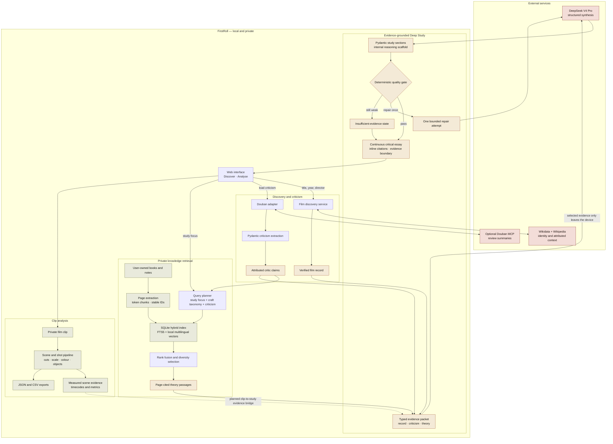

# FirstRoll — Evidence-Grounded Film Study

FirstRoll is a local film-study platform for filmmakers. It combines open film metadata,
attributed criticism, a private study library, evidence-constrained language-model
synthesis and clip-based visual analysis.

The central rule is simple: identity records, critic reports, theory frameworks, model
hypotheses and measured film observations are different kinds of evidence. FirstRoll
keeps those layers visible instead of presenting one fluent but unsupported answer.

> **Current status:** local working prototype. Discover, private-library retrieval,
> optional Douban criticism, DeepSeek synthesis and clip analysis are implemented. The
> next major milestone is connecting measured clip evidence to Deep Study.

See [Project Progress](docs/PROGRESS.md) for completed milestones, verification results,
known limitations and the next priorities.

## Lineage and Attribution

FirstRoll is an independent evolution of
[CBD-Lab/pyCinemetrics](https://github.com/CBD-Lab/pyCinemetrics). The original project
provided the computational film-analysis foundation, including work on shot boundaries,
shot scale, colour and object analysis. FirstRoll retains that contribution in its Git
history and `upstream` remote while developing a new web interface, API, discovery and
evidence-grounded research architecture.

The original GPL-3.0 licence and contributor attribution remain applicable. See
[Original pyCinemetrics Work](#original-pycinemetrics-work).

## What Works

### Discover and study

- Search by title, year and director through key-free Wikidata.
- Read attributed Wikipedia context and follow visible source links.
- Open Google Scholar, OpenAlex, IMDb, Wikidata and Wikipedia research routes.
- Browse a private local library without publishing books or file paths.
- Retrieve page-cited theory through hybrid SQLite FTS5 and local multilingual vectors.
- Use the study focus and attributed critic claims to plan retrieval.
- Fuse lexical and semantic rankings, then reduce page, document and semantic duplicates.

### Critical perspectives

- Optionally run the unofficial local Douban MCP connector.
- Retrieve review summaries and retain links to the original reviews.
- Ask DeepSeek to extract Pydantic-validated, attributed critical claims.
- Preserve missing scenes, observations, techniques and alternative readings as missing.
- Keep critic reports separate from verified film observations and creator statements.

### Deep Study

- Configure a DeepSeek key from the local Settings page.
- Build a typed evidence packet from the film record, retrieved theory and criticism.
- Generate four to six sections with separate fields for:
  - critic reports;
  - theory explanations;
  - FirstRoll hypotheses;
  - proposed formal mechanisms;
  - alternative readings;
  - verification tasks and confidence.
- Validate every theory and critic citation against supplied evidence IDs.
- Run a deterministic specificity and evidence-quality gate.
- Permit at most one bounded repair request.
- Label unresolved work as **insufficient evidence** rather than silently accepting it.
- Show the retrieval plan, source rationale and expandable evidence excerpts in the UI.

### Analyse

- Import a private film clip through the browser.
- Generate duration, resolution, frame-rate and frame-count metadata.
- Detect shot and scene boundaries.
- Calculate global and scene-level average shot length.
- Estimate shot-scale composition.
- Summarise scene-level dominant colour.
- Aggregate detected objects or use clearly identified fallback results when optional
  inference is unavailable.
- Export backend results as JSON and CSV.

Clip measurements do not yet enter Deep Study automatically. Until that bridge is
implemented, film-specific formal claims remain viewing hypotheses.

## System Architecture



The large boundary represents processes and data that remain on the user's machine.
Wikidata, Wikipedia and the optional Douban connector supply attributed research data;
DeepSeek is the only synthesis service. The embedding model runs locally. Only the typed,
selected evidence packet—not the complete books, vectors or private file paths—is sent to
DeepSeek when the user chooses **Generate study**. The dotted line is planned work: clip
measurements do not yet support claims in Deep Study.

## Quick Start

FirstRoll supports Python 3.11 and uses
[uv](https://docs.astral.sh/uv/) for environment and dependency management.

```bash
git clone https://github.com/Luo-Z-Y/FirstRoll.git
cd FirstRoll
uv sync
uv run firstroll
```

Open [http://127.0.0.1:8000](http://127.0.0.1:8000).

The frontend and API are served by the same FastAPI process; no separate frontend server
or TMDB credential is required. Full macOS, Windows and Linux instructions are in
[Local Setup](docs/LOCAL_SETUP.md).

### Local settings

Open [http://127.0.0.1:8000/settings](http://127.0.0.1:8000/settings) to configure optional
connectors. Secrets are write-only from the browser's perspective and are stored in the
Git-ignored `.firstroll/settings.json` file with local-only permissions.

Environment variables are also supported:

```bash
DEEPSEEK_API_KEY=
DEEPSEEK_MODEL=deepseek-v4-pro
DOUBAN_COOKIE=
FIRSTROLL_EMBEDDINGS=1
FIRSTROLL_EMBEDDING_MODEL=sentence-transformers/paraphrase-multilingual-MiniLM-L12-v2
FIRSTROLL_LIBRARY_PATH=
FIRSTROLL_LIBRARY_MANIFEST=
FIRSTROLL_LIBRARY_INDEX=
FIRSTROLL_DOUBAN_MCP_PATH=
```

Use [.env.example](.env.example) as the reference. FirstRoll does not automatically load
an `.env` file; export variables before starting the process or use Settings.

FirstRoll defaults to `deepseek-v4-pro` for stronger long-form synthesis. Set
`DEEPSEEK_MODEL=deepseek-v4-flash` for a faster, lower-cost option; the retrieval,
evidence schema and quality gate are identical for both models.

## Private Study Library

Place documents in `.firstroll/library`, or register absolute paths in
`.firstroll/library.json`:

```json
{
  "documents": [
    "/absolute/path/to/a-film-book.pdf",
    "/absolute/path/to/research-notes.md"
  ]
}
```

Build or rebuild the private index:

```bash
uv run firstroll-index
```

The current index schema provides:

- page-bounded, token-aware chunks with overlap;
- stable SHA-256-derived chunk IDs;
- document, page, section, topic and language metadata;
- SQLite FTS5 lexical retrieval;
- 384-dimensional local multilingual embeddings;
- reciprocal-rank fusion and diversity selection;
- an FTS-only fallback when local embeddings are disabled or unavailable.

The default embedding model supports multilingual semantic similarity and is downloaded
on the first embedding build. Set `FIRSTROLL_EMBEDDINGS=0` before rebuilding to keep only
the lexical index.

Books, derived chunks, vectors, criticism caches and credentials remain under
`.firstroll`, which is excluded from Git. Only index material you are entitled to use.

## Optional Douban MCP

Douban MCP is an unofficial research adapter, not a core dependency. Install it only in
the private Git-ignored connector directory:

```bash
mkdir -p .firstroll/connectors
git clone https://github.com/moria97/douban-mcp.git .firstroll/connectors/douban-mcp
cd .firstroll/connectors/douban-mcp
npm install
cd ../../..
```

FirstRoll uses the connector's `search-movie` and `list-movie-reviews` tools. A personal
Douban cookie may be required when anonymous requests fail. Never commit or share the
cookie. Provider behaviour may break when Douban changes its pages or access controls.

See [Data Sources](docs/DATA_SOURCES.md) for the source, copyright and model-use policy.

## API Overview

| Endpoint | Purpose |
|---|---|
| `GET /api/health` | Local process health |
| `GET /api/contract` | Public API summary |
| `GET /api/settings` | Masked local connector status |
| `GET /api/discovery/status` | Discovery and private-index status |
| `GET /api/discovery/search` | Film identity search |
| `GET /api/discovery/films/{film_id}` | Full film dossier |
| `POST /api/discovery/films/{film_id}/criticism/douban` | Retrieve and structure Douban criticism |
| `POST /api/discovery/films/{film_id}/study` | Generate an evidence-grounded Deep Study |
| `GET /api/library/status` | Private library and index status |
| `POST /api/analyze` | Analyse an uploaded private clip |

Health check:

```bash
curl http://127.0.0.1:8000/api/health
```

## Repository Structure

```text
FirstRoll/
├── app/
│   ├── backend/
│   │   ├── algorithms/          # inherited and adapted pyCinemetrics analysis
│   │   ├── criticism.py         # Douban adapter, schemas and private cache
│   │   ├── discovery.py         # Wikidata/Wikipedia discovery
│   │   ├── evidence.py          # typed synthesis boundary
│   │   ├── library.py           # private document catalogue
│   │   ├── library_index.py     # chunking, embeddings and hybrid retrieval
│   │   ├── main.py              # FastAPI routes
│   │   ├── settings.py          # local credential store
│   │   └── study_service.py     # DeepSeek synthesis and quality gate
│   └── web/
│       ├── app.js
│       ├── index.html
│       └── styles.css
├── docs/
│   ├── DATA_SOURCES.md
│   ├── LOCAL_SETUP.md
│   ├── PROGRESS.md
│   └── RELEASE.md
├── tests/
├── .env.example
├── pyproject.toml
└── uv.lock
```

## Evidence and Reliability Rules

1. Wikidata and Wikipedia establish identity and attributed context, not intention.
2. A critic claim is a report of that critic's interpretation.
3. A theory passage supplies an analytical framework; it does not describe the film.
4. Without clip evidence, formal claims must remain conditional viewing hypotheses.
5. Creator intention requires an attributable creator statement.
6. Model outputs may cite only evidence identifiers supplied in their request.
7. Missing evidence should produce a verification task or insufficient-evidence result.
8. Private source text is treated as untrusted data, never as model instructions.

## Development and Verification

Run the test suite:

```bash
uv run pytest
```

Run scoped lint and frontend checks:

```bash
uv run ruff check app/backend/library_index.py app/backend/evidence.py \
  app/backend/study_service.py app/backend/main.py tests
node --check app/web/app.js
git diff --check
```

The current verification baseline is recorded in [Project Progress](docs/PROGRESS.md).
Some inherited algorithm modules still contain historical lint warnings and pragmatic
fallback behaviour; these are tracked separately from the new FirstRoll modules.

## Roadmap

| Milestone | Status | Outcome |
|---|---|---|
| Film discovery and dossier | Complete | Key-free identity, context and visible research routes |
| Private RAG foundation | Complete | Token chunking, FTS5, local vectors, hybrid retrieval and citations |
| Attributed criticism | Complete | Optional Douban retrieval and structured critic claims |
| Evidence-grounded Deep Study | Complete | Typed evidence, Pydantic output, quality gate and layered UI |
| Clip analysis web migration | Complete | Scene, shot, colour, object and export workflow |
| Clip-to-study evidence bridge | Next | Feed measured scenes, shots and timecodes into synthesis |
| Creator primary-source layer | Planned | Search, store and cite interviews or production records |
| Persistent film projects | Planned | Retain film records, clips, analyses, notes and studies |
| Evaluation suite | Planned | Retrieval relevance, citation accuracy, abstention, latency and cost |

Progress is maintained in [docs/PROGRESS.md](docs/PROGRESS.md), including dated changes
and acceptance evidence. Update that file whenever a milestone changes state.

## Known Limitations

- Deep Study does not yet observe the film itself; it produces viewing hypotheses.
- Creator interviews and production records are not yet automatically collected.
- Douban MCP is unofficial and may return sparse summaries or stop working.
- The first semantic retrieval after process start may pause while the local model loads.
- A study may correctly remain labelled insufficient evidence after its one repair pass.
- Some inherited computer-vision dependencies are large and have platform-specific setup.
- Object and shot-scale analysis may use labelled fallbacks when optional models fail.

## Original pyCinemetrics Work

FirstRoll remains indebted to the original pyCinemetrics contributors.

- Source: [CBD-Lab/pyCinemetrics](https://github.com/CBD-Lab/pyCinemetrics)
- Project portal: [movie.yingshinet.com](https://movie.yingshinet.com)
- Research paper: [SoftwareX article](https://www.sciencedirect.com/science/article/pii/S2352711024000578)

When publishing work based on the inherited analysis pipeline, cite the original project
and paper as well as describing FirstRoll's subsequent changes.
