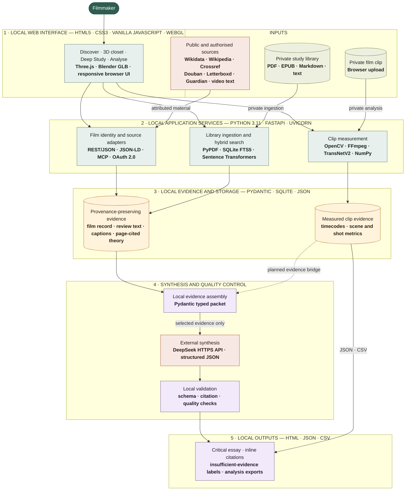

# FirstRoll — Evidence-Grounded Film Study

FirstRoll is a local film-study platform for filmmakers. It combines open film metadata,
attributed criticism, a private study library, evidence-constrained language-model
synthesis and clip-based visual analysis.

The central rule is simple: identity records, critic reports, theory frameworks, model
hypotheses and measured film observations are different kinds of evidence. FirstRoll
keeps those layers visible instead of presenting one fluent but unsupported answer.

> **Current status:** local working prototype. Discover, private-library retrieval,
> Crossref scholarship, optional Douban, Letterboxd and Guardian criticism, DeepSeek
> synthesis and clip analysis are implemented. The
> next major milestone is connecting measured clip evidence to Deep Study.

See [Project Progress](docs/PROGRESS.md) for completed milestones, verification results,
known limitations and the next priorities.

## Lineage and Attribution

FirstRoll is an independent evolution of
[CBD-Lab/pyCinemetrics](https://github.com/CBD-Lab/pyCinemetrics). The original project
provided the computational film-analysis foundation, including work on shot boundaries,
shot scale, colour and object analysis. FirstRoll retains that contribution in its Git
history and `upstream` remote while developing a new web interface, API, discovery and
evidence-grounded research architecture.

The original GPL-3.0 licence and contributor attribution remain applicable. See
[Original pyCinemetrics Work](#original-pycinemetrics-work).

## What Works

### Discover and study

- Search by title, year and director through key-free Wikidata.
- Read an attributed Wikipedia overview and poster after Wikidata resolves the film.
- Walk through a real Blender-built GLB film closet rendered locally with Three.js: drag to look,
  scroll or use W/S to walk, strafe with A/D, browse labelled director and relationship shelves,
  then hover a transparent jewel case to pull it out and select it as the new edition. Each curated
  bay is deliberately compact at 10–15 cases; sparse source results receive neutral archive fillers
  without pretending those placeholders are related or selectable films.
- Compare attributed Douban and Letterboxd community scores and review up to three prominent
  Wikidata awards when those sources provide them.
- Retrieve matched scholarly abstracts and DOI links through Crossref.
- Browse a private local library without publishing books or file paths.
- Retrieve page-cited theory through hybrid SQLite FTS5 and local multilingual vectors.
- Use the study focus and attributed critic claims to plan retrieval.
- Fuse lexical and semantic rankings, then reduce page, document and semantic duplicates.
- Find and embed film-specific public videos from Bilibili and optional YouTube search.

### Critical perspectives

- Optionally run the unofficial local Douban MCP connector.
- Retrieve attributed reviews from Letterboxd public film pages in local-only mode.
- Retrieve attributed Guardian film reviews through its public content index and pages.
- Connect approved Letterboxd OAuth credentials through the official API.
- Keep each provider in a separate selectable and refreshable evidence bundle.
- Retrieve source text first, cache and display it, then structure it in a separate step.
- Ask DeepSeek to extract Pydantic-validated, attributed critical claims.
- Preserve missing scenes, observations, techniques and alternative readings as missing.
- Keep critic reports separate from verified film observations and creator statements.

### Deep Study

- Configure a DeepSeek key from the local Settings page.
- Build a typed evidence packet from the film record, retrieved theory, full cached review text
  and attributed text attached to relevant videos.
- Generate four to six sections with separate fields for:
  - critic reports;
  - theory explanations;
  - FirstRoll hypotheses;
  - proposed formal mechanisms;
  - alternative readings;
  - verification tasks and confidence.
- Validate every theory, critic-claim and attributed-text citation against supplied evidence IDs.
- Run a deterministic specificity and evidence-quality gate.
- Permit at most one bounded repair request.
- Label unresolved work as **insufficient evidence** rather than silently accepting it.
- Show the retrieval plan, source rationale and expandable evidence excerpts in the UI.

### Analyse

- Import a private film clip through the browser.
- Generate duration, resolution, frame-rate and frame-count metadata.
- Detect shot and scene boundaries.
- Calculate global and scene-level average shot length.
- Estimate shot-scale composition.
- Summarise scene-level dominant colour.
- Aggregate detected objects or use clearly identified fallback results when optional
  inference is unavailable.
- Export backend results as JSON and CSV.

Clip measurements do not yet enter Deep Study automatically. Until that bridge is
implemented, film-specific formal claims remain viewing hypotheses.

## System Architecture

FirstRoll is a local-first, five-layer pipeline. Layer headings name the shared runtime;
the bold second line inside each component names its specialised technology.



The numbered bands show both system responsibility and implementation technology. Layers
labelled **local** run on the user's machine; books, vectors, clips and exports stay there.
External research services return attributed source material, while DeepSeek is the only
synthesis service. When the user chooses **Generate study**, only the typed, selected
evidence packet leaves the device—not complete books, local vectors, clips or private file
paths. The dotted connection is planned work: clip measurements do not yet support claims
in Deep Study.

| Layer | Primary stack |
|---|---|
| Web interface | HTML5, CSS3, vanilla JavaScript, Three.js WebGL and a Blender-authored GLB |
| API and orchestration | Python 3.11, FastAPI, Uvicorn, Pydantic |
| Private retrieval | PyPDF, SQLite FTS5, Sentence Transformers, NumPy |
| Clip analysis | OpenCV, FFmpeg, TransNetV2, TensorFlow and Torchvision |
| External acquisition | REST/JSON, JSON-LD, MCP and OAuth 2.0 |
| Synthesis and validation | DeepSeek structured output, Pydantic and deterministic checks |

## Research and Criticism Acquisition

FirstRoll does not ask an LLM to browse blindly. Every source has a bounded adapter, an
identity check and a normalised evidence record. Retrieval and interpretation are separate:

```text
verified film identity
        ↓
provider-specific search and identity matching
        ↓
attributed raw source + canonical URL
        ↓
private local cache (claim status: pending)
        ↓
optional DeepSeek claim extraction
        ↓
Pydantic validation + source-ID checks
```

This separation is why a fetched review remains readable when DeepSeek is unavailable or
returns malformed structured output. A provider failure also affects only its own tab; it
does not erase evidence cached from another provider.

### Wikidata: canonical film identity

Wikidata is the first lookup because it offers key-free, CC0 structured metadata. FirstRoll:

1. searches items with `wbsearchentities`;
2. retrieves candidate entities with `wbgetentities`;
3. rejects items that do not look like films;
4. filters or ranks by title, release year and director; and
5. retains the Wikidata QID as FirstRoll's canonical external identity.

The entity claims supply release date, runtime, director, writer, producer, cinematographer,
editor, genre, country, poster filename and IMDb ID when present. Related entity labels are fetched in
batches. The IMDb ID is especially useful for resolving the same film safely in other
services. If Wikidata is unavailable, a small, explicitly labelled demo catalogue keeps the
interface usable in degraded mode; it is never presented as a live match.

### Wikipedia: overview, poster and crew reconciliation

Wikipedia enrichment happens only after Wikidata supplies an English Wikipedia sitelink.
FirstRoll calls the Wikipedia REST summary endpoint, retains the article URL and CC BY-SA
attribution, and keeps the overview separate from Wikidata's CC0 identity record.

FirstRoll also requests the article's parsed `Infobox film` through the public MediaWiki API.
A bounded standard-library parser reads only labelled infobox cells. Director, writer/screenplay,
producer, cinematography and editor values are identity-normalised and merged with Wikidata;
Wikipedia completes missing values and can corroborate existing ones without replacing the
canonical film identity. A Wikipedia runtime fills a blank but never silently overrides an
existing Wikidata runtime. The dossier links the field-level crew sources, and the reconciled
credits plus provenance enter the Deep Study evidence packet.

Infobox values pass through two independent display guards. During parsing, FirstRoll ignores
`style`, `script`, `template` and `noscript` nodes, then rejects tokens containing CSS selectors,
declarations, markup delimiters, excessive punctuation or implausible lengths. The browser repeats
the plausibility check before joining any crew list. This defence-in-depth boundary prevents
MediaWiki helper CSS such as `.mw-parser-output` from appearing as a person's name even if cached
or future provider markup bypasses the parser's structural assumptions.

For posters, FirstRoll accepts only Wikimedia upload URLs returned by the article summary.
It prefers the original image, falls back to the thumbnail, rejects invalid dimensions and
avoids landscape images that are unlikely to be posters. Wikipedia prose establishes
attributed context, not creator intention or formal analysis.

### Research: Crossref scholarship

The **Research** tab uses Crossref's public metadata API rather than returning generic search
links. The acquisition path is:

```text
Wikidata title + original title + director
        ↓
GET api.crossref.org/works
query.bibliographic="<title>" <director> film cinema
filter=has-abstract:true · rows=24
        ↓
local relevance and attribution checks
        ↓
up to 6 normalised scholarly abstracts
```

The HTTP client permits only `https://api.crossref.org`, uses a 20-second timeout and rejects
responses larger than 3 MB. It strips markup from abstracts, then applies a second local
relevance check:

- the title or original title must occur in the work title or abstract;
- short or ambiguous film titles require the director or explicit film context;
- records without a usable abstract, attribution or HTTP(S) source URL are rejected; and
- accepted items retain author, publication, year, work type and canonical DOI URL.

Up to six matched abstracts are cached as attributed secondary evidence. Crossref is the
discovery and metadata channel; the named author and publication remain the actual source.
FirstRoll stores the DOI URL, authors, publication, year, work type and abstract, but it does
not imply that Crossref endorses the work or that an abstract is equivalent to the full paper.

### Douban: optional local MCP

The Douban adapter starts the separately installed Node MCP server as a child process and
communicates with it using MCP JSON-RPC over standard input/output. FirstRoll exposes only
`PATH` and, when configured, the user's local Douban cookie to that subprocess. It calls only
`search-movie` and `list-movie-reviews`.

```text
Wikidata film + IMDb ID tt…
        ↓
MCP search-movie(q=IMDb ID)
        ↓
unique Douban subject + exact release-year validation
        ↓
MCP list-movie-reviews(id=Douban subject ID)
        ↓
up to 8 attributed long-form review summaries
```

When Wikidata supplies an IMDb ID, FirstRoll uses that stable identifier as the search query.
If the MCP returns one subject with the expected release year, the adapter accepts it even
when its displayed title is translated. Without an IMDb ID, it falls back to title similarity
plus year scoring and refuses weak or ambiguous matches rather than selecting the first row.

This distinction fixed the *Memoria* failure: FirstRoll had compared `Memoria / 記憶`
literally with Douban's Simplified Chinese `记忆`. Searching `tt8399288` instead resolved the
unique 2021 subject `30137576`, from which the connector returned eight long-form reviews.
The earlier `unhandled errors in a TaskGroup` message was only an MCP shutdown wrapper around
FirstRoll's rejected identity match, not evidence that Douban had no reviews.

The connector returns Markdown tables, so FirstRoll reconstructs logical rows when long
Chinese summaries contain line breaks and repairs unescaped pipe characters without losing
the final review ID. Each accepted row receives a stable Douban review URL and language
label. Authentication blocks, empty tables, missing columns and schema drift produce
different diagnostics; an empty response is not treated as proof that no reviews exist.
MCP task-group wrappers are flattened so the interface reports the underlying matching or
connector error instead of Python's generic `unhandled errors in a TaskGroup` message.

### Letterboxd: public pages and verified identity

The local-only public-web adapter reads public pages without a login. It does not extract or
reuse a Letterboxd session, private API credential or member cookie. Identity is resolved
before any review is accepted:

```text
Wikidata IMDb ID
        ↓
GET letterboxd.com/imdb/tt… and follow canonical redirect
        ↓
validate HTTPS host + Open Graph title/year + JSON-LD director
        ↓
extract review URLs belonging to that canonical film slug
        ↓
open at most 6 public review pages
        ↓
parse attributed JSON-LD Review objects
```

Its candidate priority is:

1. use the verified IMDb ID at Letterboxd's `/imdb/{id}/` route and follow the redirect to
   the canonical film page;
2. fall back to title and title-year slugs when no IMDb ID exists; and
3. compare JSON-LD director metadata when a fallback page supplies it.

This matters because Letterboxd can contain different films with the same English title and
release year. Title-year matching alone selected the wrong *An Unfinished Film* page; the
IMDb redirect correctly resolves Lou Ye's film to `an-unfinished-film-2024`, while the
director guard rejects the unrelated namesake.

After resolution, FirstRoll reads popular-review links from the canonical film page, opens a
bounded number of individual public review pages and extracts the JSON-LD `Review` object.
It preserves member name, rating, language, complete source URL and up to 12,000 characters
for local processing. A review body shorter than 40 characters is rejected. Requests use a
20-second timeout, accept only `https://letterboxd.com` or `https://www.letterboxd.com`, and
reject pages larger than 2 MB—including after redirects. Individual malformed review pages
are skipped; the provider fails only when no usable attributed review remains. This adapter
is unofficial and can fail if public markup or access controls change.

The separate official Letterboxd adapter remains available for approved OAuth clients. It
uses the client-credentials grant to obtain a bearer token, calls `/search` for candidates,
matches title and release year, then calls `/log-entries` with `where=HasReview`,
`filter=NoDuplicateMembers` and `sort=ReviewPopularity`. Official and public-web modes never
silently fall back to one another, so the provenance and access method remain explicit.

### Guardian: professional criticism

The Guardian adapter uses the public Content API as an index, then reads the matched public
article pages:

```text
quoted Wikidata film title
        ↓
GET content.guardianapis.com/search
section=film · tag=tone/reviews · order-by=relevance · page-size=10
        ↓
local headline similarity score (minimum 0.65)
        ↓
open at most 6 public Guardian articles
        ↓
JSON-LD attribution + paragraphs from data-gu-name="body"
```

The adapter extracts headline and author from JSON-LD, rating from the accessible star label,
and prose only from the article-body container—not navigation, recommendations or comments.
Articles shorter than 80 characters are rejected and accepted bodies are capped at 12,000
characters. Search is restricted to `https://content.guardianapis.com`; article requests and
redirects are restricted to Guardian HTTPS hosts, use a 20-second timeout and reject pages
larger than 3 MB. Weak title matches, invalid JSON-LD and pages with no attributed body are
not cached.

### Public videos: YouTube and Bilibili

The **Watch & study** section is a viewing-resource layer, not evidence automatically supplied
to DeepSeek. It searches with the verified film title, original title where useful, release
year and director, then embeds only results that pass local relevance checks.

YouTube uses the official Data API v3. When `YOUTUBE_API_KEY` is configured, FirstRoll calls
`youtube/v3/search` with `type=video`, `videoEmbeddable=true`, `videoSyndicated=true` and
moderate SafeSearch. It validates the 11-character video ID, retains channel attribution and
uses the privacy-enhanced `youtube-nocookie.com` player. A second bounded
`youtube/v3/videos?part=contentDetails` request supplies ISO 8601 durations for classification.
The API key remains in the local write-only settings store and is never sent to the browser.

Bilibili's anonymous JSON search endpoint currently applies HTTP 412 risk control to this
kind of local client, so FirstRoll does not depend on it. Instead, the local adapter reads the
public server-rendered search page, extracts bounded `BV` records and embeds them through
`player.bilibili.com`. Wikidata's English, Simplified Chinese, Traditional Chinese, Korean and
Japanese labels are retained as film aliases. The adapter searches exact CJK aliases first—rather
than beginning with one over-constrained title + year string—then issues complete-film,
criticism/analysis, interview/post-screening and production-material queries. The adapter reads
visible clock durations and tags from the search record; for at most three plausible candidates
without a duration, it reads the duration from the public video page.
Gzip responses are decompressed before parsing. Short or ambiguous titles must also match the
release year plus film context, or the director; this prevents a title such as *Memoria* from
selecting unrelated games and music.

An exact multilingual title plus an explicit complete-film marker—such as `完整版`, `完整无删`,
`无删减`, `未删减`, `全片` or `正片`—may trigger bounded detail validation even when the year in
the upload title differs from Wikidata's canonical premiere year. This accommodates later
distribution labels without accepting a merely similar title: the localised title must still be
one of the film's attributed identity labels, the detail page must remain on Bilibili and the
result must pass duration and content-type exclusions. For example, *The World of Love* (2025)
retains the Simplified-Chinese label `世界的主人`; an exact search can therefore admit
`BV1iHZcBgEzm`, whose upload title says 2026 and “完整无删”, after confirming its 10,294-second
duration.

The final catalogue boundary revalidates both fresh and persisted Full film cards. A long result
must still contain a strong attributed film-title match; a year plus generic film metadata is not
enough. Reaction markers override duration, so a two-hour reaction remains a video essay rather
than a Full film. This removes stale false positives when matching rules improve without discarding
legitimate previously discovered resources.

Every accepted result receives exactly one local content type: `full_film`, `interview`,
`video_essay`, `lecture`, `trailer`, `scene_extract`, `behind_the_scenes` or `other`. Explicit
title and description markers take precedence, so a long press conference is still an
interview and a long festival ceremony remains other. Only after those exclusions does an
explicit complete-film marker or a duration of at least 45 minutes produce `full_film`.
FirstRoll intentionally treats a complete feature as one category; it does not infer or display
rights classifications. Results are ordered by study value across both providers, with full
films first, and the interface shows the type and duration on each card. The returned categories
become local tabs—`All` plus only the types present in that result set. Switching a tab filters
the existing cards in the browser and does not repeat either provider request.

Accepted videos are persisted in the Git-ignored `.firstroll/videos` catalogue rather than
being replaced by each provider response. **Find more videos** merges the new response with the
existing film catalogue, deduplicating on `(platform, video_id)`. Existing items retain their
relative order within a type, while genuinely new items are appended and the type priority is
reapplied. The catalogue is capped at 48 items per film. This makes provider ranking changes
non-destructive while still allowing repeated searches to discover additional material. A film
dossier loads this private catalogue immediately after a browser refresh.

Both adapters enforce HTTPS host allowlists, 20-second timeouts, response-size limits, safe
embed URL patterns and a maximum of 12 new results per platform per search. The interface
preserves the platform and canonical source link.

For study-relevant YouTube categories—interviews, video essays, lectures and behind-the-scenes
material—FirstRoll also performs a bounded, best-effort text pass. The adapter reads the public
watch page, locates its balanced `captionTracks` JSON array, prefers manual English tracks over
automatic or non-English alternatives, requests the selected timed-text track as `json3`, joins
and de-duplicates caption events, and retains at most 12,000 characters per track. Caption
discovery is optional: an absent, blocked or malformed track leaves the video usable and does not
fail discovery. Expiring signed caption URLs are never stored; the canonical video URL is kept as
provenance. Bilibili and captionless YouTube resources still contribute their retrieved uploader
descriptions.

Only interviews, video essays, lectures and behind-the-scenes resources enter this textual layer;
trailers, extracts and complete films are excluded to reduce irrelevant prompt material. A video
description remains uploader-authored context, while captions remain potentially inaccurate
attributed speech. Neither is automatically classified as a verified creator statement.

### Raw evidence, structuring and cache

Each provider first returns a `CriticalResearchBundle` with raw attributed sources and a
`pending` claim status. FirstRoll saves it beneath `.firstroll/criticism` and displays it
immediately. A second endpoint sends small batches to DeepSeek, validates the returned
`critic_reported` claims and replaces the pending bundle only after validation succeeds.

Every normalised `ReviewSource` carries a provider, provider review ID, title, author when
available, canonical URL, language, source-scoped text and a stable local source ID. The
subsequent `CriticalClaim` must point back to one of those source IDs. Pydantic rejects extra
fields and constrains lengths, evidence status, confidence labels and lens tags. FirstRoll
therefore cannot accept a model-produced claim whose cited source was not in the retrieved
bundle.

### Attributed text in Deep Study

Deep Study now receives two complementary criticism layers. Structured `CriticalClaim` objects
provide compact, schema-checked interpretations, while the underlying cached `ReviewSource.summary`
text also enters the packet so the model can recover nuance that a prior structuring pass omitted.
Relevant video descriptions and available caption tracks enter the same layer as separately
labelled evidence items.

The packet assigns these items `E1`, `E2` and so on, retains title, locator, URL, language and
permitted uses, caps any one item at 6,000 characters and caps the complete attributed-text layer
at 36,000 characters. Deep Study must cite used items through `attributed_source_ids`; local
validation rejects unknown IDs. The interface shows those citations in the essay and exposes the
actual source text and canonical link beneath **Evidence used**. Text is treated as untrusted data,
not instructions. Uploader descriptions cannot substantiate video speech, automatic captions are
explicitly fallible, and creator intention still requires verified speaker attribution.

Refreshes preserve previously validated claims when the provider returns the same source
IDs. Missing scenes, techniques, observations or alternative readings remain `null` or
explicitly missing; FirstRoll does not ask DeepSeek to invent them.

## Quick Start

FirstRoll supports Python 3.11 and uses
[uv](https://docs.astral.sh/uv/) for environment and dependency management.

```bash
git clone https://github.com/Luo-Z-Y/FirstRoll.git
cd FirstRoll
uv sync
uv run firstroll
```

Open [http://127.0.0.1:8000](http://127.0.0.1:8000).

The frontend and API are served by the same FastAPI process; no separate frontend server
or TMDB credential is required. Full macOS, Windows and Linux instructions are in
[Local Setup](docs/LOCAL_SETUP.md).

### Local settings

Open [http://127.0.0.1:8000/settings](http://127.0.0.1:8000/settings) to configure optional
connectors and manage the private study library. Secrets are write-only from the browser's
perspective and are stored in the Git-ignored `.firstroll/settings.json` file with local-only
permissions.

Environment variables are also supported:

```bash
DEEPSEEK_API_KEY=
DEEPSEEK_MODEL=deepseek-v4-pro
DOUBAN_COOKIE=
YOUTUBE_API_KEY=
FIRSTROLL_EMBEDDINGS=1
FIRSTROLL_EMBEDDING_MODEL=sentence-transformers/paraphrase-multilingual-MiniLM-L12-v2
FIRSTROLL_LIBRARY_PATH=
FIRSTROLL_LIBRARY_MANIFEST=
FIRSTROLL_LIBRARY_INDEX=
FIRSTROLL_DOUBAN_MCP_PATH=
```

Use [.env.example](.env.example) as the reference. FirstRoll does not automatically load
an `.env` file; export variables before starting the process or use Settings.

FirstRoll defaults to `deepseek-v4-pro` for stronger long-form synthesis. Set
`DEEPSEEK_MODEL=deepseek-v4-flash` for a faster, lower-cost option; the retrieval,
evidence schema and quality gate are identical for both models.

## Private Study Library

Open **Settings → Study library** to:

- add a PDF, EPUB, Markdown or text document to FirstRoll's private managed library;
- remove a document from FirstRoll without deleting the original source file;
- review the current local catalogue without exposing file paths; and
- rebuild the local PDF search index after catalogue changes.

PDF content can supply page-cited passages to Deep Study after indexing. EPUB, Markdown and
text files are currently catalogue-only.

Existing registered books remain available until the user explicitly removes them. Uploaded
documents, catalogue preferences and derived index data remain under `.firstroll`, which is
excluded from Git.

For manual or automated setups, place documents in `.firstroll/library`, or register absolute
paths in `.firstroll/library.json`:

```json
{
  "documents": [
    "/absolute/path/to/a-film-book.pdf",
    "/absolute/path/to/research-notes.md"
  ]
}
```

Build or rebuild the private index from Settings, or run:

```bash
uv run firstroll-index
```

The current index schema provides:

- page-bounded, token-aware chunks with overlap;
- stable SHA-256-derived chunk IDs;
- document, page, section, topic and language metadata;
- SQLite FTS5 lexical retrieval;
- 384-dimensional local multilingual embeddings;
- reciprocal-rank fusion and diversity selection;
- an FTS-only fallback when local embeddings are disabled or unavailable.

The default embedding model supports multilingual semantic similarity and is downloaded
on the first embedding build. Set `FIRSTROLL_EMBEDDINGS=0` before rebuilding to keep only
the lexical index.

Books, derived chunks, vectors, criticism caches and credentials remain under
`.firstroll`, which is excluded from Git. Only index material you are entitled to use.

## Optional Douban MCP

Douban MCP is an unofficial research adapter, not a core dependency. Install it only in
the private Git-ignored connector directory:

```bash
mkdir -p .firstroll/connectors
git clone https://github.com/moria97/douban-mcp.git .firstroll/connectors/douban-mcp
cd .firstroll/connectors/douban-mcp
npm install
cd ../../..
```

FirstRoll uses the connector's `search-movie` and `list-movie-reviews` tools. A personal
Douban cookie may be required when anonymous requests fail. Never commit or share the
cookie. Provider behaviour may break when Douban changes its pages or access controls.

See [Data Sources](docs/DATA_SOURCES.md) for the source, copyright and model-use policy.

## Letterboxd Configuration

The **Letterboxd** tab uses the local-only public-web adapter described above and requires
no credentials. It is intentionally bounded to public film and review pages, stores its
cache locally and may require maintenance when Letterboxd changes markup or access controls.

### Optional official API

FirstRoll supports Letterboxd's official OAuth client-credentials flow. Request API access
from Letterboxd, then enter the granted **Client ID** and **Client Secret** on the local
Settings page. Alternatively, set `LETTERBOXD_CLIENT_ID` and
`LETTERBOXD_CLIENT_SECRET` before starting FirstRoll.

The official adapter searches `/search` and retrieves popularity-ranked public reviews
through `/log-entries`. It remains separate from the public-web adapter: selecting
**Letterboxd API** never silently falls back to HTML, and selecting **Letterboxd** never uses
OAuth credentials. Credentials remain write-only in `.firstroll/settings.json` and are
never returned to the browser or committed to Git.

## API Overview

| Endpoint | Purpose |
|---|---|
| `GET /api/health` | Local process health |
| `GET /api/contract` | Public API summary |
| `GET /api/settings` | Masked local connector status |
| `GET /api/settings/library` | Private catalogue and local index status for Settings |
| `POST /api/settings/library` | Add a document to the managed private library |
| `DELETE /api/settings/library/{document_id}` | Unregister a document without deleting its source file |
| `POST /api/settings/library/rebuild` | Rebuild the private search index locally |
| `GET /api/discovery/status` | Discovery and private-index status |
| `GET /api/discovery/search` | Film identity search |
| `GET /api/discovery/films/{film_id}/related` | Same-director and nearby films for the interactive closet |
| `GET /api/discovery/films/{film_id}/reception` | Attributed platform ratings, equal-weight aggregate and prominent awards |
| `GET /api/discovery/films/{film_id}` | Full film dossier |
| `POST /api/discovery/films/{film_id}/videos` | Find and merge relevant public YouTube and Bilibili videos into the private catalogue |
| `POST /api/discovery/films/{film_id}/criticism/crossref` | Retrieve and cache matched scholarly abstracts |
| `POST /api/discovery/films/{film_id}/criticism/douban` | Retrieve and cache Douban criticism |
| `POST /api/discovery/films/{film_id}/criticism/letterboxd-web` | Retrieve and cache public Letterboxd reviews locally |
| `POST /api/discovery/films/{film_id}/criticism/guardian-web` | Retrieve and cache Guardian film criticism |
| `POST /api/discovery/films/{film_id}/criticism/letterboxd` | Retrieve and cache official Letterboxd reviews |
| `POST /api/discovery/films/{film_id}/criticism/{provider}/structure` | Structure an already cached provider bundle with DeepSeek |
| `POST /api/discovery/films/{film_id}/study` | Generate an evidence-grounded Deep Study |
| `GET /api/library/status` | Private library and index status |
| `POST /api/analyze` | Analyse an uploaded private clip |

Health check:

```bash
curl http://127.0.0.1:8000/api/health
```

## Repository Structure

```text
FirstRoll/
├── app/
│   ├── backend/
│   │   ├── algorithms/          # inherited and adapted pyCinemetrics analysis
│   │   ├── criticism.py         # Research/criticism adapters, schemas and private cache
│   │   ├── discovery.py         # Wikidata/Wikipedia discovery
│   │   ├── evidence.py          # typed synthesis boundary
│   │   ├── library.py           # private document catalogue
│   │   ├── library_index.py     # chunking, embeddings and hybrid retrieval
│   │   ├── main.py              # FastAPI routes
│   │   ├── settings.py          # local credential store
│   │   └── study_service.py     # DeepSeek synthesis and quality gate
│   └── web/
│       ├── app.js
│       ├── closet3d.js           # Three.js walk camera and live selectable cases
│       ├── index.html
│       ├── models/                # web-ready Blender GLB room shell
│       ├── styles.css
│       └── vendor/three/          # pinned local Three.js runtime and licence
├── docs/
│   ├── DATA_SOURCES.md
│   ├── LOCAL_SETUP.md
│   ├── PROGRESS.md
│   └── RELEASE.md
├── tests/
├── tools/
│   └── build_closet_blender.py    # deterministic Blender asset generator
├── .env.example
├── pyproject.toml
└── uv.lock
```

## Evidence and Reliability Rules

1. Wikidata and Wikipedia establish identity and attributed context, not intention.
2. A critic claim is a report of that critic's interpretation.
3. A theory passage supplies an analytical framework; it does not describe the film.
4. Without clip evidence, formal claims must remain conditional viewing hypotheses.
5. Creator intention requires an attributable creator statement.
6. Model outputs may cite only evidence identifiers supplied in their request.
7. Missing evidence should produce a verification task or insufficient-evidence result.
8. Private source text is treated as untrusted data, never as model instructions.

## Development and Verification

Run the test suite:

```bash
uv run pytest
```

Run scoped lint and frontend checks:

```bash
uv run ruff check app/backend/library_index.py app/backend/evidence.py \
  app/backend/study_service.py app/backend/main.py tests
node --check app/web/app.js
node --check app/web/closet3d.js
git diff --check
```

The checked-in GLB is ready to serve and does not require Blender at runtime. To regenerate
the room asset after changing its geometry or materials, install Blender 5.2 or newer and run:

```bash
blender --background --python tools/build_closet_blender.py
```

The current verification baseline is recorded in [Project Progress](docs/PROGRESS.md).
Some inherited algorithm modules still contain historical lint warnings and pragmatic
fallback behaviour; these are tracked separately from the new FirstRoll modules.

## Roadmap

| Milestone | Status | Outcome |
|---|---|---|
| Film discovery and dossier | Complete | Key-free identity, context and visible research routes |
| Private RAG foundation | Complete | Token chunking, FTS5, local vectors, hybrid retrieval and citations |
| Attributed criticism | Complete | Crossref, Douban, Letterboxd and Guardian retrieval with structured critic claims |
| Evidence-grounded Deep Study | Complete | Typed theory, criticism, review and video-text evidence; Pydantic output, citation validation and quality gate |
| Clip analysis web migration | Complete | Scene, shot, colour, object and export workflow |
| Clip-to-study evidence bridge | Next | Feed measured scenes, shots and timecodes into synthesis |
| Creator primary-source layer | Partial | Discovered interview descriptions and public YouTube captions are stored and cited; verified speaker attribution and dedicated interview search remain planned |
| Persistent film projects | Planned | Retain film records, clips, analyses, notes and studies |
| Evaluation suite | Planned | Retrieval relevance, citation accuracy, abstention, latency and cost |

Progress is maintained in [docs/PROGRESS.md](docs/PROGRESS.md), including dated changes
and acceptance evidence. Update that file whenever a milestone changes state.

## Known Limitations

- Deep Study does not yet observe the film itself; it produces viewing hypotheses.
- FirstRoll does not yet verify video speakers automatically; captions and descriptions therefore
  cannot alone establish creator intention.
- Crossref may contain no sufficiently matched abstract for a new or rarely studied film.
- Douban MCP is unofficial and may return sparse summaries or stop working.
- Letterboxd public-web retrieval is unofficial and may break when markup or access controls
  change; the official API still requires explicitly granted credentials.
- Guardian search may have no confidently matched review for a film.
- The first semantic retrieval after process start may pause while the local model loads.
- A study may correctly remain labelled insufficient evidence after its one repair pass.
- Some inherited computer-vision dependencies are large and have platform-specific setup.
- Object and shot-scale analysis may use labelled fallbacks when optional models fail.

## Original pyCinemetrics Work

FirstRoll remains indebted to the original pyCinemetrics contributors.

- Source: [CBD-Lab/pyCinemetrics](https://github.com/CBD-Lab/pyCinemetrics)
- Project portal: [movie.yingshinet.com](https://movie.yingshinet.com)
- Research paper: [SoftwareX article](https://www.sciencedirect.com/science/article/pii/S2352711024000578)

When publishing work based on the inherited analysis pipeline, cite the original project
and paper as well as describing FirstRoll's subsequent changes.
