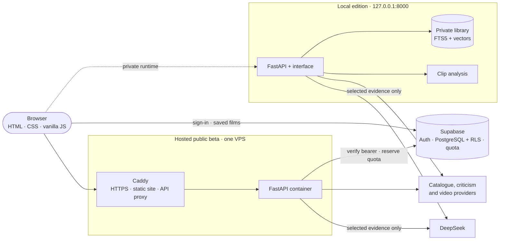

# FirstRoll — Evidence-Grounded Film Study

FirstRoll is a film-study platform for filmmakers. It confirms a film's identity from open or
licensed catalogues, gathers attributed criticism, scholarship and public videos and, in the local
edition, page-cited passages from a private study library. A language model then writes a
**Deep Study** that may cite only the evidence it was given: every claim stays traceable, and a gap
the evidence cannot fill is labelled **insufficient evidence** instead of being smoothed over. The
local edition also runs clip-based visual analysis inherited from pyCinemetrics.

**Governing rule:** identity records, critic reports, theory frameworks, model hypotheses and
measured film observations are different kinds of evidence. FirstRoll keeps those layers visible
instead of presenting one fluent but unsupported answer.

| Evidence layer | Typical source | Can support | Cannot, on its own, support |
|---|---|---|---|
| Identity and context | TMDb, Wikidata, Wikipedia | Which film; credits; attributed overview | Creator intention or formal analysis |
| Criticism and scholarship | Douban, Letterboxd, Guardian reviews; Crossref abstracts | What a named critic or publication argued | A verified fact about the film |
| Theory | Private books (local) or built-in analytical frameworks (hosted) | An analytical framework | A description of this film |
| Video context | YouTube and Bilibili descriptions; public YouTube captions | Attributed, fallible context | Creator intention without a verified speaker |
| FirstRoll hypothesis | DeepSeek, citing only supplied evidence IDs | A conditional viewing hypothesis with a verification task | A confirmed formal claim |
| Measured observation | Local clip analysis | Shot, scene, colour and object measurements | Deep Study claims, until a bridge exists |

Retrieved text is untrusted data: it cannot issue instructions or change FirstRoll policy. The full
rules and how the code enforces them:
[docs/ARCHITECTURE.md](docs/ARCHITECTURE.md#5-evidence-and-reliability-rules).

## Editions

| | Local-first edition | Hosted public beta |
|---|---|---|
| Where it runs | Your computer: one FastAPI process serves the interface and API on `http://127.0.0.1:8000` | [firstroll.app](https://firstroll.app) and `api.firstroll.app`: Caddy and a FastAPI container on one Tencent Lighthouse VPS in Singapore |
| Accounts | Loopback-only development account kept in browser storage | Supabase email-and-password accounts; profiles, preferences and saved films protected by row-level security |
| Discovery, dossier, shelf, reception, criticism retrieval, videos | Yes | Yes |
| Criticism claim structuring, private study library, developer Settings console (`/settings`), clip analysis | Yes | No (local only) |
| Deep Study | With your DeepSeek key and an indexed private library; no FirstRoll quota | Authenticated and quota-limited (3 per account, 30 overall, per UTC day); **currently disabled** |

**Hosted status (5 October 2026):** v232 (`cf43ba57`), deployed in owner-approved run `37213215944`.
Live file/API verification and desktop festival filtering/details/zoom checks passed; v230 remains
the application rollback target. No TMDb token is configured, so discovery uses Wikidata/Wikipedia.
Authenticated account/quota acceptance and a rollback drill remain outstanding. The Agent/Azure
removal is merged but not deployed. Evidence: [docs/PROGRESS.md](docs/PROGRESS.md).

**Festivals:** 32 festivals, including SGIFF, and the Oscars appear on an inline world map and
calendar. Month filtering, selection and zoom use no map API or credential. Dates are typical
windows, not confirmed edition dates; verify with each organiser. The mobile update adds
scrollable 44-pixel month controls, a separate zoom toolbar, screen-sized pins and a wrapping
calendar list with explicit dates. Selecting a mobile calendar entry reveals its detail card.
The header also fits narrow phones without hiding navigation, account controls or the build
label. Browser layout/interaction checks passed at 320, 390 and 430 CSS px and desktop;
physical-device pinch testing and production deployment remain outstanding.

## Documentation Map

New to the repository? Start with [the codebase guide](docs/CODEBASE.md). Frontend build and
preview tools live together in `tools/frontend/`; release tooling remains in `tools/release/`.
After installing the development dependencies, `npm run preview` builds and opens a local
server at `http://127.0.0.1:4173/` (visit that address in your browser).

| Reader need | Document |
|---|---|
| Find a feature, understand folders or choose a development command | [docs/CODEBASE.md](docs/CODEBASE.md) |
| Topology, components, runtime modes, data flows, evidence rules, threat model and responsiveness | [docs/ARCHITECTURE.md](docs/ARCHITECTURE.md) |
| Install, configure, verify and troubleshoot the local edition; contributor checks | [docs/SETUP.md](docs/SETUP.md) |
| Learn the strict TypeScript modules and shared browser build | [docs/FRONTEND_GUIDE.md](docs/FRONTEND_GUIDE.md) |
| Run the public beta: server, DNS, release approval, rollback, Supabase quota and acceptance | [docs/OPERATIONS.md](docs/OPERATIONS.md) |
| Data sources and content-use boundaries, storage and lifetimes, and the HTTP API reference | [docs/DATA.md](docs/DATA.md) |
| Why the major architectural choices were made | [docs/DECISIONS.md](docs/DECISIONS.md) |
| Current status, dated milestones, acceptance evidence and next work | [docs/PROGRESS.md](docs/PROGRESS.md) |
| August 2026 milestone ledger | [docs/PROGRESS_ARCHIVE_2026-08.md](docs/PROGRESS_ARCHIVE_2026-08.md) |
| The single-server stack files | [infra/vps/README.md](infra/vps/README.md) |
| Project-local Pi subagents | [.pi/README.md](.pi/README.md) |
| Binding repository and delivery rules for contributors and agents | [AGENTS.md](AGENTS.md) |

## Lineage and Attribution

FirstRoll is an independent evolution of
[CBD-Lab/pyCinemetrics](https://github.com/CBD-Lab/pyCinemetrics). The original project
provided the computational film-analysis foundation, including work on shot boundaries,
shot scale, colour and object analysis. FirstRoll retains that contribution in its Git
history and `upstream` remote while developing a new web interface, API, discovery and
evidence-grounded research architecture.

The original GPL-3.0 licence and contributor attribution remain applicable. See
[Original pyCinemetrics Work](#original-pycinemetrics-work).

## What Works Today

- **Film identity:** search by title, year and director through TMDb when a token
  (`TMDB_BEARER_TOKEN`) is configured, otherwise key-free Wikidata/Wikipedia; close matches require
  an explicit choice.
- **Dossier and shelf:** attributed overview, poster and field-level crew provenance beside a native
  director shelf of up to twelve films that uses only identity-checked posters.
- **Reception and videos:** attributed Douban and Letterboxd community scores, up to three Wikidata
  awards, and YouTube (with an API key) and Bilibili videos classified by type and duration.
- **Criticism and research:** Crossref abstracts with DOI links, Douban reviews through the optional
  MCP connector, Letterboxd public reviews (or the official API with granted OAuth credentials) and
  Guardian reviews, each a separate cached bundle that fails independently. Raw attributed text is
  shown first; locally, DeepSeek can then extract Pydantic-validated critic claims that must cite
  retrieved source IDs and leave unknown scenes or techniques missing.
- **Private study library (local):** catalogue PDF, EPUB, Markdown and text files without exposing
  paths; text-layer PDFs become page-cited chunks searched through SQLite FTS5 and local
  384-dimensional multilingual embeddings, fused by reciprocal rank, with an FTS-only fallback. Add
  only material you are entitled to use.
- **Deep Study:** a typed, bounded packet (up to eight theory passages, twelve critic claims and
  twelve attributed review or video excerpts) with omission reasons and a packet-quality assessment;
  four to six sections separating critic reports, theory, hypothesis, mechanism, alternative
  reading, verification task and confidence; inline `S`, `C` and `E` citations open the evidence.
- **Transparent progress:** redacted stage timings, packet counts and token use, never prompts or
  reasoning. Hosted progress streams over authenticated SSE; only the owner can fetch the result.
- **Analyse (local):** import a clip; measure shot and scene boundaries, average shot length, shot
  scale, scene colour and objects (with labelled fallbacks); export JSON and CSV.
- **Accounts and keys:** hosted Supabase sign-up, sign-in, password recovery, saved films and an
  account Settings view with the daily allowance. Optional personal DeepSeek or YouTube keys live only
  in that tab's memory; a personal DeepSeek key never bypasses hosted enablement or quota. The hosted
  Douban connector runs anonymously and never accepts a visitor's cookie. Locally, credentials are
  write-only in the Git-ignored `.firstroll/`.
- **Workspace:** state survives view changes and refreshes (per-tab `sessionStorage`, 24 hours);
  five recent searches stay in the browser; newer searches cancel stale requests;
  keyboard-accessible tabs, specific retry states and black, white and grey light/dark themes,
  including local Settings. Festival statuses use labels, outlines and patterns rather than hue.
  Film artwork, video and measured colour-analysis results retain their original colours.

## Architecture


```mermaid
flowchart LR
    B(["Browser<br/>HTML · CSS · vanilla JS"])
    subgraph VPS["Hosted public beta · one VPS"]
        CADDY["Caddy<br/>HTTPS · static site · API proxy"] --> API["FastAPI container"]
    end
    subgraph LOCAL["Local edition · 127.0.0.1:8000"]
        LAPP["FastAPI + interface"] --> LIB[("Private library<br/>FTS5 + vectors")]
        LAPP --> CLIP["Clip analysis"]
    end
    SUPA[("Supabase<br/>Auth · PostgreSQL + RLS · quota")]
    PROV["Catalogue, criticism<br/>and video providers"]
    LLM["DeepSeek"]
    B --> CADDY
    B -->|"sign-in · saved films"| SUPA
    B -. "private runtime" .-> LAPP
    API -->|"verify bearer · reserve quota"| SUPA
    API --> PROV
    LAPP --> PROV
    API -->|"selected evidence only"| LLM
    LAPP -->|"selected evidence only"| LLM
```

Every Deep Study follows one fixed workflow with deterministic checks:

```text
verified film identity → bounded, typed evidence packet → [hosted] atomic quota reservation
  → DeepSeek structured output (≤ 3,200 completion tokens)
  → Pydantic GroundedStudy schema + citation check against the supplied evidence IDs
  → deterministic StudyQualityGate
  → at most one follow-up call: a schema retry or a quality repair (≤ 2 model calls in total)
  → study, or a result labelled "insufficient evidence"
```

A packet with no theory passages stops before any model call. Stack: Python 3.11, FastAPI, Pydantic
and Uvicorn; vanilla JavaScript with Supabase JS bundled by esbuild; PyPDF, SQLite FTS5 and Sentence
Transformers; OpenCV, FFmpeg, TransNetV2, TensorFlow and Torchvision; Docker Compose and Caddy.
Quotas use Supabase RPC by default; the identity-neutral PostgreSQL client
(`FIRSTROLL_QUOTA_PROVIDER=postgres`, `FIRSTROLL_DATABASE_URL` and the `database/migrations` schema)
is retained and staged, not active. Details: [docs/ARCHITECTURE.md](docs/ARCHITECTURE.md).

## Quick Start

Requires Git, Python 3.11 or 3.12 and [uv](https://docs.astral.sh/uv/); FFmpeg only for clip analysis.

```bash
git clone https://github.com/Luo-Z-Y/FirstRoll.git
cd FirstRoll
uv sync
uv run firstroll        # interface and API on http://127.0.0.1:8000
```

No frontend server or API key is required: discovery falls back to key-free Wikidata/Wikipedia, and
a loopback-only test account stands in for sign-in. Enter DeepSeek, TMDb, YouTube or Letterboxd API
credentials in the developer Settings console (<http://127.0.0.1:8000/settings>) or export them as
environment variables (`.env` files are not loaded). Deep Study also needs at least one indexed
text-layer PDF in the private library. Configuration, the optional Douban MCP connector, the
library, the test account and troubleshooting: [docs/SETUP.md](docs/SETUP.md).

## Repository Structure

```text
FirstRoll/
├── .github/                  # workflows/ci.yml, workflows/vps-release.yml, Dependabot, PR template
├── .pi/                      # project-local Pi subagent roles, extension and prompts
├── app/
│   ├── backend/
│   │   ├── algorithms/       # inherited and adapted pyCinemetrics analysis
│   │   ├── analysis_pipeline.py  # local clip analysis and JSON/CSV export
│   │   ├── auth.py, quota.py # Supabase bearer check; Supabase RPC and PostgreSQL quotas
│   │   ├── discovery.py      # Wikidata/Wikipedia discovery and labelled offline records
│   │   ├── tmdb_discovery.py # TMDb adapter and the hybrid catalogue router
│   │   ├── criticism.py      # Crossref, Douban, Letterboxd and Guardian adapters; cache
│   │   ├── video_sources.py  # YouTube and Bilibili adapters and the video catalogue
│   │   ├── library.py, library_index.py  # private catalogue and hybrid retrieval
│   │   ├── evidence.py, packet_quality.py  # bounded evidence packet and its assessment
│   │   ├── study_service.py  # DeepSeek synthesis, citation checks and quality gate
│   │   ├── public_study.py   # built-in analytical frameworks for hosted studies
│   │   ├── research_stream.py, study_observability.py  # SSE progress, run store, timings
│   │   ├── settings.py, settings.html  # local write-only credential store and console
│   │   └── main.py           # FastAPI application and routes
│   └── web/                  # index.html/styles.css; app.ts composition root; src/ typed features;
│                             #   auth.ts, local-auth.ts, integrations.ts, festivals.ts; generated/ ignored
├── database/migrations/      # portable identity-neutral quota schema (PostgreSQL client)
├── supabase/migrations/      # Supabase quota functions and RLS-owned account tables
├── docs/                     # see the Documentation Map
├── infra/vps/                # Compose, Caddyfile, bootstrap.sh, deploy.sh, .env.example
├── models/                   # TransNetV2 and pose-model weights for clip analysis
├── tests/                    # pytest suite; web/ Node request/race checks; fixtures/ packet cases
├── tools/                    # build_web.sh, preview_hosted_web.sh, browser diagnostic;
│                             #   release/ (protocol.py, vps.py)
├── video/                    # empty placeholder inherited from pyCinemetrics
├── .env.example              # local environment-variable template
├── AGENTS.md                 # binding repository and delivery rules
├── Dockerfile                # hosted API image with the pinned Douban MCP connector
├── pyproject.toml, uv.lock   # local edition dependencies and entry points
├── requirements-hosted.txt   # slim hosted API dependencies
├── package.json, package-lock.json  # Supabase client, TypeScript and esbuild
└── LICENSE.txt, THIRD_PARTY_NOTICES.md
```

## Development and Delivery

Contributor checks (pytest, strict TypeScript, Node contracts/race tests, Ruff, local/hosted builds
and the hosted-mode preview) are listed in
[docs/SETUP.md](docs/SETUP.md#development-and-verification).

Branch from `origin/master` as `feat/`, `fix/`, `docs/` or `chore/`, and reach protected `master`
only through a current, green pull request that also updates this README and
[docs/PROGRESS.md](docs/PROGRESS.md) when behaviour changes. Branches and pull requests never
receive a deployment credential. A successful `master` CI run builds a sealed release candidate;
deployment waits until a human repository owner approves that exact run in the protected GitHub
`production` environment. Never commit `.firstroll`, keys, cookies, private books, extracted text,
vectors, criticism caches or film clips. Binding rules: [AGENTS.md](AGENTS.md); release procedure:
[docs/OPERATIONS.md](docs/OPERATIONS.md).

**Pi subagents:** trusted Pi sessions get a project-local `subagent` tool for read-only scout,
planner and reviewer work or one bounded worker task, while the parent session keeps Git and
delivery. Its exclusions of private material and Git operations are prompt-level controls, not an
operating-system sandbox, so the parent inspects every diff. Setup, usage and limits:
[`.pi/README.md`](.pi/README.md).

## Roadmap

| Status | Items |
|---|---|
| Shipped | Discovery, dossier and director shelf; festival atlas; strict TypeScript browser modules; attributed criticism; private hybrid retrieval; fixed-workflow Deep Study with authenticated progress; local clip analysis; single-server public beta (v232) |
| Next | Complete authenticated account/quota acceptance before enabling hosted Deep Study; a separately authorised rollback drill; a Supabase monitor; live responsiveness profiling |
| Planned | Persistent film projects; cost telemetry and an operator kill switch; clip-to-study evidence bridge; creator primary sources with verified speaker attribution (descriptions and public captions are already cited); release hardening |
| Parked | Autonomous research Agent programme, which never had an HTTP route: tag `archive/agent-programme` |
| Retired | Azure delivery path (Static Web Apps, Container Apps, Entra External ID, Terraform): tag `archive/azure` |

Reasons: ADR-026 and ADR-027 in [docs/DECISIONS.md](docs/DECISIONS.md); acceptance criteria and
dates: [docs/PROGRESS.md](docs/PROGRESS.md).

## Known Limitations

- Deep Study does not watch the film: formal claims stay viewing hypotheses and clip measurements do
  not enter the packet. Captions from unverified video speakers cannot establish creator intention.
- Crossref and the Guardian may have no confident match for a new or rarely studied film. Douban
  (unofficial MCP connector) and Letterboxd public pages can break when markup or access changes.
- Generating a study sends the selected evidence excerpts (never whole books or clips) to DeepSeek.
- A study may correctly end as insufficient evidence after its one repair call; a provider transport
  failure needs an explicit retry. Locally, a study requested during embedding warm-up waits for it.
- Hosted study results live only in API memory for ten minutes: no durable history, one instance.
- The public beta is one VPS: a single point of failure with no CDN, a brief API restart on each
  release and no rehearsed recovery. The Supabase Free plan pauses after seven idle days, which
  breaks sign-in until the project is resumed.
- Inherited computer-vision dependencies are large and platform-sensitive; object and shot-scale
  analysis may use clearly labelled fallbacks, and an analysis runs on the local API's event loop,
  so other requests wait until it finishes.

## Licence

FirstRoll inherits the GNU General Public License, version 3 or (at your option) any later version,
from pyCinemetrics; see [LICENSE.txt](LICENSE.txt). The MIT-licensed `moria97/douban-mcp` connector
(built into the hosted image from a pinned revision) and the Pi subagent extension adapted from
`earendil-works/pi` are listed in [THIRD_PARTY_NOTICES.md](THIRD_PARTY_NOTICES.md). Software
licences grant no rights to provider content: reviews, Wikipedia text, posters and videos remain
their owners' and are shown with attribution and source links. This product uses the TMDB API but
is not endorsed or certified by TMDB.

## Original pyCinemetrics Work

FirstRoll remains indebted to the original pyCinemetrics contributors.

- Source: [CBD-Lab/pyCinemetrics](https://github.com/CBD-Lab/pyCinemetrics)
- Project portal: [movie.yingshinet.com](https://movie.yingshinet.com)
- Research paper: [SoftwareX article](https://www.sciencedirect.com/science/article/pii/S2352711024000578)

When publishing work based on the inherited analysis pipeline, cite the original project
and paper as well as describing FirstRoll's subsequent changes.
